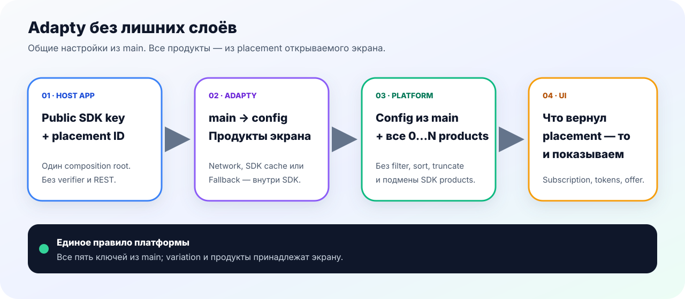

# Adapty и placements

## Что является актуальным

Этот справочник сверён с `BroadMonetization 1.0.0`, текущим integration
catalog и новой федеративной архитектурой. Adapty/StoreKit adapters принадлежат
`broad-monetization-ios`; готовый экран принадлежит `broad-ui-flows-ios`, а
реальные keys, IDs и Dashboard-конфигурация — host app.

## Базовая схема нового приложения

| Что | Правило |
|---|---|
| Product без trial | Naming convention команды — `nottrial` слитно, например `weekly_9.99_nottrial`; runtime не делает выводов из имени |
| Paywall names | `main`; `tokens` и `special_offer` создаются только когда соответствующий flow нужен |
| Placement IDs | `onboarding`, `pro_icon`, `settings`, `main`, `CTR`, `special_offer`; дополнительные — из app specification |
| Fallback | Базовые placements связываются с `main`; requested/resolved placement сохраняются отдельно |
| Products | Показывается весь provider array в исходном порядке, включая 0, 1, N и duplicate SKU |

`main` является логическим fallback, но host app всё равно передаёт реальные
Adapty IDs через typed registry. Строковые provider IDs не размещаются внутри
SwiftUI View.

## Remote Config

Для нового app, где optional features ещё не подключены, безопасный начальный
пример выглядит так:

```json
{
  "ru_pay": false,
  "auto_revenue_view": false,
  "special_offer": false
}
```

Этот пример нельзя копировать поверх рабочего Dashboard. Для уже подключённого
RU Billing значение `ru_pay` определяет product/backend owner.



| Источник payload | Обычный paywall | Special Offer | RU Billing |
|---|---:|---:|---:|
| Текущий ответ Adapty: network или SDK cache | да | по `special_offer = true` | нет без fresh proof |
| Dashboard fallback через Adapty SDK | да | по `special_offer = true` | нет |
| Host-controlled verified-fresh remote | да | по `special_offer = true` | по `ru_pay = true` |
| Persistent cache BroadMonetization | да | нет | нет |

`special_offer` является presentation capability. `ru_pay` — финансовая
capability с более строгим происхождением.

## Единый provider pipeline

```text
Adapty.getPaywall
  → Adapty.getPaywallProducts
  → 1:1 mapping всего массива
  → exact raw-product registry
  → qualify Remote Config capability
  → resolver / UI
```

Не создавайте второй Adapty REST transport, словарь по SKU, local sorting или
фильтрацию trial. Purchase обязан использовать raw product из того же registry,
не перезагружая paywall перед оплатой.

## Проверка

- requested и resolved placement записаны раздельно;
- `main` используется только при фактическом fallback;
- все продукты и duplicate occurrences сохранены;
- app cache не включает чувствительные flags;
- purchase/restore открывают premium только после entitlement refresh;
- настоящая финансовая операция не нужна для этой проверки.

[Полный module README](https://github.com/BroadApps-official/broad-monetization-ios) ·
[Special Offer](./special-offer.md) · [RU Billing](./ru-billing.md)
