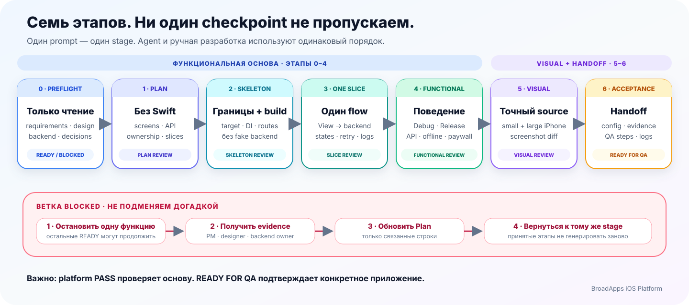

# Создание приложения

Эта инструкция нужна **до первого изменения Swift-кода**. Она помогает не
начать разработку на основе догадок, старого BroadCore или случайного примера.

## Сначала выберите свой случай

| Что происходит | Куда перейти |
|---|---|
| Нужно только добавить платформу в существующий проект | [Первое подключение](./getting-started.md) |
| Создаётся новое приложение с Codex или Claude | Продолжить раздел [Работа с агентом](#работа-с-агентом) |
| Новое приложение создаёт разработчик вручную | Продолжить раздел [Работа без агента](#работа-без-агента) |
| В проекте уже есть старый private BroadCore или локальные файлы платформы | [Переход со старого BroadCore](./legacy-app-migration.md) |

Не выполняйте все маршруты подряд. Выберите одну строку, соответствующую
текущему приложению.

## Что такое BroadApps iOS

Платформа — это общий код для iPhone-приложений компании. Она разделена на
четыре библиотеки, чтобы приложение не скачивало ненужные функции.

| Если приложению нужно | Подключите |
|---|---|
| Цвета, клавиатура и небольшие Swift-утилиты | `BroadExtensions` |
| Последовательность запуска, кеш, логи и повтор запросов | `BroadCore` |
| Подписки и покупки со своим интерфейсом | `BroadMonetization` |
| Готовые первые экраны, экран подписки и переходы | `BroadUIFlows` |

Ключи, тексты, изображения, адрес сервера и правила продукта всегда
остаются в приложении. Платформа не знает бренд и бизнес-решения конкретного
продукта.

[Подробная таблица выбора модуля](./module-selection.md)

## Что нужно узнать до разработки

Перед кодом соберите ответы на семь вопросов:

1. Какое приложение создаётся и какой у него Bundle ID?
2. Где лежат согласованные требования задачи?
3. Где лежит настоящий дизайн каждого обязательного экрана?
4. Какое приложение используется только как пример поведения?
5. Какие запросы к серверу нужны каждой функции приложения?
6. Нужны ли подписка, токены, СБП или банковская карта?
7. Где находятся тексты поддержки, Privacy Policy и Terms?

Если ответа нет, запишите конкретный пробел и человека, у которого его нужно
получить. Не заменяйте отсутствующие данные значениями из похожего приложения.

## План перед кодом

Создайте в репозитории приложения файл
`Documentation/AppIntegrationPlan.md`. В нём достаточно зафиксировать:

- обязательные экраны и состояния;
- источник дизайна каждого экрана;
- запрос к серверу для каждого сценария;
- выбранные модули и версии;
- ключи и идентификаторы, которые ещё должен предоставить владелец;
- что уже готово, что заблокировано и что не требуется;
- какой один сценарий будет реализован первым.

Готовый шаблон лежит в
[публичном интеграционном репозитории](https://github.com/BroadApps-official/broad-platform-integration/blob/main/Documentation/Templates/AppIntegrationPlan.md).
Если файл уже существует, не перезаписывайте его: сохраните принятые решения и
добавьте только недостающие сведения.

## Разрабатывайте по одному сценарию

Не создавайте все экраны и сервисы одновременно. Возьмите один законченный
сценарий, например «запуск → первый экран» или «открыть экран подписки →
увидеть варианты», и доведите его до рабочего состояния.

Для каждого сценария проверьте:

- загрузку;
- нормальное содержимое;
- пустой ответ;
- ошибку;
- отсутствие сети;
- повторное нажатие кнопки;
- возвращение в сценарий после перезапуска приложения.

После первого рабочего сценария покажите его разработчику, исправьте замечания
и только затем переходите к следующему.

## Работа с агентом

### Шаг 1. Откройте правильную папку

Для нового приложения создайте отдельную папку репозитория. Для существующего
откройте его настоящий репозиторий. Папки платформы и приложений-примеров нужны
только для чтения — агент не должен изменять их вместо вашего приложения.

### Шаг 2. Сначала попросите только провести аудит

Используйте первый запрос из
[`AgentPreflight.md`](https://github.com/BroadApps-official/broad-platform-integration/blob/main/Documentation/AgentPreflight.md).
На этом шаге агент читает источники и возвращает:

- что найдено;
- чего не хватает;
- где именно он это проверил;
- можно ли создать безопасный каркас;
- можно ли реализовать все обязательные функции.

На этом шаге агент **не создаёт код** и не придумывает отсутствующий дизайн или
ответы сервера.

### Шаг 3. Подтвердите план

После аудита агент создаёт или дополняет `AppIntegrationPlan.md`. Прочитайте
план и явно подтвердите следующий шаг. До подтверждения Swift-код и Xcode-проект
не меняются.

### Шаг 4. Отправляйте этапы по одному

Порядок работы:

1. безопасный каркас приложения;
2. один рабочий пользовательский сценарий;
3. проверка этого сценария разработчиком;
4. остальные сценарии по одному;
5. отдельная проверка функций;
6. отдельное сравнение интерфейса с дизайном;
7. итоговая подготовка к QA.

Не отправляйте весь
[`Agent Prompt Pack`](https://github.com/BroadApps-official/broad-platform-integration/blob/main/Documentation/AgentPromptPack.md)
одним сообщением. После паузы агент должен перечитать план и последние
изменения, а не начинать проект заново.

## Работа без агента

Разработчик проходит тот же путь самостоятельно:

1. собирает требования, настоящий дизайн, примеры поведения и описание запросов сервера;
2. заполняет `AppIntegrationPlan.md`;
3. создаёт новый проект через `iOS → App` или использует существующее основное приложение;
4. подключает только нужные публичные модули;
5. создаёт одно место, где при запуске собираются сервисы и конфигурация;
6. реализует один пользовательский сценарий со всеми состояниями;
7. проверяет функции и отдельно сравнивает интерфейс с дизайном;
8. собирает Debug и Release и передаёт приложение в QA.

## Как понять, что можно передавать в QA

Проверки самой платформы доказывают только исправность общих библиотек. Они не
доказывают готовность конкретного приложения.

Перед QA разработчик лично подтверждает:

- каждый обязательный экран существует и соответствует своему дизайну;
- каждый запрос к серверу работает на настоящих данных;
- ошибки, пустые ответы и отсутствие сети показаны понятно;
- экран подписки показывает все варианты, полученные от Adapty;
- Premium открывается только после подтверждения покупки;
- СБП и карта не считаются успешными только из-за возврата из браузера;
- в репозитории нет реальных ключей и персональных данных;
- приложение собирается в Debug и Release;
- в плане нет необъяснённых статусов или забытых блокеров.

Настоящая покупка, восстановление покупки и российская оплата не запускаются
автоматическими проверками платформы. Их результат подтверждают StoreKit,
Adapty и сервер приложения.

Полный лист передачи находится в
[`ProjectDelivery.md`](https://github.com/BroadApps-official/broad-platform-integration/blob/main/Documentation/ProjectDelivery.md).
