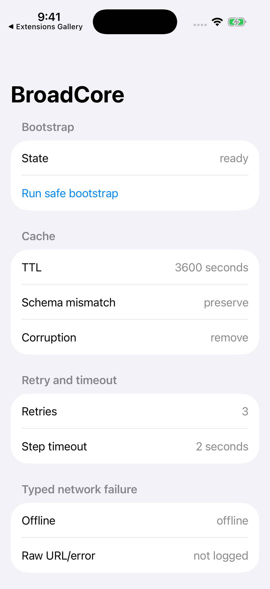

# BroadCore

`BroadCore` помогает **запускать приложение, хранить кеш и обрабатывать загрузку и ошибки**. Готовых экранов в нём нет: приложение использует эти механизмы в своей логике, а результат показывает своим интерфейсом или через [BroadUIFlows](./broad-ui-flows.md).

Например, список уроков можно сохранить после успешной загрузки и показать без сети. Core проверит запись кеша, а приложение решит, допустимы ли старые данные и какое предупреждение увидит пользователь.

## Что входит в модуль

| Задача | Что использовать |
|---|---|
| Выполнить шаги запуска с ограничением ожидания и повторами | `AppBootstrapCoordinator`, `BootstrapStep` |
| Описать загрузку, контент, пустой результат или ошибку | `LoadableState`, `AppError` |
| Сохранить JSON со схемой, версией и сроком хранения | `VersionedJSONCacheRepository` |
| Хранить небольшие флаги или файлы | `UserDefaultsKeyValueStore`, `FileSystemKeyValueStore` |
| Различить отсутствие сети, timeout и отмену | `NetworkFailureClassifier` |
| Задать повторы и максимальное ожидание | `RetryPolicy`, `TimeoutPolicy` |
| Записать диагностические события | `BroadLoggerProtocol`, `OSLogBroadLogger` |
| Учесть время сервера | `ServerSynchronizedClock` |

Также есть адаптер системного запроса ATT и инструменты для Debug: `DebugFlagStore` и `DebugKeychainCleaner`. Они нужны только тем приложениям, которые используют эти функции.

## Запуск приложения

Приложение передаёт координатору список шагов. У каждого шага есть действие, важность, timeout и правила повтора.

- **Критические шаги** выполняются до выбора первого маршрута. Например, чтение конфигурации, без которой нельзя продолжить.
- **Фоновые шаги** могут закончиться позже и не должны удерживать первый экран.

> [!CAUTION]
> **Системные запросы и оплата не входят в запуск.**
> ATT, просьбу оценить приложение, покупку, Restore и поддержку вызывают из подходящего видимого экрана. Не добавляйте их в bootstrap или `init`.

Core применяет правила к переданным ему действиям. Подключение пакета само по себе не добавляет timeout ко всем запросам и не блокирует повторные нажатия: это нужно связать с логикой конкретного экрана.



Это служебный пример `BroadCoreSandbox` из репозитория модуля. Кнопка **Run safe bootstrap** запускает локальный шаг без обращения к платёжным сервисам. Экран показывает настройки примера; он не является готовым интерфейсом Core для приложения.

## Состояния данных для экрана

`LoadableState<Value>` хранит состояние вместе с данными. Так экрану не приходится согласовывать отдельные флаги `isLoading`, `hasError` и `isEmpty`.

| Состояние | Что означает |
|---|---|
| `idle` | Загрузка ещё не началась |
| `loading(previousValue: nil)` | Первая загрузка, старых данных нет |
| `loading(previousValue: value)` | Обновление с сохранением прежнего контента |
| `loaded(value)` | Данные получены |
| `empty` | Запрос завершился, но показывать нечего |
| `stale(value: error:)` | Приложение разрешило показать устаревшие данные |
| `error(_: previousValue:)` | Ошибка; прежние данные можно сохранить, если это допустимо |

Текст ошибки, кнопку повтора и внешний вид выбирает приложение. Готовое отображение этих состояний есть в `BroadLoadableView` из BroadUIFlows.

## Кеш и работа без сети

`VersionedJSONCacheRepository` проверяет схему, версию и срок записи. Результат чтения — `fresh`, `stale` или `missing`. Повреждение JSON, отсутствие записи и несовместимость схемы возвращаются как причины `missing`.

Типичный сценарий: запрос не удался → приложение читает кеш → проверяет его пригодность → передаёт экрану данные или ошибку. Core даёт инструменты для этого пути, но не собирает его автоматически за приложение.

> [!CAUTION]
> **Устаревший кеш не подтверждает оплату.**
> Список уроков можно показать без сети, если это разрешено правилами приложения. Право на Premium и баланс токенов проверяются через платёжный слой и сервер; обычный кеш Core не служит доказательством покупки.

## Время сервера и логи

`ServerSynchronizedClock` получает серверную дату от HTTP-слоя приложения, например из заголовка `Date`. Он сохраняет смещение к часам устройства и различает время после синхронизации и неподтверждённое время устройства. До первой синхронизации платный сценарий должен учитывать статус `unverified`.

Это клиентский механизм отсчёта времени, а не серверная проверка доступа. Новая дата сервера может скорректировать показания, в том числе назад. Решение о платном доступе остаётся за платёжным слоем и сервером.

Для логов используйте предусмотренные события и безопасные значения. Не записывайте ключи, пользовательские токены, чеки, платёжные ссылки и полные ответы сервисов. `OSLogBroadLogger(subsystem:)` принимает строку, например идентификатор приложения.

## Как подключить

В Xcode откройте **File → Add Package Dependencies…**, вставьте адрес и выберите product **BroadCore** для нужного target:

```text
https://github.com/BroadApps-official/broad-core-ios.git
```

```swift
import BroadCore
```


Core использует Swinject. Платёжные SDK и готовые экраны вместе с ним не подключаются. Если Core уже пришёл через Monetization или UIFlows, добавляйте его product в target, когда код приложения напрямую использует `import BroadCore`.

Версии выбирайте по [проверенному набору платформы](./compatibility.md). Ссылка на старый репозиторий `BroadApps-official/BroadCore` ведёт к прежнему монолиту — для него есть [инструкция перехода](./legacy-broadcore.md).

## Что проверить

1. Успешный запуск, ошибку и timeout критического шага: экран должен получить конечный результат.
2. Чтение свежего, устаревшего, отсутствующего и повреждённого кеша.
3. Повторное нажатие Retry: пока запрос выполняется, второй не начинается.
4. ATT из видимого экрана и отсутствие чувствительных данных в логах.

[Первое приложение с Core](./getting-started.md) · [Запуск, ошибки и восстановление](./runtime-reliability.md) · [README и API](https://github.com/BroadApps-official/broad-core-ios)
