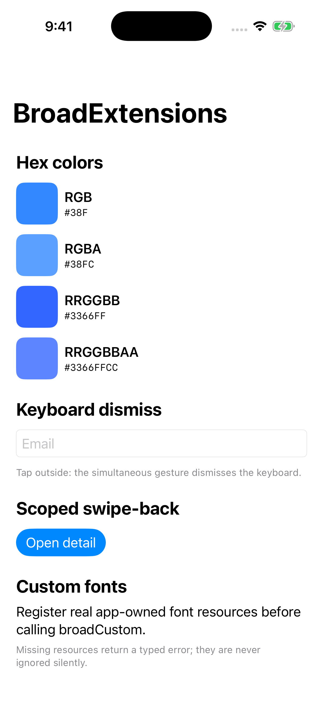

# BroadExtensions

`BroadExtensions` — **четыре небольшие утилиты для интерфейса**: HEX-цвета, свои шрифты, закрытие клавиатуры и системный свайп назад. Модуль независим: не подключает Core, Adapty, Swinject или готовые экраны платформы.

## Как это выглядит



Это настоящий экран `BroadExtensionsGallery` из репозитория модуля. На нём можно сравнить цвета, открыть клавиатуру и проверить возврат с экрана **Open detail**. Цвета и оформление своего приложения вы задаёте отдельно.

## HEX-цвета

```swift
import BroadExtensions
import SwiftUI
import UIKit

let accent = Color(broadHex: "#4F8CFF")
let overlay = UIColor(broadHex: "101828CC")
let channels = BroadRGBAColor(hex: "#0F08")
```

Поддерживаются `RGB`, `RGBA`, `RRGGBB` и `RRGGBBAA`; решётка `#` необязательна. В вариантах с прозрачностью alpha находится **в конце** строки.

> **Неверный HEX возвращает `nil`.** Все три примера дают optional-значение. Обработайте ошибку или явно задайте запасной цвет, например `Color(broadHex: value) ?? .clear`.

## Свои шрифты

Добавьте файлы шрифта в ресурсы target и зарегистрируйте их перед использованием:

```swift
try BroadFontRegistrar.register(
    resourceNames: ["Inter-Regular", "Inter-Bold"],
    withExtension: "ttf",
    in: .main
)

let title = Font.broadCustom("Inter-Bold", size: 28, relativeTo: .title)
let body = UIFont.broadCustom("Inter-Regular", size: 16)
```

Имена в `resourceNames` — имена файлов без расширения. В `broadCustom` передаётся внутреннее имя шрифта (PostScript name); оно не обязательно совпадает с именем файла. Файлы Inter в пакет не входят — здесь это пример ресурсов приложения.

Registrar сообщает ошибку, если ресурс отсутствует или его не удалось зарегистрировать. `UIFont.broadCustom` возвращает `nil`, если шрифт с таким именем недоступен. Для SwiftUI отдельной ошибки от `Font.broadCustom` нет, поэтому регистрацию и имя нужно проверить заранее.

Оба помощника поддерживают Dynamic Type — увеличение текста из настроек iPhone. В SwiftUI базовый стиль задаёт `relativeTo`, в UIKit — параметр `textStyle`.

## Закрытие клавиатуры

Примените модификатор к контейнеру с полем ввода. Переменная `email` в примере — состояние вашей формы.

```swift
Form {
    TextField("Email", text: $email)
}
.broadDismissKeyboardOnTap()
```

Модификатор добавляет одновременный жест нажатия, чтобы закрытие клавиатуры могло работать вместе с действиями дочерних элементов. Проверьте свою форму: нажатие вне поля должно закрывать клавиатуру, а кнопки — продолжать работать.

## Свайп назад

Если у экрана своя кнопка Back, системный жест от левого края может перестать работать. Добавьте модификатор к экрану внутри навигационного стека:

```swift
DetailView()
    .navigationBarBackButtonHidden(true)
    .broadInteractiveSwipeBack()
```

Он временно настраивает жест текущего navigation controller и восстанавливает прежние настройки после закрытия экрана. Это локальное дополнение к навигации, а не замена `NavigationStack`.

## Как подключить и запустить пример

В Xcode откройте **File → Add Package Dependencies…** и вставьте:

```text
https://github.com/BroadApps-official/broad-extensions-ios.git
```

Выберите product **BroadExtensions** для нужного target. Для согласованного набора версий используйте [таблицу совместимости](./compatibility.md).

Чтобы открыть Gallery, клонируйте репозиторий и выполните из его корня. Скрипт подготовит нужную версию XcodeGen:

```bash
bash Scripts/generate_gallery.sh
open Examples/BroadExtensionsGallery/BroadExtensionsGallery.xcodeproj
```

Выберите схему **BroadExtensionsGallery**, iPhone Simulator и нажмите **Run**.

## Что проверить

1. Цвет и прозрачность совпадают с дизайном; неверная строка обрабатывается явно.
2. Шрифт найден по правильному имени, текст увеличивается через Dynamic Type.
3. Клавиатура закрывается, кнопки формы остаются рабочими.
4. Свайп назад работает на нужном экране и не меняет поведение соседних экранов.

[README модуля](https://github.com/BroadApps-official/broad-extensions-ios) · [Полный Public API](https://github.com/BroadApps-official/broad-extensions-ios/blob/main/Documentation/PublicAPI.md) · [Как выбрать модуль](./architecture.md)
