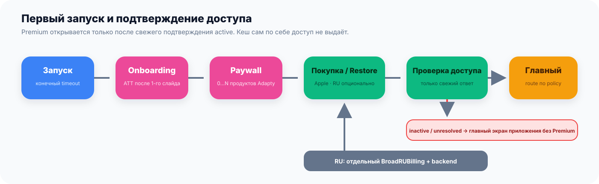

# BroadMonetization

`BroadMonetization` — платёжная логика **без готового интерфейса**. Модуль получает варианты покупки, проводит purchase и restore, а затем проверяет, действительно ли пользователю открыт Premium. Экран рисует приложение — либо готовый `BroadUIFlows`.

> Пример: приложение хочет собственный paywall из Figma. Оно рисует карточки и кнопку само, но получает данные продуктов и вызывает покупку через `BroadMonetization`. Так дизайн остаётся уникальным, а опасная финансовая логика не копируется в каждом проекте.

## Где находится граница модуля

| Делает `BroadMonetization` | Делает приложение или `BroadUIFlows` |
|---|---|
| Активирует платёжный adapter по переданной конфигурации | Выбирает фон, шрифты, тексты и расположение карточек |
| Загружает placement и все продукты | Показывает loader, ошибку, список и кнопки |
| Сохраняет исходную ссылку на каждый provider product | Решает, как визуально выделить тариф |
| Координирует purchase и restore | Показывает результат человеку |
| Проверяет подтверждённое право на Premium | Переходит в основное приложение после подтверждения |
| Не допускает параллельные финансовые операции | Сразу блокирует повторное нажатие в интерфейсе |



## Что такое Adapty placement простыми словами

Placement — имя места в приложении, где нужен paywall. Например, `onboarding`, `settings`, `pro_icon` или `special_offer`. В Adapty к этому имени привязывается нужный paywall и набор продуктов.

Для обычного приложения достаточно:

1. публичного SDK key Adapty;
2. имён placements, которые реально используются;
3. текстов ошибок и другой конфигурации, принадлежащей приложению.

Дополнительный identity provider или отдельный verifier для обычного anonymous-сценария не нужен. Они имеют смысл только если у приложения действительно есть собственный вход в аккаунт и отдельный серверный контракт.

## Как загружается paywall

1. Приложение просит placement, например `settings`.
2. Adapty возвращает paywall для этого placement.
3. Модуль запрашивает продукты paywall.
4. Каждый provider product сохраняется один к одному вместе с исходной ссылкой, нужной для purchase.
5. Результат передаётся интерфейсу в исходном provider order.

> Правило: модуль не делает `filter`, `sort`, `dedup` или `prefix(2)`. Если Adapty вернул 0, 1, 2 или 8 продуктов, интерфейс получает именно 0, 1, 2 или 8.


Если конкретному приложению нужны только два продукта, разработчик может реализовать отдельное продуктовое правило в своём app-слое. Это не должно становиться скрытым общим правилом платформы.

## Что происходит после нажатия «Купить»

1. UI сразу переходит в состояние `in flight`, показывает loader и блокирует второй tap.
2. Модуль запускает purchase именно того raw product, который соответствовал выбранной карточке.
3. Ответ SDK сам по себе не открывает Premium.
4. Модуль заново получает подтверждённое entitlement-состояние — то есть право пользователя на доступ.
5. Только активное подтверждение возвращает итог «Premium открыт».
6. Cancel даёт отмену без ложной ошибки; timeout или неизвестный результат остаётся pending до повторной проверки.

Такое разделение защищает от двух типичных ошибок: двойной покупки после повторного нажатия и открытия Premium по промежуточному callback.

## Restore: зачем он нужен

Restore восстанавливает подписку или нерасходуемую покупку Apple на новом устройстве или после переустановки. После restore модуль снова проверяет entitlement. Показ сообщения «Покупки восстановлены» до этой проверки недопустим.

Расходуемые токены Restore не восстанавливает. Их баланс принадлежит backend конкретного приложения.

## Спешл оффер от Adapty без лишней сложности

Спешл оффер от Adapty — второй paywall после закрытия первого без покупки.

- приложение запрашивает placement `special_offer`;
- модуль читает payload именно фактически загруженного placement;
- показ разрешает только `special_offer = true`;
- все продукты передаются интерфейсу без фильтрации;
- успешный purchase или restore первого paywall ведёт на главный экран приложения и обходит второй экран.

Контракт показа состоит из одной проверки:

```text
special_offer == true → показать Special Offer
всё остальное         → не показывать Special Offer
```

При `true` Special Offer показывается всегда. Таймер не участвует в этой
проверке: UI отдельно показывает локальный цикл
`24:00:00 → 00:00:00 → 24:00:00`, который продолжается между открытиями и на
нуле не закрывает оффер.

## Токены

Для расходуемых пакетов используется отдельный purchase manager, потому что подписка и баланс токенов означают разные вещи.


Безопасная последовательность:

1. provider возвращает все пакеты;
2. пользователь выбирает один raw product;
3. purchase создаёт уникальную операцию;
4. backend приложения делает начисление exactly once — один раз для одной операции;
5. UI получает полный новый snapshot баланса.

Локальный кеш, нажатие кнопки или callback StoreKit не являются источником баланса.

## Карта и СБП

Модуль содержит контракты для российской оплаты, но финальное подтверждение всегда делает backend приложения. Возврат из банковского окна означает только «пользователь вернулся», а не «деньги получены».

Текущее общее правило: свежий `ru_pay=true` **и** (`Storefront RU/RUS` **или**
регион iPhone `RU/RUS`), затем точный продукт backend и серверное разрешение.
Язык ничего не включает, а отсутствующий флаг не превращается в `true`. Полный
контракт и матрица переходов находятся на странице
[«Карта и СБП»](./ru-billing.md), а JSON, endpoints и подключение decoder — в
[инструкции каталога](./backend-product-catalog.md).

Дополнительное coupon-предложение после закрытия основного paywall использует
тот же каталог и checkout; отдельный payment engine не нужен. Точный gate
`special_offer = true` и сопоставление coupon product ID разбираются в
[«Спешл оффер RU Billing»](./ru-special-offer.md).

## Что хранится в приложении

Следующие значения нельзя вшивать в публичный package:

- public SDK key конкретного приложения;
- placement names и product IDs;
- backend URLs и авторизационные заголовки;
- тексты, изображения, legal URLs и продуктовые правила;
- решение, какие placements существуют и откуда открываются;
- правила RU Billing и серверное подтверждение;
- пользовательские токены, receipts и raw provider payload в логах.

## Когда выбирать Monetization, а когда UIFlows

| Ситуация | Выбор |
|---|---|
| Есть уникальный paywall из Figma, нужен только платёжный engine | `BroadMonetization` |
| Нужен готовый SwiftUI paywall и стандартные состояния | `BroadUIFlows` — Monetization загрузится автоматически |
| Нужны только запуск, кеш и ошибки без оплаты | `BroadCore` |
| Нужны только HEX-цвета или keyboard helper | `BroadExtensions` |

## Как подключить

Добавьте публичный репозиторий:

```text
https://github.com/BroadApps-official/broad-monetization-ios.git
```

В target выберите product `BroadMonetization`. Xcode автоматически загрузит совместимые `BroadCore`, Adapty и Swinject. Обязательного общего `BroadPlatform` нет.

Текущая проверенная версия — [`1.0.0`](https://github.com/BroadApps-official/broad-monetization-ios/releases/tag/1.0.0).

## Проверка интеграции

1. Загрузите placement с 0, 1 и несколькими продуктами; количество и порядок должны сохраниться.
2. Убедитесь, что purchase получает исходный raw product выбранной карточки.
3. Быстро нажмите purchase дважды; вторая операция не должна стартовать.
4. Проверьте cancel, offline, timeout и успешный ответ отдельно.
5. Убедитесь, что Premium открывается после entitlement-проверки, а не по нажатию или промежуточному callback.
6. Проверьте restore после чистой установки.
7. Просмотрите логи: там не должно быть ключей, receipts, payment URL и raw payload.

[Adapty: ключ и placements](./adapty-setup.md) · [Экран подписки](./paywall-ui.md) · [Спешл оффер (от Adapty)](./special-offer.md) · [Спешл оффер RU Billing](./ru-special-offer.md) · [Покупка токенов](./token-paywall.md) · [README и точный API модуля](https://github.com/BroadApps-official/broad-monetization-ios)
