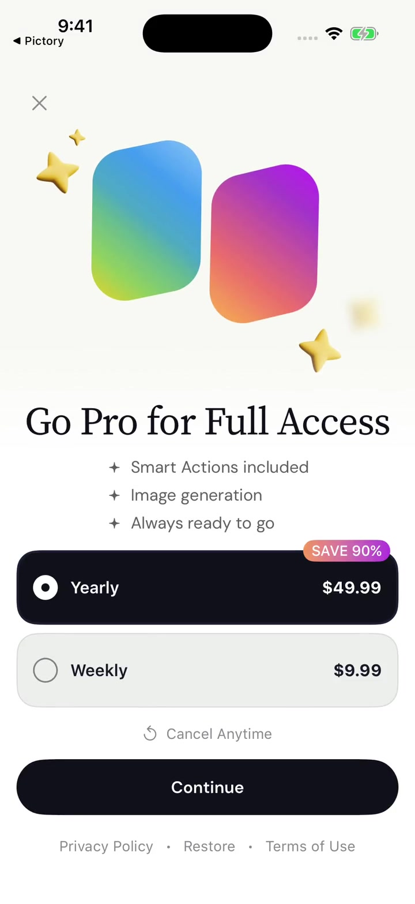

# BroadMonetization

`BroadMonetization` отвечает за **загрузку продуктов, покупку, восстановление и проверку платного доступа**. Готового paywall в модуле нет. Приложение рисует его самостоятельно или подключает [BroadUIFlows](./broad-ui-flows.md).

Например, у приложения свой экран подписки: карточки и кнопку рисует команда приложения, а данные тарифов и результат покупки получает через Monetization.

## Кто за что отвечает

| BroadMonetization | Приложение или BroadUIFlows |
|---|---|
| Получает paywall и продукты от провайдера | Показывает карточки, цены и выбор тарифа |
| Выполняет покупку и Restore | Обрабатывает нажатия, показывает загрузку и результат |
| Проверяет право на доступ — entitlement | Открывает Premium после подтверждения |
| Координирует платёжные операции | Блокирует повторное нажатие на время операции |

Ключ Adapty, имена плейсментов, адреса backend, тексты и правила продукта передаёт приложение. Их не вшивают в общий пакет. Для обычного приложения без входа в аккаунт отдельный сервер идентификации не нужен.

## Как загружаются продукты

Placement ID — имя места показа paywall: например, `onboarding`, `settings` или `pro_icon`. В кабинете Adapty к нему привязывают paywall с продуктами.

1. Модуль получает выбранный paywall плейсмента `main` и его Remote Config.
2. Загружает paywall и продукты нужного плейсмента. Для `main` использует уже полученный paywall.
3. Передаёт интерфейсу весь массив в исходном порядке, сохраняя связь каждой карточки с объектом SDK для покупки.

> [!CAUTION]
> **Общие настройки — из main, продукты — из своего плейсмента.**
> Флаги и RU A/B-коды читаются только из выбранного paywall `main`. Если обычный плейсмент недоступен, используется резервный `main`. Для `tokens` и `special_offer` такая подмена запрещена: у них свои продукты и цены.

Массив Adapty не сокращают, не сортируют и не удаляют из него повторы. Если дизайн предусматривает две карточки, два продукта настраивают в кабинете. Правила выбора серверных RU-продуктов описаны отдельно в [инструкции каталога](./backend-product-catalog.md).



Снимок из 5115 показывает роль интерфейса: он даёт выбрать тариф и запустить действие. Это пример дизайна приложения, а не готовый экран Monetization. Цены относятся к моменту записи; свой экран получает их от провайдера.

Если данные для оплаты получить не удалось, включая подключённый RU-резерв, экран показывает ошибку с повторной попыткой. Бесконечный переход `main → main` недопустим. Полный порядок настройки — в [статье Adapty](./adapty-setup.md).

## Покупка и Restore

Путь покупки: **выбор продукта → нажатие «Купить» → операция → проверка доступа → результат на экране**. Выбор карточки сам по себе ничего не покупает.

> [!CAUTION]
> **Premium открывается только после подтверждения доступа.**
> Нажатие кнопки, промежуточный ответ SDK и возврат из банковского окна не подтверждают покупку. Отмена не открывает Premium, а неизвестный результат требует повторной проверки состояния платежа.

UI сразу показывает загрузку и блокирует второй tap. Для покупки используется тот объект продукта, который соответствует выбранной карточке. После операции модуль проверяет entitlement — право пользователя на платный доступ.

**Restore** восстанавливает доступ к подписке или нерасходуемой покупке Apple. После него также проверяется entitlement: нельзя сообщать об успешном восстановлении, если доступ не подтверждён. Расходуемые токены через Restore не возвращаются — их баланс ведёт backend приложения.

`AppleTransactionUpdatesBridge` помогает подхватить проверенную StoreKit-транзакцию, завершившуюся позже, например после одобрения Ask to Buy. Его подключают один раз на процесс до старта Adapty; завершение транзакции остаётся за провайдером покупок.

## Special Offer, токены и оплата картой

Эти сценарии подключаются по потребностям приложения. Подробные настройки вынесены в отдельные инструкции.

| Сценарий | Главное правило | Инструкция |
|---|---|---|
| Special Offer от Adapty | Только `special_offer == true` из `main`; продукты из отдельного `special_offer`. Окно 24 часа, затем 24 часа cooldown | [Special Offer](./special-offer.md) |
| Пакеты токенов | Backend начисляет покупку один раз и возвращает новый баланс | [Токены](./token-paywall.md) |
| Карта и СБП | Доступность способа и тариф проверяются перед оплатой; итог подтверждает backend | [RU Billing](./ru-billing.md) |
| RU-продукты и резерв | Свежий каталог, правила сопоставления ID и выбора `isDefault` | [Каталог backend](./backend-product-catalog.md) |
| RU Special Offer | Продукт с `isSpecialOffer` из серверного каталога, общий checkout | [RU Special Offer](./ru-special-offer.md) |
| RU A/B | Отдельно подключённый tracker и выбор продуктов варианта | [RU Billing A/B](./ru-billing-ab-platform.md) |

Для Special Offer одного флага недостаточно: проверяются окно показа, cooldown и отсутствие подтверждённой покупки. При загрузке оффера `main` обновляется ещё раз — более новый запрет отменяет разрешение.

Для цены за неделю и сравнения тарифов есть `ProductPricePresenter`. Он рассчитывает числовые значения по ценам и периодам продуктов и сравнивает экономию только в одной валюте; UI форматирует подписи. Если данных недостаточно, расчёт не добавляется. В приложениях BroadApps нет бесплатного trial — не добавляйте его в интерфейс или логику покупки.

## Как подключить

В Xcode откройте **File → Add Package Dependencies…**, добавьте репозиторий и выберите product **BroadMonetization**:

```text
https://github.com/BroadApps-official/broad-monetization-ios.git
```

```swift
import BroadMonetization
```

Вместе с модулем загружаются Core, Adapty и Swinject. Точные версии возьмите из [проверенного набора](./compatibility.md), затем настройте [ключ и плейсменты Adapty](./adapty-setup.md). Подключение одного пакета ещё не настраивает оплату приложения.

Если нужен готовый SwiftUI paywall, начните с BroadUIFlows. Если свой код напрямую импортирует Monetization, его product тоже должен быть доступен этому target.

## Как проверять без списаний

В Debug можно явно подключить `LocalStoreKitPurchaseRepository` и `LocalStoreKitRestoreRepository` с локальным файлом `.storekit` в схеме Xcode. Идентификаторы продуктов в нём должны совпадать с каталогом.

Этот путь создаёт локальные StoreKit-транзакции и позволяет проверить реакцию приложения без реальных денег. Он **не проверяет боевую валидацию чеков Adapty, банковский checkout или серверное начисление**. Сам по себе режим Debug не переключает приложение на локальную оплату. Эти типы не входят в Release.

## Что проверить

1. Ноль, один и несколько продуктов: порядок и связь выбранной карточки с покупкой сохраняются.
2. Двойное нажатие не создаёт вторую операцию; отмена, ошибка и неизвестный результат различаются.
3. Покупка и Restore открывают доступ только после проверки entitlement.
4. Настройки читаются из `main`; обычный fallback не подменяет `tokens` и `special_offer`.
5. В логах нет ключей, чеков, платёжных ссылок и полных ответов SDK.

[Подключение Adapty с кодом](./adapty-integration-guide.md) · [Экран подписки](./paywall-ui.md) · [README и API](https://github.com/BroadApps-official/broad-monetization-ios)
