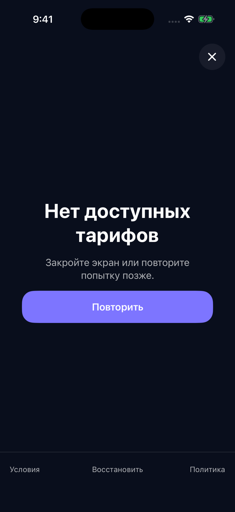
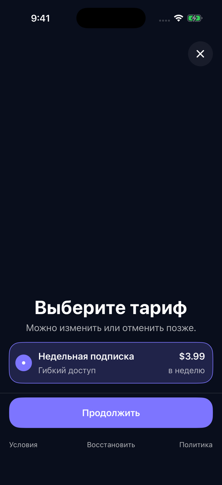
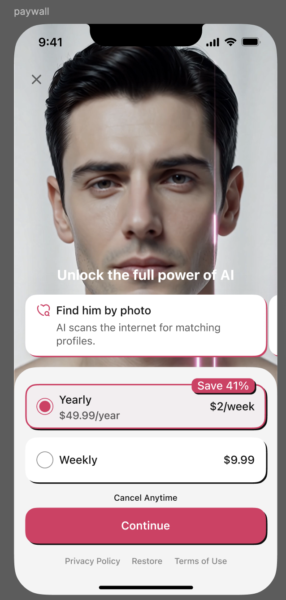

# BroadUIFlows

`BroadUIFlows` — это **готовый интерфейс на SwiftUI**: экраны, их состояния и переходы между ними. Если пользователю нужно увидеть onboarding, paywall, загрузку, ошибку или выбор способа оплаты, это верхний модуль платформы.

> Пример: приложению нужен готовый экран подписки. Разработчик подключает `BroadUIFlows`, передаёт тексты, изображения, цвета, юридические ссылки и данные продуктов. Модуль строит экран и возвращает результат: пользователь закрыл его, купил продукт или восстановил покупку.

## Что именно увидит пользователь

Это не абстрактный «UI-слой». Ниже — реальные состояния Gallery, на которых проверяется поведение готовых компонентов.


В ответе Adapty может оказаться любое количество продуктов. UIFlows не предполагает, что тарифов всегда два: при нуле он показывает понятное пустое состояние, при одном — одну полноценную карточку, при нескольких — весь список в исходном порядке.






> Важно: это эталон поведения компонентов, а не обязательный дизайн приложения. Фон, тексты, изображения, цвета, цены и юридические ссылки передаёт конкретное приложение.

## Зачем нужен отдельный UI-модуль

Без UIFlows каждое приложение заново решает одинаковые задачи: как показать загрузку без мигания, что делать при пустом ответе, как заблокировать двойное нажатие во время покупки, когда показать запрос Apple и куда перейти после закрытия paywall.

UIFlows собирает эти повторяющиеся решения в готовые SwiftUI-компоненты. Разработчик приложения сохраняет контроль над брендом и продуктовым сценарием, но не пишет заново механику каждого состояния.

| Вопрос | Кто отвечает |
|---|---|
| Как выглядит карточка, кнопка, loader и ошибка | `BroadUIFlows` даёт готовый компонент, приложение передаёт тему и содержимое |
| Какие продукты доступны и сколько их | Adapty возвращает данные через `BroadMonetization` |
| Как реально выполнить purchase или restore | `BroadMonetization` |
| Какой текст, фон, иллюстрация и legal URL использовать | Приложение |
| Когда открыть главный экран приложения | Приложение задаёт маршрут, UIFlows исполняет переход |

## Какие готовые части есть в модуле

### Первые экраны и переход в приложение

`BroadOnboardingView` показывает стандартный onboarding. Количество страниц не зашито: приложение передаёт массив `OnboardingConfiguration.pages`, поэтому экранов может быть 1, 3, 8 или сколько требуется продукту.

`BroadOnboardingFlowHost` нужен, когда дизайн onboarding полностью уникальный. В этом случае приложение рисует экран само, а модуль сохраняет правильный жизненный цикл и момент запроса ATT — App Tracking Transparency, системного разрешения Apple на отслеживание.


### Загрузка, данные, пустой ответ и ошибка

`BroadLoadableView` связывает состояние из `BroadCore` с понятным интерфейсом:

| Состояние | Что видит человек | Что может сделать |
|---|---|---|
| Первая загрузка | Loader вместо пустого экрана | Дождаться ответа или закрыть разрешённый сценарий |
| Данные загружены | Основной контент | Работать с экраном |
| Данных нет | Объяснение, почему список пуст | Повторить или перейти назад |
| Ошибка без старых данных | Сообщение и кнопка повтора | Retry или Close |
| Обновление существующих данных | Старый контент остаётся, поверх виден индикатор | Продолжать чтение; повторное действие блокируется |
| Есть допустимый старый кеш | Контент и аккуратное предупреждение | Обновить позже |

### Экран подписки

`BroadPaywallView` принимает уже загруженные продукты и показывает их **все**. Он не фильтрует, не сортирует и не оставляет только первые два. Если конкретному приложению нужны ровно две карточки, это отдельное продуктовое решение самого приложения.

Пока purchase выполняется, выбранная карточка остаётся на месте, поверх появляется loader, а повторное нажатие блокируется.


### Special Offer

Спешл оффер от Adapty — второй экран оплаты, который можно показать только после закрытия первого paywall без покупки. Его разрешает флаг `special_offer = true` в данных фактически загруженного placement Adapty.




Таймер `24:00:00 → 00:00:00 → 24:00:00` — пока только визуальный цикл, жёстко заданный платформой. Ноль не скрывает уже показанный экран и не запрещает покупку. Настраиваемую длительность и серверное расписание оставляем на будущее.

### Покупка токенов

`BroadTokenPaywallView` показывает 0, 1 или N расходуемых пакетов. Тексты, цены, картинка, скидка и сами product ID принадлежат приложению и provider-настройке.


Локальный callback покупки ещё не означает, что баланс начислен. Экран обновляет баланс после полного подтверждённого ответа backend приложения.

### Оплата картой и СБП

UIFlows содержит отдельные интерфейсные заготовки для выбора способа оплаты и
управления российской подпиской. Экран сам не читает `ru_pay`, Storefront,
регион или backend-флаг: он показывает только методы, уже разрешённые
`BroadMonetization`. Backend URL/auth, legal-тексты и дизайн остаются в
приложении. Текущий gate и порядок подтверждения разобраны в
[RU Billing guide](./ru-billing.md), продукты — в
[инструкции backend-каталога](./backend-product-catalog.md).

## Как проходит один сценарий от запуска до результата

1. Приложение создаёт конфигурацию: страницы onboarding, тема, тексты, изображения, legal URL и имена placements.
2. UIFlows показывает первый реально видимый экран.
3. Если нужен ATT, запрос Apple планируется только после появления этого экрана и только пока сценарий ещё активен.
4. `BroadMonetization` получает данные указанного placement и все продукты Adapty.
5. UIFlows превращает полученное состояние в loader, пустой экран, ошибку или готовый paywall.
6. При нажатии покупки UIFlows сразу показывает занятое состояние и блокирует второй tap.
7. `BroadMonetization` выполняет операцию и заново проверяет Premium.
8. UIFlows переходит в основное приложение только после подтверждённого результата.

> Важно: UIFlows сам не активирует Adapty, не создаёт сетевой запрос внутри `View` и не объявляет покупку успешной. Он показывает состояние и вызывает переданные действия.

## Что передаёт приложение

Приложение остаётся владельцем всего, что отличает один продукт от другого:

- текста заголовков, кнопок, ошибок и пустых состояний;
- изображений, логотипа, фона, цветов и шрифтов;
- публичного ключа Adapty и имён placements;
- юридических ссылок и текста согласий;
- порядка бизнес-сценариев и решения, нужен ли Special Offer;
- server URL и правил RU Billing;
- реакции на финальный результат: показать main, закрыть sheet или обновить профиль.

## Что подключить в Xcode

Добавьте один публичный адрес:

```text
https://github.com/BroadApps-official/broad-ui-flows-ios.git
```

Выберите product `BroadUIFlows` для основного iPhone target. Swift Package Manager автоматически загрузит совместимые `BroadMonetization`, `BroadCore`, Adapty и Swinject. Не добавляйте их повторно, если приложение не импортирует их API напрямую.

Текущая проверенная версия — [`1.0.0`](https://github.com/BroadApps-official/broad-ui-flows-ios/releases/tag/1.0.0).

## Как выбрать точную точку входа

| Нужен результат | Начните с |
|---|---|
| Стандартный onboarding | `BroadOnboardingView` |
| Полностью свой onboarding, но правильный lifecycle и ATT | `BroadOnboardingFlowHost` |
| Любой экран со loading/content/empty/error/stale | `BroadLoadableView` |
| Готовый экран подписки | `BroadPaywallView` |
| Готовый экран пакетов токенов | `BroadTokenPaywallView` |
| Единый маршрут onboarding → paywall → main | `BroadAppFlowView` и `AppFlowCoordinator` |
| Управление российской подпиской | `BroadRUSubscriptionManagementView` после готового backend-контракта |

## Как проверить интеграцию

1. Откройте Gallery модуля и сравните нужное состояние с экраном приложения.
2. Проверьте 0, 1 и несколько продуктов — все три состояния должны выглядеть осмысленно.
3. Включите медленную сеть: старый контент не должен исчезать во время refresh или purchase.
4. Быстро нажмите кнопку покупки дважды: вторая операция не должна стартовать.
5. Закройте первый paywall без покупки: спешл оффер Adapty появляется только при `special_offer = true`.
6. Завершите purchase или restore: main открывается только после повторной проверки Premium.
7. Проверьте длинные русские строки, Dynamic Type и небольшой iPhone.

## Что Gallery доказывает, а что нет

Gallery компилирует настоящие production-компоненты и показывает их состояния на iPhone Simulator. Она доказывает, что layout существует и адаптируется к данным. Fixture-продукты в Gallery не проводят настоящую покупку, restore или RU payment и не заменяют проверку приложения с его Adapty dashboard и backend.

[Первые экраны и ATT](./onboarding-att.md) · [Экран подписки](./paywall-ui.md) · [Спешл оффер (от Adapty)](./special-offer.md) · [Оплата картой и СБП](./ru-billing.md) · [README и точный API модуля](https://github.com/BroadApps-official/broad-ui-flows-ios)
