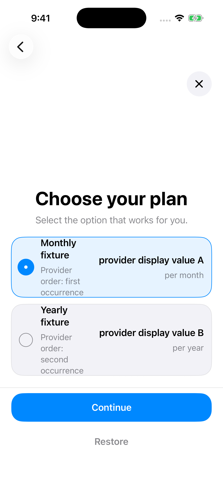
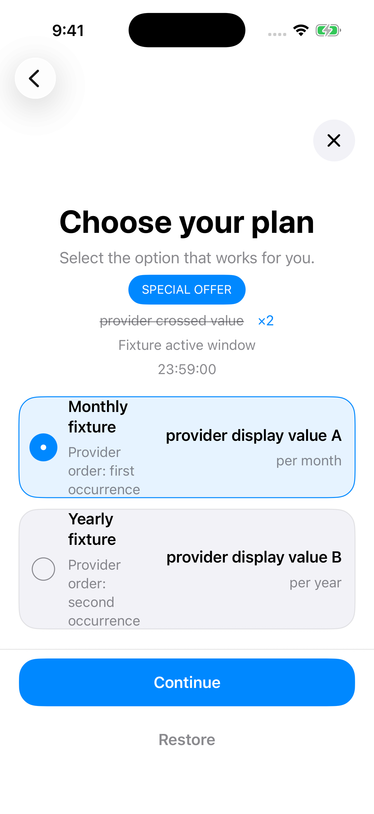
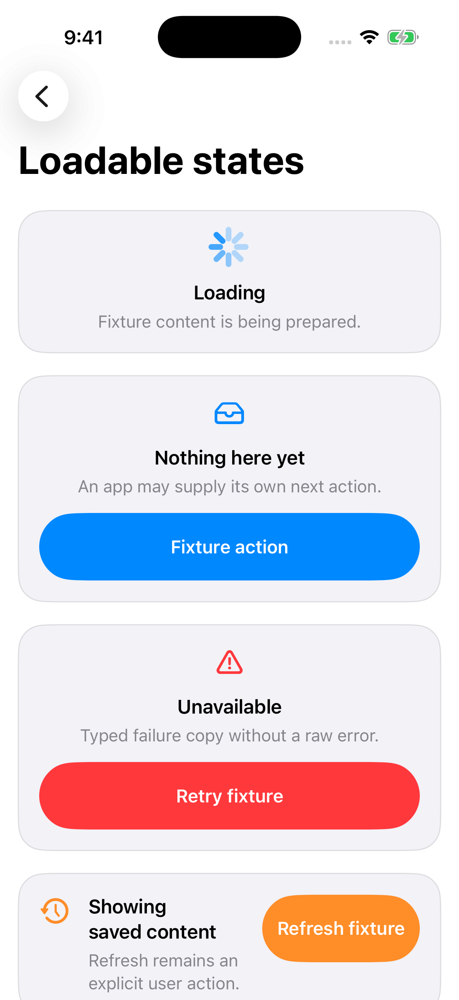

# BroadUIFlows

`BroadUIFlows` — **готовые SwiftUI-экраны и переходы**: онбординг, paywall, Special Offer, загрузка, ошибка и пустой результат. Приложение передаёт тексты, изображения и настройки, а библиотека помогает собрать пользовательский маршрут.

Покупки и проверку Premium выполняет [BroadMonetization](./broad-monetization.md). UIFlows показывает состояние этой работы: выбор тарифа, загрузку, отмену, ошибку или подтверждённый доступ.

## Как выглядит готовый маршрут

Один из вариантов первого запуска: **онбординг → paywall → главный экран приложения**. Если человек закрывает paywall без покупки и оффер разрешён, перед главным экраном появляется Special Offer.

Приложение само задаёт переходы и условия доступа. Готовые экраны можно посмотреть отдельно в **BroadUIFlowsGallery**. Ниже — новые снимки из этого примера: обычный paywall, Special Offer и состояния данных.





Gallery работает на демонстрационных данных без активации Adapty и финансовых операций. Слова `fixture` и `provider display value` — технические заглушки. В приложении вместо них должны быть ваши тексты и реальные цены провайдера. Эти снимки показывают состав компонентов, а оформление вы настраиваете под свой дизайн.

## Какие компоненты использовать

| Задача | Компонент |
|---|---|
| Показать переданные страницы онбординга | `BroadOnboardingView` |
| Сохранить управление онбордингом при своём дизайне | `BroadOnboardingFlowHost` |
| Отобразить загрузку, контент, ошибку, пустой результат или старые данные | `BroadLoadableView` |
| Показать подписки и выбор тарифа | `BroadPaywallView` |
| Показать расходуемые пакеты токенов | `BroadTokenPaywallView` |
| Связать онбординг, paywall и главный экран | `BroadAppFlowView` |
| Дать управление RU-подпиской при подключённом backend | `BroadRUSubscriptionManagementView` |

Экран настроек собирается под приложение: состав разделов и переходы задаёт оно само. Для письма в поддержку есть `BroadSupportEmailComposer`, который открывает системный редактор письма; отправку подтверждает пользователь.

## Правила поведения

> [!CAUTION]
> **Выбор тарифа не запускает покупку.**
> Нажатие на карточку меняет выбранный продукт. Покупка начинается отдельной кнопкой; на время операции интерфейс показывает загрузку и блокирует повторное нажатие. Все полученные продукты должны оставаться доступны пользователю.

После подтверждённой покупки или Restore приложение продолжает маршрут с Premium. При закрытии paywall без покупки дальнейший путь зависит от правил приложения: закрытие экрана само по себе не даёт платный доступ.

> [!CAUTION]
> **Special Offer показывается только по разрешённому сценарию.**
> Нужен точный булев `special_offer == true` из выбранного paywall `main` и активное окно показа. Окно длится 24 часа, затем идут 24 часа cooldown. Продукты Adapty загружаются из отдельного плейсмента `special_offer`; продуктами `main` их не заменяют.

Когда таймер доходит до нуля, экран оффера закрывается. Подтверждённая покупка, Restore или выключение флага сбрасывают цикл. Полный порядок — в [статье Special Offer](./special-offer.md).

Загрузка, отмена и ошибка должны быть различимы. Ошибка предлагает понятное следующее действие, например повторить или закрыть. Поддержка открывает согласованный канал связи; письмо не отправляется без действия пользователя.

## Как подключить

В Xcode откройте **File → Add Package Dependencies…**, добавьте репозиторий и выберите product **BroadUIFlows** для iPhone target:

```text
https://github.com/BroadApps-official/broad-ui-flows-ios.git
```

```swift
import BroadUIFlows
```

Xcode также загрузит Monetization, Core, Adapty и Swinject. Отдельные products нужны target, если код напрямую импортирует их API. Версии выбирайте по [проверенному набору платформы](./compatibility.md).

Дальше передайте экранам конфигурацию приложения и подключите действия к его логике. Для платёжных экранов предварительно настройте [Adapty](./adapty-setup.md); для RU-оплаты нужен соответствующий backend. Одна установка UIFlows не настраивает эти сервисы.

В репозитории есть пример **BroadUIFlowsGallery**. Используйте его для знакомства с компонентами, а свой маршрут проверяйте в приложении: Gallery не подтверждает работу реальной покупки или RU checkout.

## Где посмотреть больше примеров

| Нужно разобраться | Откройте |
|---|---|
| Страницы онбординга, завершение и переход к подписке | [Онбординг: полные проходы](./ui-flows-onboarding.md) |
| Тарифы, покупка и отдельный экран оффера | [Paywall и Special Offer](./ui-flows-paywall.md) |
| Настройки, письмо, чат и действия при недоступной почте | [Настройки и поддержка](./ui-flows-settings-support.md) |
| Состояния загрузки и повтор после ошибки | [Запуск, ошибки и восстановление](./runtime-reliability.md) |

## Что проверить

1. Пройти онбординг до конца и отдельно проверить закрытие paywall без покупки.
2. Показать ноль, один и несколько продуктов; переключать карточки без запуска покупки.
3. Дважды нажать кнопку покупки: активная операция должна остаться одна.
4. Проверить разрешённый оффер, запрет флага и завершение таймера.
5. Открыть настройки, Restore, поддержку и ссылки на документы; убедиться, что можно вернуться.

[README и API](https://github.com/BroadApps-official/broad-ui-flows-ios) · [Платёжная логика](./broad-monetization.md) · [Как устроена платформа](./architecture.md)
