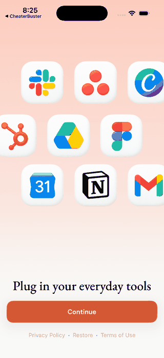

# BroadUIFlows

`BroadUIFlows` — библиотека готовых пользовательских экранов и переходов на
SwiftUI. Она нужна там, где человек **что-то видит и нажимает**: первые экраны,
paywall, Special Offer, loading, error, empty state и часть стандартных
настроек.

## Почему paywall находится здесь

Paywall состоит из двух разных частей:

```text
ВНЕШНИЙ ВИД И НАЖАТИЯ          ДЕНЬГИ И ПОДТВЕРЖДЕНИЕ
BroadUIFlows                   BroadMonetization

карточки продуктов             загрузка продуктов
выбранная карточка             purchase / restore
кнопка Continue                entitlement / backend status
loader и ошибка                подтверждённый Premium
```

Поэтому экран находится в UIFlows, а финансовая операция — в Monetization.
UIFlows не активирует Adapty, не создаёт checkout и не объявляет покупку
успешной.

## Один полный путь на экране

```text
ЗАПУСК
  ↓
ОНБОРДИНГ ── последняя страница ──→ ОБЫЧНЫЙ PAYWALL
                                             ├─ purchase / restore подтверждены → ГЛАВНЫЙ ЭКРАН ПРИЛОЖЕНИЯ
                                             └─ закрыт без покупки
                                                       ↓ если разрешено
                                                SPECIAL OFFER
                                                       ├─ подтверждён Premium → ГЛАВНЫЙ ЭКРАН ПРИЛОЖЕНИЯ
                                                       └─ закрыт → ГЛАВНЫЙ ЭКРАН ПРИЛОЖЕНИЯ

ГЛАВНЫЙ ЭКРАН ПРИЛОЖЕНИЯ → SETTINGS → Upgrade / Restore / Support / Legal
```



Это пример последовательности, а не готовый дизайн для копирования.
BroadUIFlows задаёт роли экранов и переходы между ними. Тексты, изображения,
цвета, число страниц и состав настроек выбирает конкретное приложение.

## Откройте нужный визуальный раздел

| Что хотите увидеть | Отдельная страница |
|---|---|
| Первые экраны, количество шагов и завершение | [Онбординг](./ui-flows-onboarding.md) |
| Выбор продукта, обычный paywall и Special Offer | [Paywall и Special Offer](./ui-flows-paywall.md) |
| Upgrade, Restore, Support, письмо и legal | [Настройки и поддержка](./ui-flows-settings-support.md) |

## Что уже есть в библиотеке

| Компонент | Что делает |
|---|---|
| `BroadOnboardingView` | показывает любое число переданных страниц |
| `BroadOnboardingFlowHost` | сохраняет lifecycle для полностью своего дизайна |
| `BroadLoadableView` | показывает loading, content, empty, error и stale data |
| `BroadPaywallView` | показывает все полученные продукты и выбранное состояние |
| `BroadTokenPaywallView` | показывает пакеты расходуемых токенов |
| `BroadAppFlowView` | связывает onboarding, paywall и главный экран приложения |
| `BroadRUSubscriptionManagementView` | даёт UI управления RU-подпиской при готовом backend-контракте |

## Кто за что отвечает

| Вопрос | Владелец |
|---|---|
| Как выглядит экран и его состояния | BroadUIFlows + тема приложения |
| Какие продукты и цены пришли | Adapty или backend через BroadMonetization |
| Как выполнить purchase или restore | BroadMonetization |
| Тексты, изображения, цвета и legal URL | конкретное приложение |
| Когда открыть экран | продуктовый маршрут приложения |
| Когда открыть Premium | подтверждённый entitlement или backend status |

## Что подключить

```text
https://github.com/BroadApps-official/broad-ui-flows-ios.git
```

Выберите product `BroadUIFlows` в iPhone target. Совместимые Monetization, Core,
Adapty и Swinject загрузятся автоматически. Не добавляйте их повторно, если
приложение не импортирует их API напрямую.

Текущая проверенная версия — [`1.0.1`](https://github.com/BroadApps-official/broad-ui-flows-ios/releases/tag/1.0.1).

## Стандарт, который должен сохраняться при любом дизайне

| Часть пути | Обязательное поведение |
|---|---|
| Онбординг | показывает переданные страницы по порядку и завершает маршрут один раз |
| Обычный paywall | показывает все продукты платёжного слоя и не покупает при выборе карточки |
| Special Offer | после закрытия обычного paywall точный булев флаг `true` показывает второй экран; циклический таймер только визуальный и не ограничивает показ или покупку |
| Главный экран приложения | открывается после завершения бесплатного пути или подтверждённого Premium |
| Settings | явно разделяет Upgrade, Restore, Support, legal и управление подпиской |
| Support | готовит обращение или открывает согласованный чат, но ничего не отправляет скрытно |

Внешний вид может быть любым. Если меняется одно из действий в правой колонке,
это уже изменение продуктового контракта, а не просто новый дизайн.

## Базовая проверка интеграции

1. Пройдите весь путь onboarding → paywall → главный экран приложения.
2. Проверьте 0, 1 и несколько продуктов.
3. Переключите каждую карточку без запуска покупки.
4. Дважды быстро нажмите Continue: операция должна остаться одна.
5. Закройте paywall без покупки и проверьте разрешение Special Offer.
6. Откройте settings, Restore, Support и legal-ссылки.
7. Настоящую покупку, restore или RU checkout не выполняйте в Gallery.

[README и API модуля](https://github.com/BroadApps-official/broad-ui-flows-ios) · [Платёжная логика](./broad-monetization.md) · [Как устроена платформа](./architecture.md)
