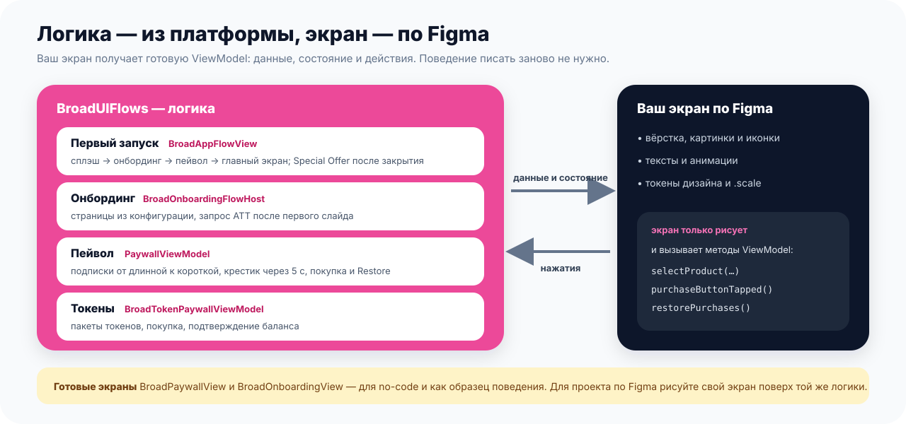

# BroadUIFlows

**Логика экранов, которые есть в каждом приложении:** первый запуск, онбординг, пейвол,
покупка токенов, настройки и алерт обновления. Экран по Figma вы рисуете сами, а хост отдаёт ему готовые данные
и действия. **Экран = только вёрстка**: поведение писать заново не нужно.



## Если работаете через агента

**Про BroadUIFlows агенту ничего говорить не нужно.** Если он запущен по
[инструкции для нового приложения](./new-app.md#что-отправить-агенту) и поставил
правила BroadApps, он сам подключит модуль и нарисует экраны поверх готовой логики.
От вас — ссылки на кадры Figma и проверка результата.

Попросите экран так:

```text
Сверстай <онбординг / пейвол / спецоффер / покупку токенов / настройки> по кадрам Figma: <ссылки>.
```

Потом проверьте в симуляторе по списку [«Что проверить»](#что-проверить) внизу
страницы. Если что-то не так, ответьте агенту одной фразой:

| Видите | Скажите агенту |
|---|---|
| Агент пишет свою покупку, сортировку тарифов или таймер крестика | «Экран — только вёрстка поверх хоста BroadUIFlows, логику не пиши» |
| Тарифы идут не от длинного к короткому или выбран не самый длинный | «Порядок и выбор тарифа — из `screen.plans`, сам не сортируй» |
| У спецоффера несколько карточек или можно выбирать | «Спецоффер — одна карточка `screen.specialOfferPlan`» |
| Пейвол с кнопки PRO выезжает пустым, потом прыгает | «Загрузи пейвол PRO заранее через `BroadPaywallPreloader`» |
| Вместо названия тарифа — ID продукта (`yearly_59.99_nottrial`) | «Название тарифа бери из `plan.name` / `package.name`, не из `title`» |

Ниже — как это устроено, для тех, кто пишет код руками или хочет понять, что делает
агент.

## Что брать

| Сценарий | Что подключить | Что уже работает |
|---|---|---|
| Первый запуск | `BroadAppFlowView` | Сплэш → онбординг → пейвол → главный экран; Special Offer после закрытия пейвола |
| Онбординг | `BroadOnboardingFlowHost` | Страницы из `OnboardingConfiguration.pages`, запрос ATT после первого слайда |
| Пейвол и Special Offer | `BroadPaywallHost` | Подписки от длинной к короткой, выбрана самая длинная, цена за неделю и экономия, крестик через 5 с, покупка и Restore без двойного нажатия, таймер оффера, ссылки на документы |
| Токены | `BroadTokenPaywallHost` | Пакеты, покупка и зачисление, баланс с сервера, безопасная проверка покупки без повторного списания |
| Настройки | `BroadSettingsHost` | Restore, пейвол подписки (без отмены и App Store), документы, письмо в поддержку, копирование ID, оценка, «поделиться»; одно касание за раз |
| Алерт обновления | `.broadAppUpdateAlert(checker)` | На главном табе: новая версия в App Store → «Отмена» / «Обновить»; первый запуск молчит |
| Загрузка и ошибки | `BroadLoadableView` | Загрузка, пустой ответ, ошибка с повтором |

## Свой экран пейвола

Хост ведёт всю логику и отдаёт экрану готовый `screen`. Экран его только раскладывает.

```swift
BroadPaywallHost(viewModel: viewModel, onClose: close, onCompleted: finish) { screen in
    MyPaywall(screen: screen)
}
```

```swift
struct MyPaywall: View {
    let screen: BroadPaywallScreen

    var body: some View {
        ForEach(screen.plans) { plan in
            PlanRow(plan: plan) // plan.name, plan.price, plan.weeklyPrice, plan.savingsPercent, plan.isSelected
                .contentShape(Rectangle())
                .onTapGesture { screen.select(plan) }
        }
        Button("Продолжить") { screen.purchase() }
            .disabled(!screen.canPurchase)
        Button("Восстановить") { screen.restore() }
        if let message = screen.noticeMessage { Text(message) }
        if screen.canClose { CloseButton { screen.close() } }
    }
}
```

| `screen` даёт | Что это |
|---|---|
| `content` | `.loading`, `.plans`, `.empty`, `.failed(error)` — что показать |
| `plans` | Тарифы в порядке показа: название `name` («Yearly», «Weekly»), цена, цена за неделю, % экономии, `isBestValue`, `isSelected` |
| `activity` | `.idle`, `.purchasing`, `.restoring` — для лоадера на кнопке |
| `notice`, `noticeMessage` | Итог покупки или Restore и готовый текст к нему |
| `canPurchase`, `canClose` | Когда кнопка покупки активна и когда показать крестик |
| `legalLinks`, `specialOfferEndsAt` | Privacy и Terms (`screen.open(link)`), конец окна оффера для таймера |

> [!TIP]
> **Превью без Adapty.** `MyPaywall(screen: .preview(.purchasing))` рисует экран в любом
> состоянии: `.plans`, `.loading`, `.pending`, `.failed`, `.specialOffer` и другие.

> Важно: не сортируйте тарифы, не выбирайте тариф при открытии и не считайте цену за
> неделю сами — всё это уже в `screen.plans`. Название тарифа тоже готовое: `plan.name` собрано
> из периода, `package.name` — из количества токенов. Не показывайте `title`: это имя
> из App Store, а менеджер обычно пишет туда ID товара.

## Остальные хосты — так же

Каждый хост отдаёт экрану готовый `screen`. Экран только раскладывает его.

```swift
BroadTokenPaywallHost(viewModel: tokens, tokenAmount: { amounts[$0.productID.rawValue] }, onClose: close) { screen in
    MyTokenStore(screen: screen)   // screen.packages (package.name — «2000 Tokens»), balanceText, purchase(), confirm()
}

BroadSettingsHost(configuration: settings, restorePurchases: restore,
                  showPaywall: { router.showPaywall(placement: .settings) }) { screen in
    MySettings(screen: screen)     // screen.restore(), showPaywall(), contactSupport() …
}

MainTabView()
    .broadAppUpdateAlert(updateChecker) // @StateObject var updateChecker = BroadAppUpdateChecker()
```

В настройках нет отмены подписки: «Get Pro», статус и «Manage subscription» вызывают
`showPaywall()` / `manageSubscription()`, и хост открывает пейвол через `showPaywall`.
Страница подписок App Store не открывается. Обработчик `showPaywall` обязателен —
это BroadUIFlows после 6.5.0 (Unreleased); в 6.5.0 его нет.

> [!CAUTION]
> **Токены: `confirm()`, а не вторая покупка.** Если покупка ждёт подтверждения,
> `screen.needsConfirmation == true` — главная кнопка вызывает `screen.confirm()`.
> Он проверяет сохранённую покупку и никогда не списывает деньги повторно.

Превью любого состояния без Adapty и сети: `BroadTokenPaywallScreen.preview(.pending)`,
`BroadSettingsScreen.preview(.restored)`, `BroadAppUpdateChecker.preview(.updateAvailable)`.

## Готовые экраны

`BroadPaywallView`, `BroadOnboardingView` и `BroadTokenPaywallView` — готовые экраны с
темой. Они подходят для no-code-приложения и как образец поведения. Для проекта по
Figma рисуйте свой экран поверх той же логики.

## Правила поведения

> [!CAUTION]
> **Выбор тарифа не запускает покупку.**
> Нажатие на карточку выбирает тариф. Покупка — отдельной кнопкой; пока она идёт,
> повторное нажатие заблокировано.

> [!CAUTION]
> **Special Offer — только по разрешению.**
> Нужен строгий `special_offer == true` и активное окно: 24 часа показа, затем 24 часа
> перерыва. Продукты — из отдельного плейсмента `special_offer`. [Подробнее](./special-offer.md).

Покупка и Restore открывают Premium только после подтверждения доступа.

## Как подключить

В Xcode: **File → Add Package Dependencies…** → адрес ниже → product **BroadUIFlows**.
Версию берите из [проверенного набора](./compatibility.md). Для пейвола сначала
настройте [Adapty](./adapty-setup.md); RU-оплата — отдельный пакет
[BroadRUBilling](./ru-billing.md).

```text
https://github.com/BroadApps-official/broad-ui-flows-ios.git
```

## Где посмотреть больше примеров

| Нужно разобраться | Откройте |
|---|---|
| Страницы онбординга, завершение и переход к подписке | [Онбординг: полные проходы](./ui-flows-onboarding.md) |
| Тарифы, покупка и отдельный экран оффера | [Paywall и Special Offer](./ui-flows-paywall.md) |
| Настройки, письмо, чат и действия при недоступной почте | [Настройки и поддержка](./ui-flows-settings-support.md) |
| Состояния загрузки и повтор после ошибки | [Запуск, ошибки и восстановление](./runtime-reliability.md) |

## Что проверить

1. Пройти онбординг до конца и отдельно проверить закрытие пейвола без покупки.
2. Показать ноль, один и несколько тарифов: сверху самая длинная подписка, она же выбрана.
3. Дважды нажать кнопку покупки: активная операция должна остаться одна.
4. Проверить разрешённый оффер, запрет флага и завершение таймера.
5. Открыть настройки, Restore, поддержку и ссылки на документы; убедиться, что можно вернуться.
   Нажать две строки настроек одновременно — сработает одна.
6. Токены: купить пакет, дождаться зачисления; в состоянии «ждёт подтверждения» кнопка
   проверяет покупку, а не покупает заново.
7. Алерт обновления: первый запуск — без алерта; версия в App Store выше — алерт на
   главном табе; без сети — без алерта.

[README и API](https://github.com/BroadApps-official/broad-ui-flows-ios) · [Платёжная логика](./broad-monetization.md) · [Как устроена платформа](./architecture.md)
