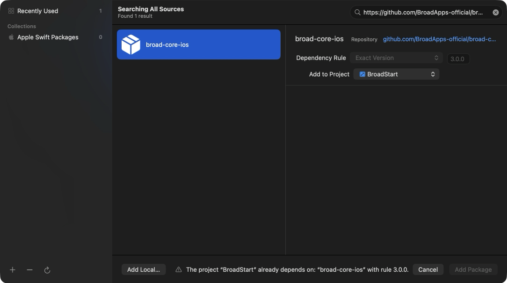

# Какие версии ставить

Для нового подключения используйте точные версии из набора 6.5.0. Подключайте только нужные продукты; integration repository не добавляется в приложение.

**На наборе 6.4.0?** Обновите BroadUIFlows до 6.5.0: появились готовые английские
тексты токен-пейвола, задержка крестика через `closeDelay`, а фоновая сверка баланса
больше не показывает уведомление. Остальные пакеты не меняйте.

**На наборе 6.3.0?** Обновите BroadUIFlows до 6.5.0 и BroadMonetization до 5.2.1:
спецоффер показывает одну карточку (`screen.specialOfferPlan`); учтите и изменения
токен-пейвола из 6.5.0. **На 6.2.0?** Те же версии: ещё спецоффер сразу по крестику,
пейвол с кнопки PRO уже с тарифами, зачёркнутая цена оффера считается сама.
**На 6.0.0 или 6.1.0?** Те же версии; свои экраны пейвола, токенов и настроек рисуются
внутри хостов, появился алерт обновления. **На 5.1.x?** Те же версии и RU Billing 1.0.1.
**На наборе 5.0.0?** Сначала перейдите на 5.1.0. Ниже есть шаги для Xcode.

Источник — [Compatibility/current.yml набора 6.5.0](https://github.com/BroadApps-official/broad-platform-integration/blob/6.5.0/Compatibility/current.yml).

## Текущий проверенный набор

| Пакет | Версия | Назначение |
|---|---|---|
| [BroadCore](https://github.com/BroadApps-official/broad-core-ios/releases/tag/3.0.0) | `3.0.0` | Общие состояния, логирование, Keychain ID |
| [BroadExtensions](https://github.com/BroadApps-official/broad-extensions-ios/releases/tag/1.0.1) | `1.0.1` | Независимые утилиты |
| [BroadMonetization](https://github.com/BroadApps-official/broad-monetization-ios/releases/tag/5.2.1) | `5.2.1` | Adapty, Apple purchase/restore, доступ, токены, спецоффер |
| [BroadUIFlows](https://github.com/BroadApps-official/broad-ui-flows-ios/releases/tag/6.5.0) | `6.5.0` | Логика онбординга, пейвола, токенов и настроек; хосты для своих экранов |
| [BroadRUBilling](https://github.com/BroadApps-official/broad-ru-billing-ios/releases/tag/1.0.1) | `1.0.1` | Опциональные products `BroadRUBilling` и `BroadRUBillingUI` |

Минимальная iOS — 17.0, устройство — iPhone, Swift language mode — 5, Swift tools — 6.0. Номер platform set **6.5.0** обозначает сочетание пакетов, а не общий runtime package.

## Обновление с набора 6.4.0 на 6.5.0

1. В Xcode → **Package Dependencies**: **BroadUIFlows** — Exact Version **6.5.0**.
   Core 3.0.0, Extensions 1.0.1, Monetization 5.2.1 и опциональный RU Billing
   1.0.1 не меняйте. Код на 6.4.0 компилируется без правок.
2. **File → Packages → Resolve Package Versions**, сохраните `Package.resolved`.
3. В английском приложении свой набор текстов токен-пейвола можно заменить на
   `BroadTokenPaywallCopy.english` (или `.standard`).
4. Если задержку крестика токен-пейвола ведёт свой таймер во view, замените его на
   `BroadTokenPaywallConfiguration(closeDelay:)`: хост и готовый экран учитывают
   задержку сами. По умолчанию `closeDelay` равен 0.
5. Если приложение скрывает уведомление «баланс актуален» при открытии
   токен-пейвола, уберите эту обработку. Автоматическая сверка баланса больше не
   выставляет notice; уведомление о результате показывается только после ручного
   обновления (Restore).

## Обновление с набора 6.3.0 на 6.5.0

1. В Xcode → **Package Dependencies**: **BroadUIFlows** — Exact Version **6.5.0**,
   **BroadMonetization** — **5.2.1**. Остальные пакеты не меняйте.
2. **File → Packages → Resolve Package Versions**, сохраните `Package.resolved`.
3. Свой экран спецоффера рисует одну карточку `screen.specialOfferPlan` и заголовок
   скидки из неё же; выбор тарифа на оффере уберите — хост сам выбирает эту карточку.
4. Для английских текстов токен-пейвола, задержки крестика и уведомления о балансе
   выполните шаги 3–5 [перехода с 6.4.0](#обновление-с-набора-6-4-0-на-6-5-0).

## Обновление с набора 6.2.0 на 6.5.0

1. В Xcode → **Package Dependencies**: **BroadUIFlows** — Exact Version **6.5.0**,
   **BroadMonetization** — **5.2.1**. Остальные пакеты не меняйте. Код компилируется
   без правок.
2. **File → Packages → Resolve Package Versions**, сохраните `Package.resolved`.
3. Спецоффер: держите один `ResolveSpecialOfferUseCase` на всё приложение и вызывайте
   `prepare(configuration:)`, пока обычный пейвол на экране. Оффер показывайте после
   закрытия любого обычного пейвола, не только после онбординга.
4. Пейвол с кнопки PRO: `BroadPaywallPreloader` — `preload(.proIcon)` при появлении
   главного экрана, `take(.proIcon)` в `PaywallViewModel(initialPayload:)` при нажатии.
5. Свой расчёт зачёркнутой цены оффера замените на `plan.regularPrice` и
   `discountPercent` (передайте `referenceProducts` закрытого пейвола), свой алерт —
   на `screen.noticeMessage` и `dismissNotice()`.
6. Проверьте в Debug: на пейволе столько тарифов, сколько в Adapty (иначе допишите
   продукты в `.storekit`), оффер выезжает сразу и целиком, PRO — уже с тарифами.
7. Для изменений токен-пейвола выполните шаги 3–5
   [перехода с 6.4.0](#обновление-с-набора-6-4-0-на-6-5-0).

## Обновление с набора 6.0.0 или 6.1.0 на 6.5.0

1. В Xcode → **Package Dependencies**: **BroadUIFlows** — Exact Version **6.5.0**,
   **BroadMonetization** — **5.2.1**. Остальные пакеты не меняйте. Код компилируется
   без правок.
2. **File → Packages → Resolve Package Versions**, сохраните `Package.resolved`.
3. Свой экран пейвола переведите на `BroadPaywallHost { screen in … }`: рисуйте из
   `screen.plans`, вызывайте `screen.purchase()`, `restore()`, `close()`. Свою
   обвязку (таймер оффера, закрытие, Safari, sheet оплаты, событие завершения)
   удалите — это делает хост. Так же токены — `BroadTokenPaywallHost`, настройки —
   `BroadSettingsHost`. [Примеры](./broad-ui-flows.md).
4. На главный таб добавьте `.broadAppUpdateAlert(updateChecker)`.
5. Проверьте покупку, Restore, крестик, оффер, токены и настройки: поведение как
   раньше, двойное нажатие в настройках срабатывает один раз.
6. Для изменений токен-пейвола выполните шаги 3–5
   [перехода с 6.4.0](#обновление-с-набора-6-4-0-на-6-5-0).

## Обновление с набора 5.1.x на 6.5.0

1. В Xcode → **Package Dependencies**: **BroadUIFlows** — Exact Version **6.5.0**,
   **BroadMonetization** — **5.2.1**; **BroadRUBilling**, если подключён, — **1.0.1**.
   Остальные пакеты не меняйте.
2. **File → Packages → Resolve Package Versions**, сохраните `Package.resolved`.
3. Если у вас свой экран пейвола: переведите его на `BroadPaywallHost` (шаг 3
   выше) и уберите свою сортировку и выбор тарифа при открытии.
4. Проверьте: сверху самая длинная подписка, и она выбрана.
5. Для изменений токен-пейвола выполните шаги 3–5
   [перехода с 6.4.0](#обновление-с-набора-6-4-0-на-6-5-0).

> Важно: прежний порядок Adapty остаётся доступен — `productOrder: .provider` в
> `BroadPaywallConfiguration`. По правилам компании его не используют.

## Обновление с набора 5.1.0 на 5.1.1

1. В Xcode откройте настройки проекта → **Package Dependencies**. Для
   **BroadUIFlows** установите **Exact Version 5.0.1** вместо 5.0.0. Остальные
   пакеты не меняйте.
2. Выполните **File → Packages → Resolve Package Versions** и сохраните
   `Package.resolved` вместе с настройками проекта.
3. Откройте письмо в поддержку: в блоке `--- App info ---` нет строки `Bundle`.

Новой настройки не требуется: параметр `bundleIdentifier` остался, в письмо он
больше не попадает. [Изменения 5.0.1](https://github.com/BroadApps-official/broad-ui-flows-ios/releases/tag/5.0.1).

## Обновление с набора 5.0.0 на 5.1.0

Эти шаги относятся к приложению, где уже установлен проверенный набор 5.0.0.
Если версии другие, сначала сверьте фактические зависимости с
[составом набора 5.1.0](https://github.com/BroadApps-official/broad-platform-integration/blob/5.1.0/Compatibility/current.yml)
и нужными предыдущими переходами на этой странице.

1. Сохраните текущее рабочее состояние проекта и `Package.resolved`. Оставьте
   прежние идентификатор аккаунта и хранилище незавершённых покупок.
2. В Xcode откройте настройки проекта → **Package Dependencies**. Для
   **BroadMonetization** установите **Exact Version 5.1.0** вместо 5.0.0.
   Core 3.0.0, Extensions 1.0.1, UIFlows 5.0.0 и опциональный RU Billing
   1.0.0 не обновляйте.
3. Выполните **File → Packages → Resolve Package Versions**. В
   `Package.resolved` проверьте, что `broad-monetization-ios` имеет версию
   `5.1.0`, а остальные пакеты остались на перечисленных в шаге 2 версиях. Сохраните
   изменение настроек проекта и `Package.resolved` вместе.
4. Соберите приложение в Debug и Release. Проверьте с доступными адаптерами
   приложения сохранение аккаунта, восстановление доступа после перезапуска и
   обработку незавершённой покупки. Сборка и локальная имитация не доказывают,
   что прошёл настоящий платёж или начисление на production backend.

Старая покупка с неизвестным исходом не очищается обновлением или таймаутом:
её нужно сверить по конкретной транзакции либо разобрать с поддержкой. После
доказанной отмены или окончательного отказа StoreKit новая попытка покупки
доступна. Для приложения с токенами backend по-прежнему должен начислять их
по точному StoreKit transaction ID.

Новые `diagnosticSnapshot()?.supportText` для письма в поддержку и проверка
`ApplePremiumProductCatalog` перед открытием оплаты подключаются отдельно,
если приложение использует эти возможности. Не добавляйте чек, JWS или
платёжные данные в письмо.

Подробности и откат — в [инструкции BroadMonetization 5.1.0](https://github.com/BroadApps-official/broad-monetization-ios/blob/5.1.0/Documentation/UpgradeTo5.1.md).

### Если приложение обновляет ИИ-агент

Откройте задачу в репозитории **приложения** и передайте агенту этот текст:

```text
Обнови это iOS-приложение с проверенного набора BroadApps 5.0.0 на 5.1.0.

1. Прочитай правила репозитория. Не затирай незакоммиченные правки. Сначала
   покажи текущие BroadApps URL, правила версий и фактические версии в
   Package.resolved. Если набор отличается от 5.0.0, не применяй этот переход
   вслепую: опиши, какие промежуточные изменения нужны.
2. Сверь целевой набор с Compatibility/current.yml именно в теге 5.1.0:
   https://github.com/BroadApps-official/broad-platform-integration/blob/5.1.0/Compatibility/current.yml
   Измени только ограничение
   BroadMonetization на Exact 5.1.0. Core 3.0.0, Extensions 1.0.1,
   UIFlows 5.0.0 и опциональный RU Billing 1.0.0 сохрани без изменений.
3. Разреши зависимости. Проверь фактические pins и diff проекта вместе с
   Package.resolved. Не меняй посторонние пакеты, ID аккаунта, Keychain,
   хранилище pending покупок и backend-контракт начисления токенов.
4. Собери Debug и Release доступным для проекта способом. Проверь затронутые
   сценарии на имеющихся имитациях или адаптерах, если они есть. Не выполняй
   настоящую покупку и не требуй Sandbox или TestFlight.
5. В конце покажи изменённые файлы, фактические версии, результаты сборок и
   проверок, а также что осталось непроверенным. Не называй реальную оплату
   или начисление токенов проверенными по одной только сборке.
```

## Обновление на набор 5.0.0

1. Обновите Core до 3.0.0, Monetization до 5.0.0 и UIFlows до 5.0.0 вместе;
   Extensions остаётся 1.0.1. Сохраните разрешённые версии в проекте.
2. Если нужна оплата картой или СБП, отдельно добавьте `BroadRUBilling`; для готовых RU-экранов — `BroadRUBillingUI`. Без RU-оплаты удалите старое RU-подключение и не добавляйте новый пакет.
3. При переносе сохраните ID пользователя, настройки сервера и незавершённые покупки. Смена модуля не должна терять ожидающий платёж.
4. Соберите приложение и проверьте покупку, отмену, ожидание и возврат из оплаты. Для приложения без RU проверьте, что RU-пакет отсутствует.

Точные изменения API и порядок подключения — в [инструкции миграции модуля](https://github.com/BroadApps-official/broad-platform-integration/blob/main/Documentation/OptionalRUBilling.md) и [README BroadRUBilling](https://github.com/BroadApps-official/broad-ru-billing-ios).

## Обновление шаблона с 4.1.1 на 4.1.2

Измените BroadMonetization на **Exact 4.1.0** и заново разрешите зависимости.
Стандартный Adapty adapter теперь авторизует RU Billing по explicit
`ru_pay=true`, включая managed cache и Dashboard fallback, которые SDK не
различает в public API. Persistent cache BroadMonetization, false, absent и
malformed значения остаются fail-closed. Проверьте RU-контекст, backend gate,
каталог и entitlement отдельно.

## Обновление шаблона с 4.1.0 на 4.1.1

Версии Swift-пакетов сохраняются. В шаблон добавлены `Configuration/AccountIntegration.json`, `Scripts/check_account_integration.rb` и build phase `Account integration readiness`. Перенесите их вместе и заполните решения по функциям своего приложения. Если токенов и баланса нет, укажите `notUsed`; ненужный backend не требуется. [Поля и предупреждения](./backend-account-data.md#предупреждение-при-сборке-шаблона).

При подключении только SPM-модулей build phase автоматически не появляется: это настройка host target приложения.

## Обновление с набора 4.0.0 на 4.1.0

Измените Core на **Exact 2.1.0** и заново разрешите зависимости. Monetization
и UIFlows остаются **4.0.0**, Extensions — **1.0.1**. Сохраните обновлённый
`Package.resolved`. Новый API Core добавлен без изменения существующих сигнатур.

В live-примере шаблона customer ID Adapty сохраняется в Keychain; ошибка чтения
останавливает активацию и загрузку paywall. Для действующего приложения
передайте прежний ID через `legacyIdentifier` и подтвердите серверный аккаунт.
Обновление версии пакета само по себе не подключает эту логику в вашем коде.
[Порядок подключения и серверное хранение](./keychain-account-recovery.md).

## Обновление с набора 3.0.0 на 4.0.0

1. Создайте ветку обновления приложения. В Xcode → настройки проекта → **Package Dependencies** измените правила уже подключённых пакетов: Core **Exact 2.0.0**, Monetization **Exact 4.0.0**, UIFlows **Exact 4.0.0**. Extensions остаётся **1.0.1**. Старые ограничения Core 1.x, Monetization 3.x или UIFlows 3.x несовместимы с новым набором; измените их вместе.
2. Выполните **File → Packages → Resolve Package Versions** и проверьте фактические версии в `Package.resolved`. Сохраните этот файл вместе с изменениями проекта.
3. Если host содержит exhaustive `switch` по `BroadLogEvent`, добавьте обработку `.host`. Для собственного события используйте `BroadLogHostEvent(code:fields:)` и `BroadLogHostField`: имена и текстовые коды — заранее объявленные `StaticString`, значения также могут быть `Bool` и `Int`. Произвольный runtime `String` этот API не принимает. [Контракт Core 2.0.0](https://github.com/BroadApps-official/broad-core-ios/blob/2.0.0/README.md).
4. Если host перебирает `TokenFulfillmentOutcome`, добавьте `.rejected`. Возвращайте этот исход только при окончательном отказе backend в начислении. Сетевой сбой, timeout, ошибка авторизации или ещё не обработанная транзакция сохраняют `.failed`, `.unavailable` либо `.pending`. `.failed` сохраняет попытку даже при `isRetryable == false`; уже начисленная тому же аккаунту покупка возвращает `.alreadyCredited`. [Контракт Monetization 4.0.0](https://github.com/BroadApps-official/broad-monetization-ios/blob/4.0.0/README.md).
5. Соберите своё приложение для iPhone Simulator и Release generic iOS без подписи. На локальном fake backend проверьте цепочку: покупка → временная ошибка начисления → Retry → начисление с прежними evidence/attempt ID и единственным вызовом покупки. Отдельно проверьте окончательный отказ, повторный `.alreadyCredited` и запись собственного log event. Настоящая покупка для этой проверки не нужна.

Если приложение только вызывает готовые UI/use case API и не перебирает эти enum, Swift-правки могут не потребоваться. Старые `.failed(error)` не нужно массово заменять на `.rejected(error)`. Собственные UI-сигнатуры не менялись.

Для возврата к предыдущему набору восстановите **вместе** ограничения версий и `Package.resolved` из ветки до обновления: Core 1.2.0, Monetization 3.0.0, UIFlows 3.0.0, Extensions 1.0.1. Уже установленное у пользователей приложение обновится только с новым выпуском самого приложения.

## Что именно подтверждает passed

Каталог связывает версии с проверками модулей, GitHub Actions, выпусками и общей сборкой BroadAppTemplate. [Отчёт последней проверки](https://github.com/BroadApps-official/broad-platform-integration/blob/main/AgentChecks/STATUS.md) описывает область результата.

Это подтверждает проверенные контракты, безопасные исполняемые сценарии и сборки платформы. Это не подтверждение реальной оплаты, настройки вашего backend, правильности ваших product ID или визуального поведения всех экранов приложения. Даже при совпадающих версиях собственное приложение нужно собрать и пройти его изменённые сценарии.

Если видите новый тег модуля, которого ещё нет в каталоге, он может существовать как отдельный выпуск. Но он ещё не является частью показанного здесь проверенного сочетания.

## Четыре разных места, где встречаются номера

| Место | Что означает | Частая ошибка |
|---|---|---|
| Правило в Xcode или `.package(...)` | Какие версии разрешено выбирать | Принять нижнюю границу диапазона за установленную версию |
| `Package.resolved` | Какие версии и ревизии реально выбраны | Не проверить файл после обновления |
| Git tag и GitHub Release | Какой исходный код опубликован под номером | Считать любую ветку main проверенным выпуском |
| `Compatibility/current.yml` | Какое точное сочетание проверялось вместе | Подставить platform set вместо версии модуля |

Файл `Package.resolved` храните вместе с проектом приложения. Не редактируйте его вручную для «исправления» несовпадения: сначала исправьте ограничения пакетов и дайте Xcode повторить разрешение зависимостей.

## Точная версия и диапазон

| Правило | Что оно разрешает | Когда удобно |
|---|---|---|
| Exact Version `2.0.0` | Только указанную версию | Первое подключение, миграция, воспроизводимое обновление |
| Up to Next Major / `from: "2.0.0"` | Совместимые по правилу версии от 2.0.0 до 3.0.0, не включая 3.0.0 | Когда команда согласовала такой диапазон и проверяет обновления |
| Branch / Revision | Конкретную ветку или commit | Временная проверка кандидата при разработке платформы |

`from` не значит «скачать ровно это». Само наличие диапазона также не обновляет уже установленное приложение у пользователей: изменения попадают в следующую собранную и выпущенную версию приложения.

**Точная версия UIFlows не фиксирует всю цепочку.** У UIFlows 5.0.0 зависимости Core и Monetization заданы диапазонами. Чтобы воспроизвести набор, проверьте все фактические pins. При необходимости добавьте в проект ограничения Exact Version для уже участвующих нижних пакетов; соответствующие products в app target нужны только при прямых imports. Это ограничение версии существующей зависимости, а не требование импортировать весь API.

## Подключение вручную в Xcode

1. Откройте каталог и запишите нужные версии. Для BroadStart это Core 3.0.0 и Extensions 1.0.1.
2. Добавьте публичный HTTPS URL нужного пакета через **File → Add Package Dependencies…**.
3. Выберите **Exact Version** и номер именно этого модуля.
4. В следующем диалоге добавьте нужный product в нужный app target.
5. Разрешите зависимости, затем сравните их фактические версии с выбранным набором.
6. Сохраните изменение проекта и `Package.resolved` вместе.



Это настоящий снимок подключения Core для BroadStart. Полная последовательность с выбором product и target находится в [первом подключении](./getting-started.md).

## Где посмотреть Package.resolved

Для обычного Xcode-проекта файл часто находится по адресу:

```text
ИмяПриложения.xcodeproj/project.xcworkspace/xcshareddata/swiftpm/Package.resolved
```

У проекта с отдельным workspace он может находиться в `ИмяПриложения.xcworkspace/xcshareddata/swiftpm/`. У Swift Package — в его корне. Найти отслеживаемые проектом файлы из папки приложения можно так:

```bash
rg --files --hidden -g Package.resolved
```

У каждого элемента `pins` проверьте `identity`, `location`, `state.version` и `state.revision`. В готовом [Package.resolved BroadStart](https://github.com/BroadApps-official/broad-docs/blob/main/examples/first-app/BroadStart.xcodeproj/project.xcworkspace/xcshareddata/swiftpm/Package.resolved) должны быть:

| Пакет | Фактическая версия в BroadStart |
|---|---|
| broad-core-ios | 3.0.0 |
| broad-extensions-ios | 1.0.1 |
| Swinject | 2.10.0 |

Отсутствие Monetization и UIFlows здесь правильно: пример их не использует. Другие приложения могут иметь дополнительные зависимости, поэтому сравнивайте ожидаемый состав конкретного проекта.

## Как обновить работающее приложение

1. Зафиксируйте текущее рабочее состояние: изменения проекта, прежний `Package.resolved`, рабочую сборку и важные пользовательские сценарии.
2. Прочитайте changelog от текущей до целевой версии. Найдите новые параметры, изменения defaults, поведения, схемы хранения и минимальной iOS.
3. Выберите проверенный набор и измените ограничения версий для затронутых пакетов. Не меняйте заодно unrelated зависимости.
4. Разрешите зависимости и изучите diff: какие пакеты действительно обновились, нет ли неожиданной ветки или локального пути.
5. Соберите Debug и Release для iPhone Simulator, затем пройдите затронутые сценарии приложения.
6. Сохраните настройки и lockfile одним согласованным изменением. В описании укажите, что было проверено, а что ещё требует данных проекта.

Новая необязательная возможность подключается отдельно. Например, обновление RU Billing не должно само включить эксперимент: у приложения остаётся работающая оплата, а tracker и настройки добавляются явно. [Подключение RU A/B](./ru-billing-ab-platform.md).

Для возврата восстановите предыдущие согласованные настройки пакетов и lockfile из сохранённого изменения, снова разрешите зависимости и соберите приложение. Откат только `Package.resolved` при новых Exact Version ограничениях не вернёт прежний набор. Откат кода также не отменяет уже выполненные серверные операции или миграции данных.

## Если версии не сходятся

| Сообщение или симптом | Что проверить первым |
|---|---|
| No such module | Product подключён к target, который компилирует import? |
| Version solving failed | Нет ли конфликтующих Exact Version и минимальной версии зависимости? |
| Manifest требует более новые Swift tools | Какой Xcode/toolchain выбран через `xcode-select` и `xcrun swift --version`? |
| Xcode выбрал новый номер из диапазона | Сравнить pins; для проверенного набора задать точные ограничения |
| Xcode просит пароль GitHub | URL действительно публичный HTTPS, без старого private BroadCore? |
| Revision / fingerprint mismatch | Сравнить опубликованный тег, ожидаемый commit и сохранённый fingerprint; не отключать проверку доверия |
| Локально собирается, на другой машине нет | Есть ли lockfile, общая scheme, файлы ресурсов и нет ли local path dependency? |

Resolve использует текущие ограничения и lockfile. Update может выбрать более новые разрешённые версии. Reset Package Caches удаляет локальные копии и заставляет скачать их снова; он не исправляет несовместимое API. [Подробная диагностика подключения](./public-package-access.md).

## Задача для агента

Передайте агенту имя проекта и требуемые функции. Для существующего приложения явно попросите сохранить его поведение:

```text
Проверь подключение BroadApps в этом приложении и подготовь обновление.

1. Прочитай правила проекта и зафиксируй текущие URLs, imports, ограничения
   версий, Package.resolved и незакоммиченные изменения.
2. Возьми проверенный набор из Compatibility/current.yml репозитория
   BroadApps-official/broad-platform-integration.
3. Выбери только нужные пакеты. Каждому прямому import должен соответствовать
   product в его target; скачанные транзитивные пакеты не путай с imports.
4. Для воспроизводимости проверь всю цепочку pins, а не только верхний пакет.
5. Не включай новые функции автоматически и не меняй существующие defaults.
6. После resolve покажи, какие версии реально выбраны. Собери приложение
   и проверь затронутые сценарии по правилам проекта.
7. Сообщи результат, конкретную причину любой ошибки и способ возврата.
   Не называй production backend или реальную оплату проверенными по compile.
```

[Выбор модулей](./module-selection.md) · [Первое подключение](./getting-started.md) · [Выпуск новой версии платформы](./release-process.md)
