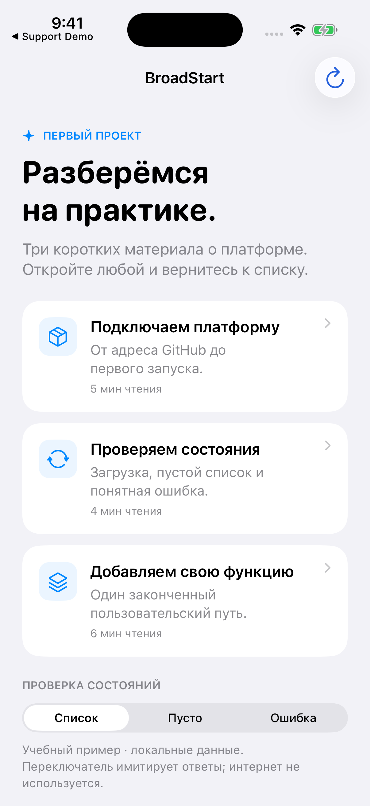
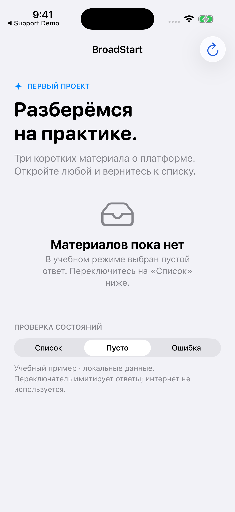

# Как исправлять документацию

Хорошая правка помогает разработчику выполнить действие: выбрать библиотеку, собрать проект, настроить сценарий или понять ошибку. **Сначала установите, какое поведение реализовано и в какой версии; затем измените объяснение у правильного владельца.**

Текст сайта хранится в открытых Markdown-файлах. Их можно читать без аккаунта. Для отправки изменения нужен GitHub-аккаунт и pull request — предложение объединить вашу правку с основной веткой.

## Где исправлять конкретный вопрос

| Что нужно исправить | Источник | Пример |
|---|---|---|
| Общую инструкцию или объяснение сценария | [broad-docs/content](https://github.com/BroadApps-official/broad-docs/tree/main/content) | Порядок первого подключения, поведение при ошибке |
| Подключение отдельной библиотеки | README её репозитория | URL, product, минимальная версия |
| Название метода и его параметры | DocC рядом с исходниками модуля и отчёт public API | Initializer OnboardingViewModel |
| Сочетание проверенных версий | [Compatibility/current.yml](https://github.com/BroadApps-official/broad-platform-integration/blob/main/Compatibility/current.yml) | Набор 4.0.0: Core 2.0.0, Extensions 1.0.1, Monetization и UIFlows 4.0.0 |
| Общую инженерную проверку | README, Scripts и AgentChecks integration repository | Что именно выполняет agent gate |
| Особенность одного приложения | Документы его собственного репозитория | Backend, тексты, идентификаторы и частный дизайн |

Markdown — обычный текст с обозначениями заголовков, ссылок и кода. README объясняет вход в репозиторий. DocC описывает API рядом с кодом. Отчёт `Documentation/PublicAPI.md` показывает публичные объявления, но не заменяет объяснение применения.

**Самая актуальная документация для применения платформы — на этом сайте.**
README integration repository содержит только модули, проверенные версии,
запуск примера и команды проверки. Подробные правила не нужно снова копировать
в README: исправьте соответствующую статью здесь и документ владельца поведения.
Инженерные инструкции и шаблоны остаются в Git и доступны через поиск сайта.

Если статья описывает API выпущенной версии, проверяйте исходник по её **тегу**, а не только текущий `main`. В main уже может находиться следующая разработка. Для общих процессов можно ссылаться на main и указать дату сверки.

## Маленькая правка прямо в GitHub

1. Внизу статьи нажмите **«Исходник»** и убедитесь, что открыт правильный файл `content/<slug>.md`.
2. Если причина неочевидна, откройте **«Изменения»**: история покажет, почему появился этот текст.
3. Нажмите **«Предложить правку»**. GitHub предложит редактирование в отдельной ветке или копии репозитория — fork, если прямого доступа на запись нет.
4. Измените текст, объясните причину и создайте pull request. Приложите пример прежней путаницы и ожидаемый результат после правки.
5. Дождитесь проверки **Public docs quality** и review. Если изменилось объяснение поведения API, дайте ссылку на подтверждающий код.

**«Чистый текст»** открывает raw Markdown для чтения или копирования. **История статьи** показывает изменения исходного файла, а не журнал развёртывания сайта. Эти два события могут происходить в разное время.

## Для большой правки запустите сайт локально

Используйте отдельную рабочую копию `broad-docs`. Не редактируйте `BroadAppsIOSPlatform/.build/DocsSite/broad-docs`: это временная копия для проверок, которую скрипт может пересоздать.

Нужны Node.js 22.13 или новее и pnpm 10.15.1. Версии проекта указаны в [package.json](https://github.com/BroadApps-official/broad-docs/blob/main/package.json). В Terminal проверьте `node --version` и `pnpm --version`, затем выполните:

```bash
git clone https://github.com/BroadApps-official/broad-docs.git
cd broad-docs
pnpm install --frozen-lockfile
pnpm run dev
```

Если рабочая копия уже есть, используйте её, предварительно проверив `git status`; не клонируйте поверх существующей папки. `--frozen-lockfile` устанавливает согласованные версии зависимостей, не переписывая lockfile ради другой установки.

Откройте адрес, который напечатал сервер, обычно `http://localhost:3000`. Для нужной статьи добавьте `/docs/` и имя файла без `.md`, например `/docs/architecture`. После изменения исходника обновляется локальная страница. Production-публикация от этого не меняется.

## Из каких файлов складывается страница

| Файл | Для чего он нужен | Когда менять |
|---|---|---|
| `content/architecture.md` | Основной текст | Меняются объяснение, примеры, ссылки |
| `lib/docs.ts` | Название, описание, группа, цель и порядок в каталоге | Меняется смысл страницы или добавляется новая |
| `app/markdown-article.tsx` | Общий показ Markdown | Нужен новый поддерживаемый формат для всех подходящих страниц |
| `app/globals.css` | Общая вёрстка и читаемость | Меняется оформление, а не текст одной статьи |
| `public/guides/…` | Скриншоты, видео и другие материалы | Добавляется или заменяется изображение/запись |
| `public/media-manifest.json` | Контрольные суммы и происхождение медиа | Изменяются сами медиафайлы |
| `lib/github-docs.generated.ts` | Дополнительный поисковый индекс репозиториев | Меняются индексируемые документы |
| `CHANGELOG.md` | Что изменилось и зачем | Готовится содержательная правка |

Обычное редактирование статьи не требует менять renderer или CSS. Новая страница требует и Markdown, и регистрации в `lib/docs.ts`; иначе каталог и переходы о ней не узнают.

## Как перестроить слабую статью

Начните с действия читателя и ожидаемого результата. Затем дайте необходимые условия, последовательность, пример, проверку результата и разбор типичных ошибок. Термины объясняйте при первом появлении и связывайте со [словарём](./glossary.md).

| Слабое объяснение | Что добавить, чтобы по нему можно было работать |
|---|---|
| «Подключите модуль» | URL, нужный product, target, правило версии и способ проверки |
| «Настройте onboarding» | Массив страниц, renderer, завершение, ATT и следующий маршрут |
| «Добавьте Retry» | Какую операцию повторяем, сколько раз и почему это безопасно |
| «Проверьте оплату» | Какой результат проверяется, где источник доступа и какие операции реально выполнялись |
| «После merge сайт обновится» | Как устроены проверка и отдельная публикация в этом репозитории |

Не превращайте вводную часть в набор декоративных схем. Схема нужна, когда она объясняет конкретную зависимость или переход; таблица — когда читателю надо сравнить варианты. Один понятный пример полезнее нескольких картинок без условий и результата.

## Как оформлять код

Укажите библиотеку и версию, место вставки и недостающие зависимости. Различайте три вида примеров:

| Вид | Что читателю надо сообщить |
|---|---|
| Готовый проект | Где скачать, чем открыть, что запустить и какие данные учебные |
| Самостоятельная функция | Какие imports и зависимости нужны, откуда вызывается |
| Фрагмент метода | Какие переменные и окружающий код уже существуют; ссылка на полный файл |

Не называйте кусок кода «готовым приложением», если в нём неизвестные `AppConfig`, `repository` и callback без реализации. Не выдавайте локальный успешный ответ за production backend. Для небольшого первого подключения используйте [BroadStart](./getting-started.md) и его полный исходник вместо очередного расходящегося фрагмента.

Проверьте сигнатуры по выпущенному public API. Если добавляете самостоятельный Swift-пример, соберите его в подходящем iPhone-проекте. Статическая проверка Markdown не компилирует Swift внутри статьи.

## Ссылки, заголовки и поддерживаемый Markdown

Используйте один заголовок первого уровня, разделы `##` и при необходимости подразделы `###`. Короткие абзацы, обычные списки, таблицы, ссылки и блоки кода поддерживаются renderer сайта. Не рассчитывайте, что произвольный HTML, вложенная сложная разметка или Mermaid автоматически отобразятся: сначала проверьте возможности renderer.

Для соседней статьи используйте относительную ссылку, чтобы она работала и на сайте, и в GitHub:

```markdown
[Первое подключение](./getting-started.md)
[Выбор версий](./compatibility.md)
```

Сайт преобразует их в `/docs/getting-started` и `/docs/compatibility`. Если добавлен якорь на раздел, сверяйте его с фактическим заголовком и логикой `slugifyHeading` в `lib/docs.ts`. После переименования заголовка проверьте старые ссылки: существование самой страницы не гарантирует, что якорь ещё работает.

Для API лучше дать ссылку на конкретный файл в нужном теге. Для объяснения процесса — на документ владельца. Ссылка на корень GitHub не заменяет точного места, где читатель найдёт ответ.

## Скриншоты и видео должны что-то доказывать

Настоящий скриншот нужен, чтобы показать поле Xcode или состояние интерфейса. Подпишите, из какого проекта он взят и что подтверждает. Пример отдельного приложения не становится правилом всей платформы.

Изображения размещайте в `public/` и ссылайтесь через `../public/`. Подпись должна описывать состояние, а не повторять «скриншот»:

```markdown


```

Соседние изображения без пустой строки образуют ряд на сайте; GitHub показывает обычные изображения. Если это отдельные иллюстрации разных шагов, разделите их пустой строкой. Полные снимки Xcode можно открыть крупнее, а телефонные варианты сравнивать рядом.

Для видео текущий renderer принимает отдельную Markdown-ссылку на `.mp4`. Рядом должны лежать постер `.jpg` и описание `.vtt` с тем же базовым именем. Соседние ссылки образуют галерею с управлением воспроизведением. Пример формата можно посмотреть в [исходнике страницы paywall](https://github.com/BroadApps-official/broad-docs/blob/main/content/paywall-ui.md).

Не публикуйте реальные токены, email пользователей, receipt/JWS, платёжные URL и raw SDK/backend payload. Для состояния покупки укажите, использовалась ли локальная имитация. Запись имитации не подтверждает настоящее списание.

## Происхождение медиа и обновление поиска

`media-manifest.json` связывает файл с контрольной суммой, размером и источником; у записей приложений есть дополнительные сведения о съёмке. Не заменяйте видео, оставляя описание старой записи. При изменении записи сначала обновите её происхождение; генератор специально останавливается, если прежние сведения больше не соответствуют файлу.

После подготовки медиа выполните из корня сайта:

```bash
pnpm run media:manifest
```

Генератор использует исходные commits и, для общих иллюстраций, соседнюю рабочую копию integration repository. В изолированной копии задайте документированные в скрипте `BROADAPPS_PLATFORM_MEDIA_REF` и `BROADAPPS_DOCS_MEDIA_REF` только настоящими исходными commits. Не подставляйте случайную ветку или новый commit для старой записи. Если медиа не менялись, перегенерация не требуется.

После содержательной правки обновите индекс:

```bash
pnpm run github-index:refresh
```

Он собирает дополнительные документы из шести репозиториев. Изучите diff generated-файла: ссылки, заголовки и описание должны относиться к правильным источникам. Это дополнение к поиску самих статей, а не отдельная закрытая база.

## Проверка перед объединением

Из корня `broad-docs` выполните:

```bash
pnpm run check
```

Команда проверяет контент, локальные ссылки на статьи, декодирование медиа, manifest, ограничения репозитория, статический анализ сайта и production-сборку. Если проверка падает, исправьте причину; не удаляйте проверку, чтобы объединить статью.

Отдельно перечитайте пример как разработчик, который не видел обсуждение. Проверьте соответствие API, якоря, внешние ссылки и видимый результат. Автоматическая сборка не доказывает эти вещи полностью. Для изменений вёрстки посмотрите широкое и узкое представление, длинные подписи и работу проигрывателя.

В changelog объясните изменение и причину. В pull request укажите конкретную проблему, результат, источники проверки и её границы. Не пишите «всё проверено», если вы только собрали сайт.

## Объединение и публикация — разные шаги

Текущий [workflow Public docs quality](https://github.com/BroadApps-official/broad-docs/blob/main/.github/workflows/quality.yml) запускается для pull request и main. Он устанавливает зависимости и выполняет `pnpm run check`. **Этот workflow не публикует сайт в Sites.**

После объединения ответственный за публикацию берёт тот же проверенный исходник, сохраняет сборку в Sites, запускает публикацию и дожидается успешного результата. До этого GitHub и публичный сайт могут показывать разные версии.

Если сайт остался старым, сравните исходник статьи, результат проверки и состояние последней публикации. Простое обновление браузера не заменяет отсутствующую публикацию. Если публикация оборвалась, сообщите об этом явно и дайте ссылку на готовый исходник или локальную страницу.

## Как поставить задачу агенту

```text
Переработай указанную статью BroadApps для разработчика, который впервые
выполняет этот сценарий.

Сначала прочитай canonical Markdown, связанные инструкции и public API
используемой выпущенной версии. Назови найденные неточности.
Дай конкретные действия, пример, ожидаемый результат и разбор ошибок.
Отдели правило платформы от особенности приложения и учебных данных.
Обнови описание в каталоге, связанные ссылки, индекс и changelog.
Проверь самостоятельный код отдельно: сборка сайта его не компилирует.
Выполни проверки репозитория. Сохрани правки других авторов.
В результате отдельно сообщи о готовности исходника и публикации сайта.
```

[Правила участия](https://github.com/BroadApps-official/broad-docs/blob/main/CONTRIBUTING.md) · [Процесс выпуска платформы](./release-process.md) · [Словарь](./glossary.md)
