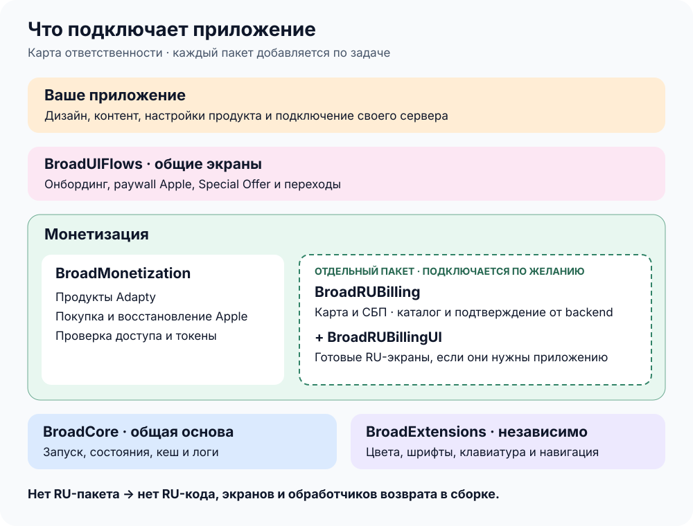
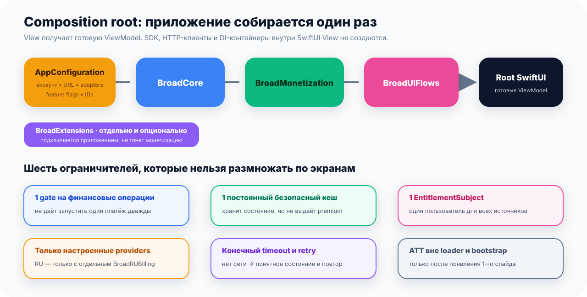

# Первое подключение платформы

## Что вы делаете

BroadApps iOS — набор готового общего кода для приложений компании. Он разделён
на четыре части. Вы выбираете, **что должно уметь приложение**, и добавляете в
Xcode одну подходящую библиотеку. Если ей нужен другой общий код, Xcode скачает
его автоматически.

Например, если нужен готовый экран подписки, приложение добавляет
`BroadUIFlows`. Вместе с ним автоматически придут `BroadMonetization`,
`BroadCore` и Adapty. Добавлять их второй раз «на всякий случай» не нужно.

## С чего начать

- **Создаёте новое приложение:** откройте готовый маршрут
  [с Codex/Claude или вручную](./app-creation.md).
- **Добавляете платформу в существующее приложение:** продолжайте эту
  инструкцию и выберите функцию, которая нужна приложению.
- **В приложении уже стоит старый BroadCore:** используйте
  [инструкцию перехода](./legacy-app-migration.md), не подключайте старые и
  новые библиотеки одновременно.

## Выберите библиотеку по задаче

| Что нужно приложению | Что добавить в Xcode | Что придёт автоматически |
|---|---|---|
| Только Swift-утилиты: цвета, клавиатура, навигация | `BroadExtensions` | Ничего — библиотека независимая |
| Запуск, кеш, логи и повтор сетевых запросов | `BroadCore` | Базовые зависимости Core |
| Оплата и подписка со своим интерфейсом | `BroadMonetization` | `BroadCore` и Adapty |
| Готовые первые экраны, экран подписки и переходы | `BroadUIFlows` | `BroadMonetization`, `BroadCore` и Adapty |

Если задача не помещается в одну строку, откройте
[полную таблицу выбора](./module-selection.md).



## Подключите библиотеку в Xcode

1. Откройте проект приложения в Xcode.
2. Выберите `File → Add Package Dependencies…`.
3. Вставьте адрес проекта GitHub из таблицы ниже.
4. Выберите версию из [каталога совместимости](./compatibility.md).
5. В списке **Add to Target** выберите основное iPhone-приложение. Эта надпись
   означает «куда добавить библиотеку». Xcode подключит её к выбранному приложению.
6. Дождитесь, пока Xcode загрузит библиотеку без ошибок, и соберите приложение.

| Библиотека | Публичный адрес GitHub |
|---|---|
| `BroadExtensions` | `https://github.com/BroadApps-official/broad-extensions-ios.git` |
| `BroadCore` | `https://github.com/BroadApps-official/broad-core-ios.git` |
| `BroadMonetization` | `https://github.com/BroadApps-official/broad-monetization-ios.git` |
| `BroadUIFlows` | `https://github.com/BroadApps-official/broad-ui-flows-ios.git` |

Аккаунт GitHub, пароль, токен и API-ключ для этих адресов не нужны. Если Xcode
просит доступ к Keychain — хранилищу паролей на Mac, — в проекте, скорее всего,
осталась ссылка на старый
закрытый репозиторий `BroadApps-official/BroadCore`. Используйте
[пошаговую диагностику](./public-package-access.md).

## Что именно выбрать в окне Xcode

После вставки GitHub-адреса Xcode покажет список **Products**. Так Xcode называет
готовые библиотеки внутри скачанного пакета. Выберите библиотеку с тем же именем:
`BroadCore`, `BroadMonetization`, `BroadUIFlows` или `BroadExtensions`.

Простое правило: если в коде приложения написано `import BroadCore`, библиотека
`BroadCore` должна стоять в списке **Frameworks, Libraries, and Embedded
Content** у этого приложения. Зависимости, которые нужны только самой
платформе, Xcode подключит автоматически.

## Если подключаете через Package.swift

Этот вариант нужен только проектам, которые управляют зависимостями через
собственный Swift Package manifest. Для обычного Xcode app используйте шаги
выше.

```swift
dependencies: [
    .package(
        url: "https://github.com/BroadApps-official/broad-core-ios.git",
        from: "1.0.0"
    )
]
```

`swift-tools-version: 6.0` в package manifest не переводит код приложения в
Swift 6. Текущие модули и host example работают в Swift 5 language mode.

## Что настраивает приложение, а что делает платформа

Представьте платформу как готовый двигатель. Она умеет запускаться, загружать
варианты покупки и проводить общие операции. Но она не знает, как называется
ваше приложение, какие у него цвета и какой экран оплаты нужен именно ему.

| Ваше приложение решает | Платформа выполняет |
|---|---|
| Какой экран открыть и когда | Запускает выбранный общий сценарий |
| Какие тексты, изображения и цвета показать | Отдаёт готовое состояние для экрана |
| Какой ключ и какое имя экрана Adapty использовать | Запрашивает Adapty и возвращает все полученные варианты покупки |
| Какой адрес сервера вызвать | Выполняет общие правила загрузки, повтора и обработки ошибки |
| Какие библиотеки нужны этому приложению | Связывает и запускает только подключённые библиотеки |

> **Пример.** Приложение передаёт ключ Adapty и имя `main`. Платформа запрашивает
> этот экран оплаты, получает все варианты подписки и отдаёт их интерфейсу.
> Приложение выбирает только внешний вид; платформа не выбрасывает продукты.

## Где хранить настройки приложения

Сделайте **одно понятное место, которое вызывается при запуске приложения**.
Там один раз передайте ключи, адрес сервера, имена экранов Adapty и создайте
нужные библиотеки. После этого SwiftUI-экраны получают уже готовые данные и действия.

| Плохой вариант | Понятный вариант |
|---|---|
| Каждый экран сам создаёт Adapty и сетевой клиент | Приложение создаёт их один раз при запуске |
| Ключи и адреса разбросаны по SwiftUI-файлам | Все значения находятся в одной конфигурации приложения |
| Экран сам решает, как повторять запрос и читать кеш | Экран просит общую библиотеку выполнить действие и показывает её результат |



Архитекторы называют такое стартовое место **composition root**. Запоминать
термин не обязательно. Важно только правило: общие сервисы создаются один раз,
а не заново в каждом экране.

## Проверьте результат

Проверка нужна не ради зелёной галочки: она доказывает, что приложение
действительно использует открытую библиотеку и не зависит от файлов на вашем Mac.

| Что сделать | Как выглядит успех | Зачем это нужно |
|---|---|---|
| Откройте список Package Dependencies в Xcode | У выбранной библиотеки указан адрес GitHub, а не папка на компьютере | Другой разработчик и сервер сборки смогут скачать тот же код |
| Найдите старый `BroadApps-official/BroadCore` | Такой ссылки в проекте больше нет | Xcode не будет просить доступ к закрытому репозиторию |
| Соберите Debug и Release для iPhone Simulator | Обе сборки завершаются без ошибок | Ошибка не спрятана только в одной конфигурации |
| Запустите приложение | Открывается именно та функция, ради которой добавили библиотеку | Одна успешная загрузка кода ещё не доказывает, что функция работает |
| Проверьте изменения Git | Ключи, адреса конкретного приложения и пользовательские данные не попали в общую библиотеку | Общая платформа остаётся безопасной для других приложений |

Демонстрационные проверки платформы не совершают настоящую покупку, не
восстанавливают подписку и не запускают оплату картой или СБП. Эти операции
проверяются отдельно в конкретном приложении.

Дальше откройте страницу выбранной библиотеки: [BroadCore](./broad-core.md),
[BroadMonetization](./broad-monetization.md),
[BroadUIFlows](./broad-ui-flows.md) или
[BroadExtensions](./broad-extensions.md).
