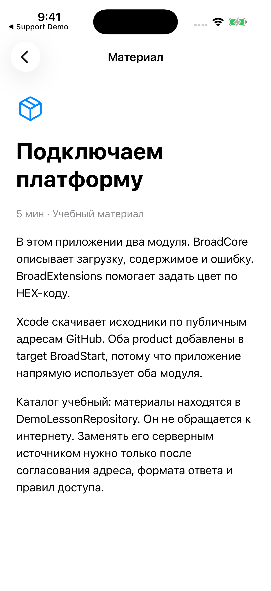
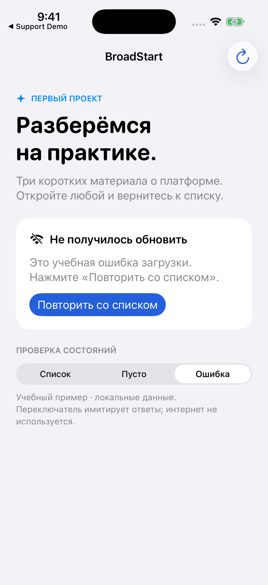
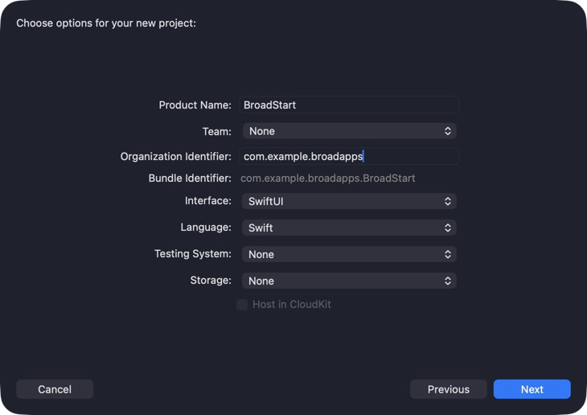
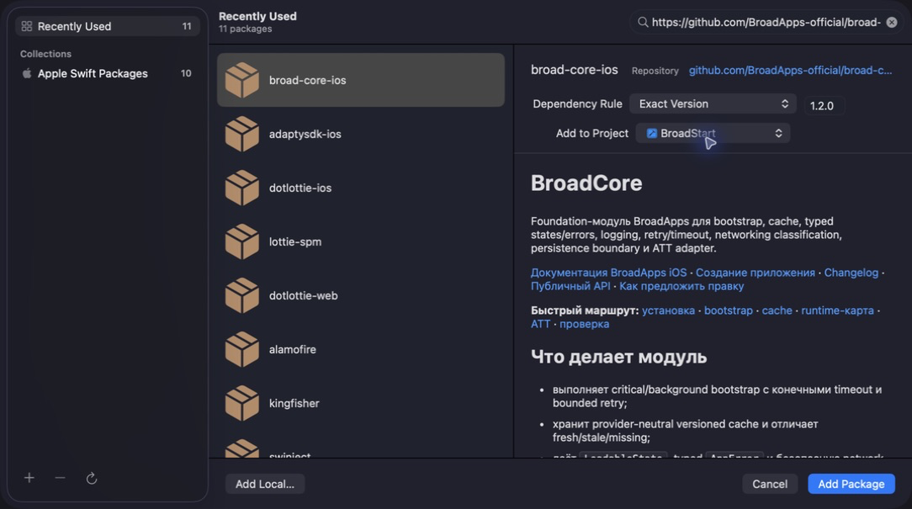
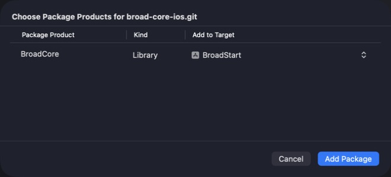
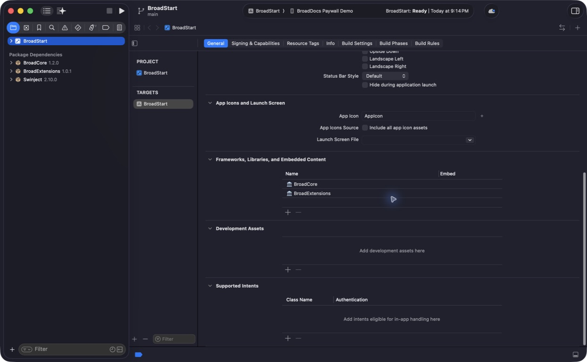

# Первое подключение

[Стандарт приложения](./app-standard.md) связывает подключение библиотек,
настройку пейвола и проверку готового проекта в один короткий маршрут.

Подключим платформу к небольшому iPhone-приложению **BroadStart**. В нём есть каталог учебных материалов, экран материала, загрузка, пустой список и ошибка с повтором. Вы получите собираемый проект и сможете проверить каждое состояние самостоятельно.

Это настоящий SwiftUI-проект с опубликованными библиотеками BroadApps. Материалы и ошибки в нём подготовлены локально: пример не обращается к серверу и не включает оплату. Для первого подключения ключи сервисов не нужны.

## Сначала посмотрите результат






Скриншоты сняты с BroadStart в iPhone Simulator. Нажмите на изображение, чтобы рассмотреть его. Исходники находятся в [папке first-app](https://github.com/BroadApps-official/broad-docs/tree/main/examples/first-app), продолжение разработки — в [статье «Создание приложения»](./app-creation.md).

| Ваша ситуация | Маршрут |
|---|---|
| Хочу сначала увидеть работающий пример | Откройте готовый BroadStart по шагам ниже |
| Есть обычный Xcode-проект без платформы | Выберите модули и выполните подключение в своём app target |
| Есть старый BroadCore или скопированные файлы | Сначала [проверьте старое подключение](./legacy-app-migration.md): одинаковые модули не должны попасть в сборку дважды |
| Создаю производственное приложение с агентом | Сначала [требования и план приложения](./app-creation.md#подготовьте-входные-данные) |

## Подготовьте Xcode

Нужны Mac, Xcode с инструментами Swift 6 и установленный iPhone Simulator. Минимальная версия iOS приложения — **17.0**, язык исходников примера — **Swift 5**. Эти параметры проверяются отдельно: версия инструментов Swift не равна режиму языка приложения.

Инструкция и скриншоты проверены в **Xcode 26.3**. В другой версии названия или расположение отдельных кнопок могут отличаться. Для запуска примера выбирайте iPhone Simulator, **Team = None**. Подписанный архив и платный Apple Developer аккаунт здесь не требуются.

| Где смотреть | Что выбрать | Для чего |
|---|---|---|
| Xcode → Settings → Components | Установленный iOS Simulator runtime | Чтобы было куда запустить приложение |
| Target → General → Minimum Deployments | iOS 17.0 или выше | Это минимум модулей платформы |
| Target → General → Supported Destinations | iPhone | Пример предназначен для iPhone |
| Target → Build Settings → Swift Language Version | Swift 5 | Режим, в котором проверен пример |
| Панель рядом с кнопкой Run | iPhone Simulator | Подключённый физический телефон не нужен |

## Вариант 1: откройте готовый проект

[Скачайте только BroadStart в ZIP](../public/downloads/BroadStart.zip), распакуйте архив и откройте `BroadStart.xcodeproj`. В архиве исходники, настройки, зафиксированные зависимости и инструкция — без файлов других приложений.

Либо скачайте репозиторий документации и откройте уже созданный проект. Команды выполняются в Terminal, в папке, где вы храните проекты; второй раз клонировать существующую папку не нужно.

```bash
git clone https://github.com/BroadApps-official/broad-docs.git
cd broad-docs
open examples/first-app/BroadStart.xcodeproj
```

1. Дождитесь окончания загрузки Package Dependencies.
2. Выберите схему **BroadStart** и iPhone Simulator в верхней панели Xcode.
3. Нажмите **Run** или **⌘R**.
4. Дождитесь списка из трёх материалов. Откройте первый и вернитесь назад.
5. Проверьте переключатели **Список**, **Пусто**, **Ошибка** внизу экрана.

XcodeGen для открытия готового `.xcodeproj` не нужен. Файл `project.yml` рядом — дополнительный способ воспроизвести настройки проекта, если вы пользуетесь XcodeGen.

## Вариант 2: создайте проект вручную

В Xcode выберите **File → New → Project… → iOS → App**. Заполните поля так, как на скриншоте. Не используйте Bundle ID рабочего приложения для учебного проекта.



| Поле | Значение в примере | Что это означает |
|---|---|---|
| Product Name | `BroadStart` | Имя проекта и приложения в Xcode |
| Team | `None` | Подпись для физического устройства сейчас не настраивается |
| Organization Identifier | `com.example.broadapps` | Учебный префикс, не идентификатор компании для выпуска |
| Interface / Language | `SwiftUI` / `Swift` | Способ описания экранов и язык кода |
| Testing System / Storage | `None` / `None` | В этом примере нет test targets и базы данных |

Сохраните проект в отдельной папке. После создания установите iOS 17.0, Swift 5 и iPhone в настройках target. Проект Xcode может по умолчанию использовать другие параметры — проверьте их явно.

## Выберите библиотеки по коду приложения

BroadStart напрямую использует **BroadCore** для состояния загрузки и **BroadExtensions** для цвета. Поэтому в target добавлены оба product. Swinject приходит как зависимость Core; исходники приложения его не импортируют.

| Задача | Библиотека | Разбор |
|---|---|---|
| Цвет из HEX, шрифты, клавиатура, жест возврата | `BroadExtensions` | [Утилиты](./broad-extensions.md) |
| Состояния загрузки, запуск, кеш, повтор, логи | `BroadCore` | [Основные механизмы](./broad-core.md) |
| Подписки и покупки со своим дизайном | `BroadMonetization` | [Логика оплаты](./broad-monetization.md) |
| Готовый или управляемый платформой сценарий первых экранов и paywall | `BroadUIFlows` | [Готовые сценарии](./broad-ui-flows.md) |

**Скачать пакет и добавить product в target — разные действия.** Xcode скачивает зависимости пакета автоматически. Но каждое `import Broad…` в коде приложения должно иметь соответствующий product в его target. Подробные сочетания есть в [выборе частей платформы](./module-selection.md).

## Добавьте BroadCore по публичному адресу

В своём проекте откройте **File → Add Package Dependencies…**. Вставьте URL целиком в поле **Search or Enter Package URL**:

```text
https://github.com/BroadApps-official/broad-core-ios.git
```

Выберите **Dependency Rule → Exact Version → 2.0.0**, затем **Add Package**. В следующем окне для product **BroadCore** укажите **Add to Target → BroadStart**. Если выбран **None**, пакет может скачаться, но приложение не получит его библиотеку.





Точные версии в этом разборе взяты из проверенного набора **platform set 4.0.0**. Для другого проекта смотрите [каталог совместимости](./compatibility.md); номер набора не нужно подставлять как версию каждого модуля.

| Пакет | Exact Version в наборе 4.0.0 | Product |
|---|---|---|
| `broad-core-ios` | `2.0.0` | `BroadCore` |
| `broad-extensions-ios` | `1.0.1` | `BroadExtensions` |
| `broad-monetization-ios` | `4.0.0` | `BroadMonetization` |
| `broad-ui-flows-ios` | `4.0.0` | `BroadUIFlows` |

Повторите добавление для `https://github.com/BroadApps-official/broad-extensions-ios.git`, выберите **1.0.1** и product **BroadExtensions**. Для BroadStart другие модули не нужны. Аккаунт GitHub и пароль для чтения этих публичных адресов не требуются; при запросе входа используйте [диагностику подключения](./public-package-access.md).

## Проверьте target и исходники

Выберите синий значок проекта, затем **TARGETS → BroadStart → General → Frameworks, Libraries, and Embedded Content**. Здесь должны быть **BroadCore** и **BroadExtensions**. Слева, в Package Dependencies, дополнительно будет Swinject — его скачал Core.



Для полного примера замените созданные Xcode `ContentView.swift` и `BroadStartApp.swift` файлами из [Sources](https://github.com/BroadApps-official/broad-docs/tree/main/examples/first-app/Sources). Добавьте все пять Swift-файлов в target BroadStart; исходный файл с `@main` должен остаться ровно один. Папка `Documentation` — текстовые пояснения, она не нужна в ресурсах приложения.

| Файл | Что в нём искать |
|---|---|
| `BroadStartApp.swift` | Однократное создание источника данных, операции загрузки и модели экрана |
| `Lesson.swift` | Материал и договорённость о том, как получать список |
| `DemoLessonRepository.swift` | Локальные учебные данные, пустой ответ и ошибка |
| `LessonListModel.swift` | Настоящие `LoadableState` и `AppError` из Core |
| `LessonListView.swift` | Список, материал, индикатор и повтор |

Список и экран материала находятся вместе в `LessonListView.swift`.

## Проверьте поведение, а не только сборку

| Действие | Ожидаемый результат |
|---|---|
| Первый запуск | Индикатор, затем три материала |
| Открыть материал → назад | Правильный текст; список снова доступен |
| Нажать обновление несколько раз | Одна загрузка; кнопка сразу недоступна, список остаётся на месте |
| Выбрать «Пусто» | Объяснение пустого результата, без бесконечного индикатора |
| После «Пусто» выбрать «Ошибка» | Ошибка без материалов и кнопка повтора |
| Нажать «Повторить со списком» | Индикатор завершается списком |
| После списка выбрать «Ошибка» | Старые учебные материалы остаются, виден текст ошибки обновления |
| Перезапустить приложение | Снова открывается локальный список; выбранный учебный режим не сохраняется |

Соберите Debug и Release для iPhone Simulator. Готовый `Package.resolved` хранит конкретные версии и коммиты; оставьте его в Git вместе с проектом, чтобы коллега воспроизвёл то же подключение.

## Если что-то не получилось

| Сообщение или симптом | С чего начать |
|---|---|
| `No such module 'BroadCore'` | Проверьте product в target, Target Membership файла и завершение загрузки пакетов |
| Требуется более новая iOS | Поднимите минимальную iOS app target до 17.0 или выше |
| Xcode требует Team | Выбран физический iPhone; переключите назначение на Simulator |
| Xcode просит пароль GitHub | Проверьте точный URL по [инструкции без пароля](./public-package-access.md) |
| `Revision … does not match previously recorded value` | Остановите обновление этой зависимости и [сверьте версию с опубликованным тегом](./public-package-access.md#если-изменилась-запомненная-ревизия) |
| Сборка прошла, но экран прежний | Проверьте схему, запускаемый target и единственную структуру с `@main` |

Дальше: [разберите создание приложения по шагам](./app-creation.md), [выберите дополнительные модули](./module-selection.md) или [найдите незнакомое слово](./glossary.md).

Первичные источники: [каталог набора 4.0.0](https://github.com/BroadApps-official/broad-platform-integration/blob/4.0.0/Compatibility/current.yml), [LoadableState](https://github.com/BroadApps-official/broad-core-ios/blob/2.0.0/Sources/BroadCore/Domain/States/LoadableState.swift), [добавление зависимостей в Xcode](https://developer.apple.com/documentation/xcode/adding-package-dependencies-to-your-app).
