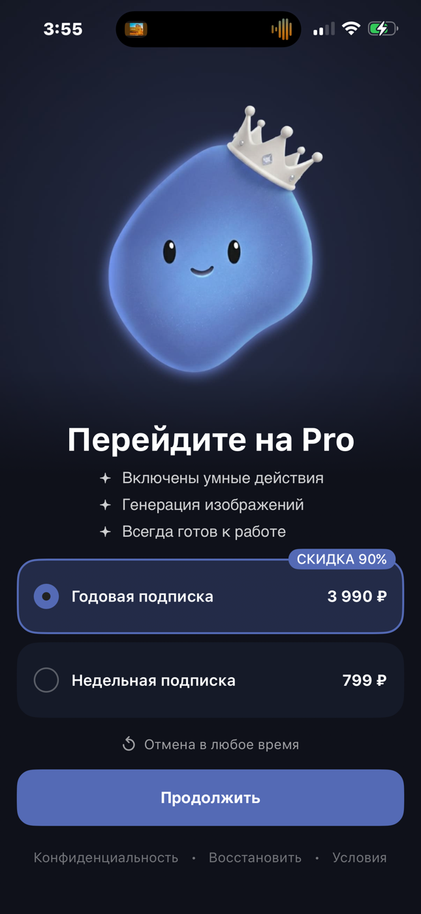
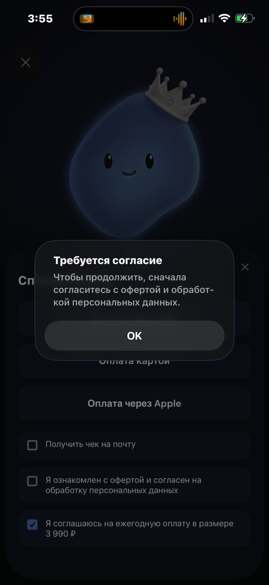
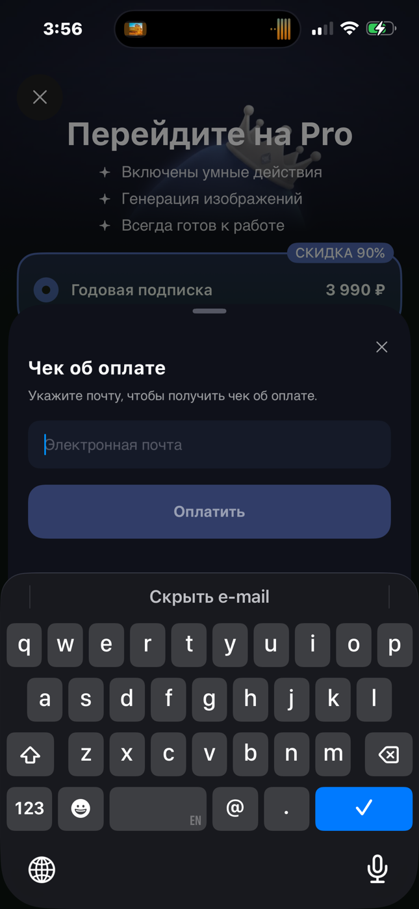

# RU Billing: карта и СБП

RU Billing добавляет к Apple два внешних способа оплаты: **СБП** и
**банковскую карту**. Эти кнопки появляются не просто по региону и не просто по
флагу — платформа последовательно проверяет все условия безопасности.

> **Актуальное правило платформы на 30 августа 2026 года.** Конкретное
> приложение могло ещё не получить это обновление. Перед его изменением
> сравните фактический код с этой страницей и уточните rollout у своего team
> lead.

## С чего начать

Выберите свой случай — читать всю страницу сразу не обязательно:

| Ваша задача | Откройте сначала | Что получите |
|---|---|---|
| понять, появятся ли карта и СБП | раздел «Ответ за 30 секунд» ниже | точное условие `ru_pay` и региона |
| получить продукты с сервера | [«Продукты с backend»](./backend-product-catalog.md) | JSON, подключение decoder и проверку массива |
| обновить существующее приложение | фактический код приложения и team lead | подтверждение, какое правило уже выпущено именно в этом app |

Сначала полностью выполните эту статью: каталог, `ru_pay`, регион, checkout,
возврат из браузера, проверку статуса и подтверждение Premium. Только когда
обычный RU Billing работает целиком, переходите к отдельной инструкции
[«RU Billing: спешл оффер»](./ru-special-offer.md). В ней добавляется булев флаг
показа в Remote Config основного paywall и отдельный RU-продукт из платёжного
каталога backend, помеченный отметкой `isSpecialOffer`. Этот RU-продукт не
берётся из Adapty или App Store. Показ ограничен циклом «окно оффера →
cooldown».

[«Спешл оффер (от Adapty)»](./special-offer.md) остаётся другим flow.

## Ответ за 30 секунд

СБП и карта доступны только когда одновременно выполнено:

```text
RU Billing настроен в приложении
AND свежий ответ Adapty содержит ru_pay = true
AND (App Store Storefront RU/RUS OR регион iPhone RU/RUS)
AND на backend найден точный продукт
AND backend разрешает создать оплату
AND Premium ещё не активен
```

Внутри региональной строки достаточно **одного** совпадения: Storefront или
регион iPhone. Остальные строки соединены через **AND** — обязательна каждая.

## Самое важное про `ru_pay`

`ru_pay` — управляемый переключатель в текущем ответе Adapty.

| Значение | Что увидит пользователь |
|---|---|
| свежий `true` | платформа продолжит остальные проверки |
| `false` | только Apple |
| поле отсутствует | только Apple |
| значение сломано или противоречиво | только Apple |
| старое значение из кеша | только Apple |

Платформа **не подставляет `ru_pay=true` автоматически**. Если поля нет,
значит разрешения нет. Это позволяет отключить RU-оплату без выпуска новой
версии приложения.

## Как определяется российский регион

Проверяются только два независимых сигнала:

1. текущая страна App Store Storefront — `RU` или `RUS`;
2. выбранный на iPhone регион — `RU` или `RUS`.

| Storefront | Регион iPhone | RU-условие |
|---|---|---|
| RU | RU | выполнено |
| RU | не RU | выполнено |
| не RU | RU | выполнено |
| временно недоступен | RU | выполнено |
| не RU/недоступен | не RU | не выполнено |

Русский язык интерфейса, клавиатура, IP, timezone и валюта форматирования
ничего не включают. Язык отвечает только за перевод текста.

## Почему проверок две

Storefront отвечает на вопрос «в какой витрине App Store сейчас находится
пользователь». Регион iPhone помогает, когда Storefront временно недоступен или
ещё не загружен. Поэтому это `Storefront OR регион`, а не две обязательные
проверки.

Перед созданием внешней оплаты платформа **заново загружает Storefront**. Если
он изменился, решение пересчитывается; старый кеш не разрешает финансовую
операцию.

## Полный путь пользователя

```text
выбор продукта
  → проверка ru_pay и региона
  → точное совпадение с продуктом backend
  → Apple / СБП / карта
  → обязательные согласия и email для чека
  → внешняя платёжная страница
  → возврат в приложение
  → проверка статуса на backend
  → новая проверка Premium
```

Возврат из браузера **не означает успешную оплату**. Даже статус «оплачено» от
промежуточного экрана не открывает Premium сам по себе. Доступ появляется
только после подтверждённой общей проверки entitlement.

## Как этот путь выглядит на экране

Ниже — reference одного готового приложения. Он показывает **порядок действий**,
а не обязательный дизайн: изображения, тексты, цены и набор тарифов принадлежат
конкретному приложению.

Сначала пользователь выбирает тариф. Если RU Billing доступен, после кнопки
продолжения появляется выбор Apple, СБП или банковской карты. Кнопка внешней
оплаты становится доступной только после обязательных согласий.

| 1. Выбрать тариф | 2. Выбрать способ оплаты | 3. Подтвердить согласия |
|---|---|---|
|  |  |  |

Если обязательное согласие не выбрано, приложение объясняет, что исправить.
Email запрашивается только когда пользователь просит чек. Затем открывается
внешняя страница выбранного платёжного способа.

| 4. Показать, чего не хватает | 5. Запросить email для чека | 6. Открыть оплату картой | 7. Или другой внешний checkout |
|---|---|---|---|
|  |  |  |  |

> **Важно:** последние два кадра — примеры внешних страниц. Конкретный экран
> зависит от выбранного способа оплаты и настройки backend. Возврат с любой из
> них запускает проверку статуса, но сам по себе не открывает Premium.

## Откуда берутся продукты

Adapty отдаёт продукты для экрана, а backend — соответствующие варианты для
СБП/карты. Платформа связывает их только по точному product ID.

```text
Adapty/App Store product ID
       exact equality
backend appStoreProductId
```

Нельзя угадывать товар по цене, названию, периоду или месту в массиве. Если
точного совпадения нет, RU-способ для этой карточки скрывается безопасно.

Как получить массив с backend, кто хранит URL/auth и как подключить готовый
decoder, разобрано на отдельной странице:
[«Продукты с backend»](./backend-product-catalog.md).

## Почему платформа не сокращает список

Общая платформа принимает ответ backend как массив и сохраняет:

- каждую строку;
- исходный порядок;
- повторения одного SKU;
- 0, 1, 2 или любое другое количество продуктов.

Она не сортирует, не обрезает список до двух карточек и не удаляет дубли. Полный
контракт массива, поддерживаемые поля и ошибки decoder собраны на странице
[«Продукты с backend»](./backend-product-catalog.md). Если конкретному
приложению нужно показать только два продукта, оно делает это своим UI/config
после получения полного массива.

## Что остаётся в конкретном приложении

Платформа даёт общую логику, но не может знать данные каждого продукта.

| В приложении | В общей платформе |
|---|---|
| backend URL и авторизация | модели каталога и проверка полей |
| Adapty key и placements | строгая проверка `ru_pay` |
| legal URLs и тексты | Storefront/region gate |
| дизайн карточек | точное сопоставление продуктов |
| решение показать 2 из N | полный массив без потерь |
| серверные статусы конкретного API | checkout, pending и повторная проверка доступа |

## Безопасные состояния экрана

| Ситуация | Ожидаемое поведение |
|---|---|
| `ru_pay=false` или отсутствует | только Apple |
| два non-RU региональных сигнала | только Apple |
| каталог пуст | Apple или понятный Retry по правилу приложения |
| продукт не совпал точно | RU-кнопки для него скрыты |
| backend недоступен до операции | ошибка/Retry, без открытия браузера |
| сеть пропала после создания операции | pending до сверки с backend |
| пользователь нажал дважды | вторая операция не создаётся |
| возврат из браузера | проверка статуса, не мгновенный Premium |

## Debug не равен production

В Debug приложение может временно переключить remote gate, чтобы проверить
экран. Такой переключатель не обходит регион, каталог, backend и проверку
Premium. После перезапуска снова используется Adapty. В Release ручного
переключателя нет.

## Что проверить перед передачей QA

- `ru_pay`: отсутствует, `false`, сломан, свежий `true`, кешированный `true`;
- Storefront RU + non-RU регион;
- non-RU/недоступный Storefront + RU регион;
- русский язык + два non-RU сигнала — остаётся Apple;
- 0, 1, 2 и 20+ продуктов, включая дубли;
- точное совпадение и намеренно неверный product ID;
- ошибка/timeout до создания checkout;
- двойной tap;
- возврат в приложение, перезапуск и pending;
- Premium открывается только после подтверждения.

Настоящий платёж не входит в автоматическую проверку платформы и проводится
только по согласованному процессу конкретного приложения.

## Куда идти дальше

- [Аккаунт-менеджеру: спешл оффер](./ru-billing-account-manager.md)
- [Продукты с backend](./backend-product-catalog.md)
- [BroadMonetization](./broad-monetization.md)
- [Экран подписки](./paywall-ui.md)
- [Какие версии ставить](./compatibility.md)
