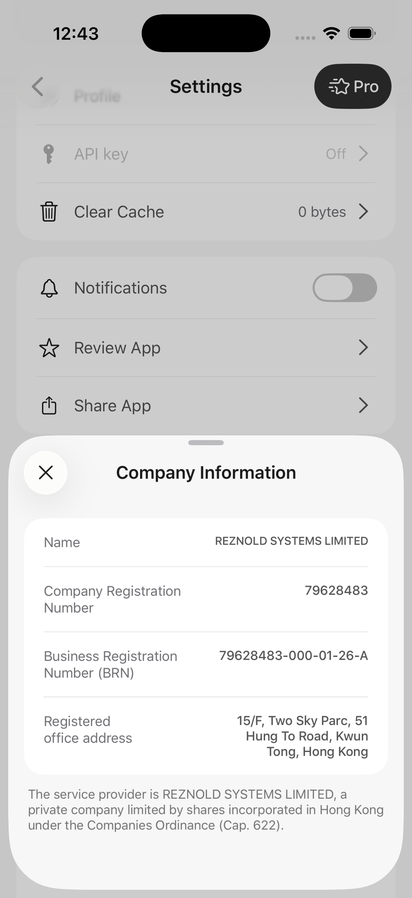

# RU Billing: карта и СБП

RU Billing позволяет оплатить подписку картой или через СБП через сервер
приложения. Это работает и при недоступном Adapty — например, когда приложение
удалено из App Store и магазин больше не возвращает его продукты.

**Правило обновлено 9 сентября 2026 года, BroadMonetization 1.5.4 (API с 1.5.0).** Резервный
сценарий подключается явно и не включается одним обновлением пакета. Старые
сигнатуры API сохранены. В 1.5.2 также исправлена подмена `tokens` и
`special_offer` обычными подписками при ошибке загрузки. Ниже — условия,
способ подключения и проверки перед выпуском.

## С чего начать

Выберите свой случай — читать всю страницу сразу не обязательно:

| Ваша задача | Откройте сначала | Что получите |
|---|---|---|
| понять, появятся ли карта и СБП | раздел «Ответ за 30 секунд» ниже | точное условие `ru_pay` и региона |
| получить продукты с сервера | [«Продукты с backend»](./backend-product-catalog.md) | JSON, подключение decoder и проверку массива |
| обновить существующее приложение | фактический код приложения и team lead | подтверждение, какое правило уже выпущено именно в этом app |

Сначала полностью выполните эту статью: каталог, `ru_pay`, регион, checkout,
возврат из браузера, проверку статуса и подтверждение Premium. Только когда
обычный RU Billing работает целиком, переходите к отдельной инструкции
[«RU Billing: спешл оффер»](./ru-special-offer.md). В ней добавляется булев флаг
показа в Remote Config выбранного paywall плейсмента `main` и отдельный RU-продукт из платёжного
каталога backend, помеченный отметкой `isSpecialOffer`. Этот RU-продукт не
берётся из Adapty или App Store. Показ ограничен циклом «окно оффера →
cooldown».

[«Спешл оффер (от Adapty)»](./special-offer.md) остаётся другим flow.

## Ответ за 30 секунд

Сначала определяем, откуда получить тарифы. Затем проверяем возможность оплаты.

**Если Adapty не вернул ни одного продукта — в том числе успешно вернул пустой
массив `[]` — и регион телефона RU/RUS или регион Storefront RU/RUS, подключённый
резерв сразу запрашивает свежие продукты с сервера. Достаточно любого одного
из этих регионов, оба одновременно не требуются.**

Не нужно показывать пустой paywall и ждать повторного нажатия: серверный запрос
выполняется в той же попытке загрузки. Успешный пустой ответ учитывается с
**1.5.3**. Полученный запрет `ru_pay=false`, отсутствующий или некорректный флаг
по-прежнему закрывает резерв.

| Что произошло | Что делает приложение |
|---|---|
| Adapty вернул продукты и есть точные совпадения с backend | Сохраняет обычный paywall; карта/СБП доступны у сопоставленных продуктов при открытом RU gate |
| Adapty вернул продукты, но ни один ID не совпал с backend | При открытом RU gate и подключённом резерве показывает все обычные серверные подписки с `isDefault=true` |
| Adapty не ответил, а Storefront **или** регион телефона — RU/RUS | При подключённом резерве запрашивает свежие тарифы с сервера приложения |
| Adapty вернул `ru_pay=true`, но продукты не загрузились | При российском регионе и подключённом резерве также идёт в серверный каталог |
| Adapty вернул `ru_pay=true` и пустой массив продуктов `[]` | При RU-регионе телефона **или** Storefront сразу запрашивает свежий каталог backend |
| Adapty ответил `ru_pay=false` | RU-оплата закрыта, даже если затем не загрузились продукты |
| Ответ есть, но поле отсутствует или некорректно | RU-оплата закрыта |
| Ни Storefront, ни регион телефона не российские | Серверный резерв не включается |

**Нет ответа и ответ без поля — разные случаи.** Если Adapty недоступен,
приложение не обязано ждать положительного флага от неработающего сервиса.
Но полученный запрет нельзя потерять при ошибке загрузки продуктов.

Для самой оплаты по-прежнему обязательны настроенный backend, выбранный
серверный тариф, доступный способ оплаты и авторизация. Активную подписку
обрабатывает проверка доступа. Возврат из браузера не выдаёт Premium.

## Как подключить резерв при сбое Adapty

1. Обновите BroadMonetization до **2.0.0** вместе с [проверенным набором платформы](./compatibility.md).
2. Сохраните существующий `RUBillingCompositionFactory`: URL, формат каталога,
   пользователя и авторизацию именно вашего приложения.
3. Если сервисы собирает `AdaptyMonetizationFactory`, замените `makeServices`
   на `makeServicesWithRUFallback` и добавьте аргумент `ruBillingFallback: ruFactory`.
   Остальные аргументы остаются прежними.
4. Если сервисы собираются вручную, передайте новый загрузчик в
   `BroadMonetizationServices.loadPaywall`:

```swift
let loadPaywall = ruFactory.makePaywallLoader(
    provider: adaptyPaywallRepository,
    cache: paywallCache,
    presentationLifecycle: adaptyLifecycle,
    staleLoadError: errors.stalePaywallLoad
)
```

Для обычных подписок сохраняется переход с недоступного дополнительного placement
на `main`. Если настроенный `main` тоже недоступен или не вернул продукты,
проверяется RU-резерв.
Если сам `main` не настроен, исправьте конфигурацию приложения.
`tokens` и `special_offer` используют свои продукты и цены: их нельзя заменить
основным paywall или резервным каталогом обычных RU-подписок.

Здесь используются уже созданные зависимости приложения. Checkout подключается
через ту же RU-композицию, как и раньше. UIFlows получает привычную модель
paywall; отдельную копию экрана делать не требуется.

В резервной ветке ID, цена, валюта и период берутся с сервера. Порядок и дубли
сохраняются. Обычный paywall исключает отмеченные сервером Special Offer;
неизвестные типы и токены не становятся обычной покупкой Premium. У серверных
тарифов нет оплаты через Apple. Перед оплатой выбранная строка заново сверяется
со свежим каталогом: изменение цены или порядка требует обновить выбор.

[Полный контракт и пример шаблона](https://github.com/BroadApps-official/broad-platform-integration/blob/main/Documentation/RUProviderFallback.md)
· [Исходный загрузчик](https://github.com/BroadApps-official/broad-monetization-ios/blob/main/Sources/BroadMonetization/Application/Paywalls/LoadPaywallWithRUFallbackUseCase.swift).

## Что означает `ru_pay`

Обычный путь использует подтверждённый свежий `ru_pay=true`. Кеш SDK и
сохранённый JSON не доказывают, что переключатель сейчас включён.
Резерв при сбое Adapty получает отдельное разрешение для текущего показа:
он **не подставляет `ru_pay=true`** и не выдаёт кеш за свежий ответ.
После восстановления приложения разрешение из сохранённого paywall не оживает.

Резерв не создаёт A/B-назначение или Special Offer из отсутствующего ответа.
Настройка экспериментов остаётся отдельным шагом: [RU Billing A/B](./ru-billing-ab-platform.md).

## Как определяется российский регион

Проверяются только два независимых сигнала:

1. текущая страна App Store Storefront — `RU` или `RUS`;
2. выбранный на iPhone регион — `RU` или `RUS`.

| Storefront | Регион iPhone | RU-условие |
|---|---|---|
| RU | RU | выполнено |
| RU | не RU | выполнено |
| не RU | RU | выполнено |
| временно недоступен | RU | выполнено |
| не RU/недоступен | не RU | не выполнено |

Русский язык интерфейса, клавиатура, IP, timezone и валюта форматирования
ничего не включают. Язык отвечает только за перевод текста.

## Почему проверок две

Storefront отвечает на вопрос «в какой витрине App Store сейчас находится
пользователь». Регион iPhone помогает, когда Storefront временно недоступен или
ещё не загружен. Поэтому это `Storefront OR регион`, а не две обязательные
проверки.

Перед созданием внешней оплаты платформа **заново загружает Storefront**. Если
он изменился, решение пересчитывается; старый кеш не разрешает финансовую
операцию.

## Данные о компании

**Данные компании одинаковые для всех проектов. Берите актуальные реквизиты
из [общего документа Kaiten — «Доп. условия при использовании 1payments»](https://broadapps.kaiten.ru/documents/d/fe97e05e-1386-49ab-a175-1182384483df#Доп-условия-при-использование-1payments-b3fda0b7).**
Для открытия документа нужен доступ к рабочему Kaiten.

В приложении разместите пункт **«Настройки → Информация о компании»**, как в
5115. На экране покажите данные из общего документа:

- название компании;
- регистрационный номер компании;
- Business Registration Number (BRN);
- юридический адрес;
- пояснение о компании — поставщике услуги.

Названия полей переводятся на язык интерфейса. Название компании, номера и
адрес сохраняйте в написании из источника. Перед выпуском сверяйте значения
с Kaiten: скриншот ниже показывает оформление экрана 5115, а актуальные данные
берутся по ссылке выше.



[Открыть скриншот в полном размере](../public/guides/settings-support/5115-company-info.png).
В коде 5115 данные собраны в
[CompanyInfo.swift](https://github.com/BroadApps-official/5115Copilot/blob/6da728e2ec0c1e25366bbac859a4722470c35268/5115Copilot/Core/Config/CompanyInfo.swift),
а экран — в
[CompanyInfoSheet.swift](https://github.com/BroadApps-official/5115Copilot/blob/6da728e2ec0c1e25366bbac859a4722470c35268/5115Copilot/Features/Settings/Components/CompanyInfoSheet.swift).

## Полный путь пользователя

```text
выбор продукта
  → проверка разрешения текущего сценария и региона
  → точное совпадение с продуктом backend
  → Apple / СБП / карта
  → обязательные согласия и email для чека
  → внешняя платёжная страница
  → возврат в приложение
  → проверка статуса на backend
  → новая проверка Premium
```

Возврат из браузера **не означает успешную оплату**. Даже статус «оплачено» от
промежуточного экрана не открывает Premium сам по себе. Доступ появляется
только после подтверждённой общей проверки entitlement.

## Как этот путь выглядит на экране

Ниже — reference одного готового приложения. Он показывает **порядок действий**,
а не обязательный дизайн: изображения, тексты, цены и набор тарифов принадлежат
конкретному приложению.

Сначала пользователь выбирает тариф. Если RU Billing доступен, после кнопки
продолжения появляется выбор Apple, СБП или банковской карты. Кнопка внешней
оплаты становится доступной только после обязательных согласий.

| 1. Выбрать тариф | 2. Выбрать способ оплаты | 3. Подтвердить согласия |
|---|---|---|
|  |  |  |

Если обязательное согласие не выбрано, приложение объясняет, что исправить.
Email запрашивается только когда пользователь просит чек. Затем открывается
внешняя страница выбранного платёжного способа.

| 4. Показать, чего не хватает | 5. Запросить email для чека | 6. Открыть оплату картой | 7. Или другой внешний checkout |
|---|---|---|---|
|  |  |  |  |

> **Важно:** последние два кадра — примеры внешних страниц. Конкретный экран
> зависит от выбранного способа оплаты и настройки backend. Возврат с любой из
> них запускает проверку статуса, но сам по себе не открывает Premium.

## Продукты обычного RU paywall

**Если точных совпадений по ID нет, показываем все продукты backend с
`isDefault=true` из раздела обычных подписок.** Это относится и к случаю, когда
приложение удалили из App Store: Adapty не возвращает продукты, поэтому список
тарифов и условия оплаты берутся с сервера.

| Что есть в каталоге | Что показываем |
|---|---|
| Есть точные совпадения Adapty product ID с backend `appStoreProductID` или `catalogProductID` | Обычный paywall сохраняется; RU-оплата использует соответствующие серверные строки |
| Совпадений нет, в том числе Adapty вернул `[]` или недоступен | Все обычные подписки с `isDefault=true`, в порядке backend, включая дубли |
| Совпадений нет и ни одна обычная подписка не помечена `isDefault` | Полный раздел обычных подписок — совместимость со старыми каталогами; backend-команде нужно явно отметить резервные тарифы |
| В выбранном наборе нет пригодного тарифа или сервер недоступен | Сохраняем доступный обычный paywall либо показываем ошибку с повторной попыткой |

Например, сервер вернул месячный тариф с `isDefault=true`, годовой с
`isDefault=false` и ещё один месячный с `isDefault=true`. При отсутствии
совпадений показываем **оба отмеченных тарифа**, а не только первый.
`isDefault` определяет резервный набор, а не выбранную радиокнопку.

Этот выбор встроен в подключаемый загрузчик `LoadPaywallWithRUFallbackUseCase`
с **1.5.4**. Для собственного RU-экрана есть
[`RUExperimentCatalogSelector`](./ru-billing-ab-platform.md): он использует
то же правило и не требует включать A/B-тесты.

Если совпала только часть ID, точные совпадения имеют приоритет: defaults к ним
не добавляются. Нельзя привязать несопоставленной карточке Apple случайную
серверную цену. В резервном наборе ID, цена, валюта и период принадлежат
backend-строке; оплата через Apple для неё недоступна. Перед платежом платформа
заново проверяет именно выбранную строку и её условия. По цене, названию,
периоду или позиции продукт не угадывается.

Регион и `ru_pay` проверяются по правилам выше: `isDefault` сам по себе не
включает RU Billing и не обходит полученный запрет.

Это правило обычного paywall. Для [RU Special Offer](./ru-special-offer.md)
продукт выбирается из backend-каталога по `isSpecialOffer`; его ID, цена и
валюта берутся из найденной строки. Обычный paywall отмеченную строку не
показывает, а отсутствие оффера не компенсирует обычной подпиской.

Как получить массив с backend, кто хранит URL/auth и как подключить готовый
decoder, разобрано на отдельной странице:
[«Продукты с backend»](./backend-product-catalog.md).

## Почему платформа не сокращает список

Общая платформа принимает ответ backend как массив и сохраняет:

- каждую строку;
- исходный порядок;
- повторения одного SKU;
- 0, 1, 2 или любое другое количество продуктов.

Она не сортирует, не обрезает список до двух карточек и не удаляет дубли. Полный
контракт массива, поддерживаемые поля и ошибки decoder собраны на странице
[«Продукты с backend»](./backend-product-catalog.md).
На экране показывается весь выбранный набор: точные совпадения, резервные
`isDefault` или отдельный RU Special Offer. Исходный каталог при этом остаётся
полным. Произвольное ограничение до двух карточек
в коде старого приложения — частный случай, а не общее правило.

## Что остаётся в конкретном приложении

Платформа даёт общую логику, но не может знать данные каждого продукта.

| В приложении | В общей платформе |
|---|---|
| backend URL и авторизация | модели каталога и проверка полей |
| Adapty key, placements и подключение резерва | различает отсутствие ответа и полученный запрет |
| legal URLs и тексты | Storefront/region gate |
| дизайн карточек | точное сопоставление продуктов |
| оформление полного набора карточек | полный каталог и выбор продукта по правилам сценария |
| серверные статусы конкретного API | checkout, pending и повторная проверка доступа |

## Безопасные состояния экрана

| Ситуация | Ожидаемое поведение |
|---|---|
| Получен `ru_pay=false` или ответ без поля | RU закрыт; Apple доступен только если его продукты пригодны |
| Нет ответа Adapty + российский регион + подключён резерв | Свежие серверные тарифы, карта/СБП |
| Два non-RU региональных сигнала | Резерв закрыт; обычный paywall или ошибка загрузки |
| каталог пуст | Apple или понятный Retry по правилу приложения |
| Ни один ID не совпал, RU gate открыт и резерв подключён | Все обычные серверные подписки с `isDefault=true`; для старого каталога без отметок — полный раздел |
| Совпала только часть ID | RU-оплата у совпавших продуктов; подстановка defaults в чужую карточку запрещена |
| backend недоступен до операции | ошибка/Retry, без открытия браузера |
| сеть пропала после создания операции | pending до сверки с backend |
| пользователь нажал дважды | вторая операция не создаётся |
| возврат из браузера | проверка статуса, не мгновенный Premium |

## Debug не равен production

В Debug приложение может временно переключить remote gate, чтобы проверить
экран. Такой переключатель не обходит регион, каталог, backend и проверку
Premium. После перезапуска снова используется Adapty. В Release ручного
переключателя нет.

## Что проверить перед передачей QA

- Adapty недоступен: российский Storefront; российский регион при недоступном Storefront;
- ответ `ru_pay=false` получен, затем продукты не загрузились — резерв закрыт;
- ответ есть, но `ru_pay` отсутствует или сломан — резерв закрыт;
- свежий `true`, кешированный `true`, восстановленный JSON и повторный запуск;
- Storefront RU + non-RU регион;
- non-RU/недоступный Storefront + RU регион;
- русский язык + два non-RU сигнала — остаётся Apple;
- 0, 1, 2 и 20+ продуктов, включая дубли;
- точное совпадение и намеренно неверный product ID;
- ошибка/timeout до создания checkout;
- двойной tap;
- возврат в приложение, перезапуск и pending;
- Premium открывается только после подтверждения.

Настоящий платёж не входит в автоматическую проверку платформы и проводится
только по согласованному процессу конкретного приложения.

## Куда идти дальше

- [Аккаунт-менеджеру: спешл оффер](./ru-billing-account-manager.md)
- [Продукты с backend](./backend-product-catalog.md)
- [BroadMonetization](./broad-monetization.md)
- [Экран подписки](./paywall-ui.md)
- [Какие версии ставить](./compatibility.md)
