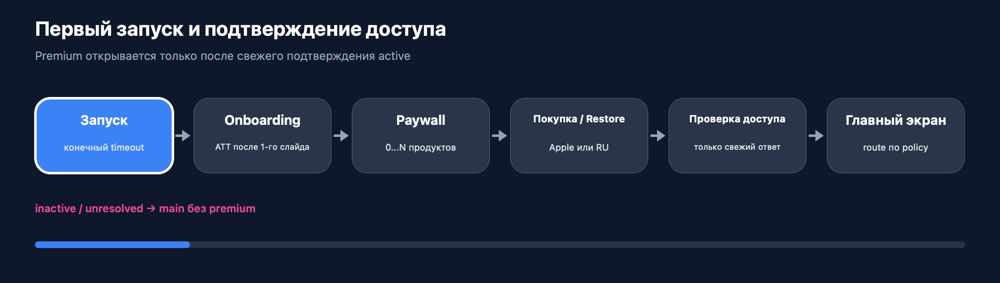

# Запуск, ошибки и восстановление

Эта страница объясняет, что должен увидеть пользователь, когда сеть медленная,
данные устарели, кнопка нажата дважды или оплата ещё не подтверждена.

## Запуск приложения


При запуске приложение один раз создаёт SDK и сервисы. Действия делятся на две
группы:

- обязательные — без них нельзя выбрать первый экран;
- фоновые — аналитика, предварительная загрузка и другие действия, которые не
  должны задерживать интерфейс.

Обязательные действия выполняются по порядку и имеют ограниченное время и
повтор. Фоновые запускаются после появления безопасного первого экрана.

## Что можно делать с кешем

Кеш сообщает одно из трёх состояний: данные свежие, устаревшие или отсутствуют.
Устаревшие данные можно показать с заметным сообщением и кнопкой Retry.

Кеш **не подтверждает** Premium, покупку или разрешение российской оплаты. Для
финансовых решений всегда нужен свежий ответ StoreKit, Adapty или backend.

## Полный пользовательский маршрут



```text
запуск → onboarding, если нужен → paywall, если нужен
       → покупка / restore / возврат из банка
       → свежая проверка Premium
       → открыть Premium или продолжить без него
```

«Не удалось проверить» не равно «Premium неактивен». «Операция ожидает» не
становится успехом или отказом только потому, что прошёл таймаут.

## Что происходит после нажатия кнопки


Сразу после нажатия приложение показывает загрузку и блокирует повторное
действие. Это происходит до первого сетевого ожидания, поэтому быстрое двойное
нажатие не запускает две покупки или два запроса.

Ошибка или отсутствие сети завершают загрузку и дают понятное действие: Retry,
Close или «проверить статус». Автоматический повтор не должен создавать новую
финансовую операцию.

## Поведение при обрыве сети

| Где оборвалась сеть | Что делает приложение |
|---|---|
| Загрузка каталога | Показывает кеш, пустое состояние или ошибку с Retry |
| Покупка или restore | Сохраняет состояние ожидания и позже проверяет результат |
| Начисление токенов | Не запускает второе списание автоматически |
| Оплата картой или СБП | Проверяет уже созданную операцию, а не создаёт новую |
| Отмена подписки | Заново спрашивает статус; повторная отмена требует действия пользователя |

## После переустановки

- подписку Apple подтверждает StoreKit;
- баланс токенов возвращает backend текущего аккаунта;
- российскую покупку возвращает backend текущего аккаунта;
- локальный кеш только ускоряет экран и не является источником истины.

Debug-инструмент очистки Keychain допустим только после подтверждения
разработчика и полностью отсутствует в Release. Он не должен удалять запись о
незавершённой оплате.

[BroadCore](./broad-core.md) ·
[BroadMonetization](./broad-monetization.md) ·
[Подробные правила обрыва сети](https://github.com/BroadApps-official/broad-platform-integration/blob/main/Documentation/NetworkInterruptions.md)
