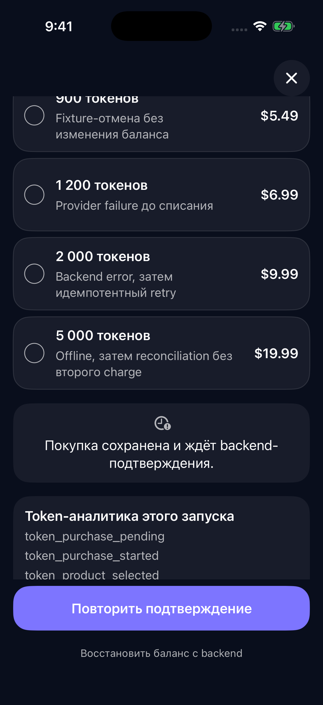
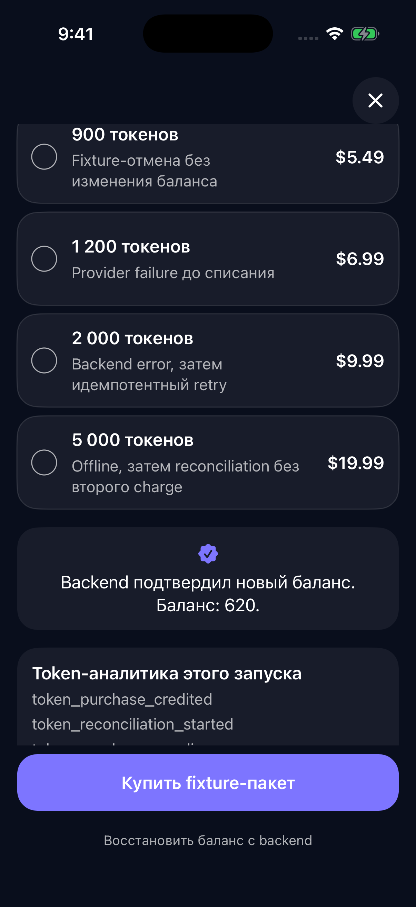

# Покупка токенов

Этот экран продаёт расходуемые пакеты, например «100 токенов» или «500
токенов». Adapty возвращает данные paywall и продукты из placement `tokens`.
Интерфейс строит приложение: можно подключить `BroadTokenPaywallView` или
использовать собственный экран с теми же операциями покупки.

Инструкция описывает **Apple-покупку через Adapty и начисление на backend
приложения**. `TokenPurchaseManager` принимает только Apple-покупки продуктов
типа `consumable`. Для оплаты токенов через СБП или карту нужен отдельный
серверный checkout; он не включается автоматически флагом `ru_pay`.

## Как работает экран

```text
placement tokens → продукты в порядке Adapty → выбор пакета
  → Apple-покупка → проверенная транзакция → backend начисляет токены
  → приложение получает полный подтверждённый баланс
```


Пять карточек на снимке — пример, а не лимит. Показывайте весь список в порядке
Adapty, включая выбранный им A/B-вариант. Не сортируйте, не обрезайте и не
удаляйте повторяющиеся продукты. Для идентичности карточки используйте
`presentationID`: один `productID` может встретиться в ответе несколько раз.

## Что подготовить

1. Подключите BroadMonetization и BroadUIFlows из [проверенного набора версий](./compatibility.md).
2. Создайте расходуемые покупки **Consumable** в App Store Connect, свяжите их с продуктами Adapty и добавьте в paywall, назначенный placement `tokens`.
3. На backend задайте соответствие **product ID → количество токенов**. Например, один продукт начисляет 100, другой — 500. Количество для начисления нельзя брать из цены, заголовка карточки или присланного клиентом числа.
4. Подготовьте устойчивый аккаунт пользователя, проверку покупок и получение его баланса. Adapty identity, StoreKit `appAccountToken` и серверная авторизация должны относиться к одному пользователю.

Название пакета берётся из `localizedTitle` продукта, цена — из данных магазина
с его валютой и локалью. Подготовьте понятные локализованные названия и проверьте,
что они соответствуют серверному каталогу. Купить можно только `consumable`
с корректной числовой ценой. Остальные карточки готовый экран оставляет
видимыми, но недоступными для покупки.

> **Не подменяйте токены подпиской.** Для `tokens` fallback на `main` запрещён.
> При недоступном placement или пустом ответе покажите объяснение и повтор загрузки.

Remote Config читается из paywall токенового placement с fallback отсутствующих ключей на `main`, а продукты
и их порядок — из `tokens`. Поэтому настройте оба placement и явно сопоставьте
имена приложения в `AdaptyPlacementRegistry`.
[Ключ Adapty, placements и Remote Config](./adapty-setup.md).

## Как подключить готовый экран

Соберите зависимости в `AppCompositionRoot` после подготовки текущего аккаунта.
Backend и хранилище незавершённой покупки предоставляет приложение.

| Зависимость | Что передать |
|---|---|
| `services` | Настроенные `BroadMonetizationServices`: загрузка paywall, выбор продукта, аналитика и общий `operationGate` |
| `purchaseRepository` | `AdaptyPurchaseRepository` с теми же configuration, identity и `AdaptyRepositoryContext`, что у загрузчика продуктов |
| `evidenceProvider` | `StoreKitTokenTransactionEvidenceProvider` с bundle ID приложения и ownership policy для `appAccountToken` текущего пользователя |
| `pendingStore` | `PendingTokenPurchaseStore` текущего `EntitlementSubject`, с постоянным защищённым хранилищем приложения |
| `fulfillment` | Реализация `TokenFulfillmentRepositoryProtocol`: отправляет доказательство покупки на backend |
| `recoverAccount` | Реализация `RecoverTokenAccountUseCaseProtocol`: загружает полный серверный баланс авторизованного аккаунта |
| `applyConfirmedBalance` | Обновляет состояние интерфейса целиком из `TokenBalanceSnapshot`, не прибавляет покупку повторно |

Ниже — фрагмент сборки с уже подготовленными зависимостями из таблицы.
`services.operationGate` должен быть общим с другими покупками и Restore
в этом приложении.

```swift
import BroadMonetization
import BroadUIFlows

let tokenManager = TokenPurchaseManager(
    purchaseRepository: purchaseRepository,
    evidenceProvider: evidenceProvider,
    fulfillmentRepository: fulfillment,
    pendingStore: pendingStore,
    analytics: services.analytics,
    operationGate: services.operationGate
)

// ViewModel и состояние интерфейса создаются на MainActor.
let tokenModel = BroadTokenPaywallViewModel(
    configuration: BroadTokenPaywallConfiguration(copy: .russian),
    dependencies: BroadTokenPaywallViewModelDependencies(
        loadPaywall: services.loadPaywall,
        selectProduct: services.selectProduct,
        purchaseManager: tokenManager,
        recoverTokenAccount: recoverAccount,
        onBalanceConfirmed: { snapshot in
            applyConfirmedBalance(snapshot)
        }
    )
)
```

Сохраните `tokenManager` и `tokenModel` в объекте композиции. Не создавайте их
заново при каждом вычислении SwiftUI `body`. Из экрана приложения покажите:

```swift
BroadTokenPaywallView(
    viewModel: tokenModel,
    theme: appPaywallTheme,
    onClose: closeTokenScreen
)
```

`appPaywallTheme` — тема приложения типа `BroadPaywallTheme`,
`closeTokenScreen` — его действие закрытия. Тексты задаёт `BroadTokenPaywallCopy`;
замените учебные формулировки `.russian`, в том числе название кнопки покупки,
перед выпуском своего приложения.

Готовый View сам вызывает `viewDidAppear()`: загружает каталог, запрашивает
баланс и проверяет сохранённую покупку. По умолчанию выбирается первый доступный
пакет; изменить предпочтение можно через `defaultSelectionIndex`. Длинный
список прокручивается, основная кнопка остаётся внизу. Пока выполняется операция,
выбор и повторное нажатие блокируются.

[Пример композиции в BroadAppTemplate](https://github.com/BroadApps-official/broad-platform-integration/blob/main/Examples/BroadAppTemplate/BroadAppTemplate/Application/AppCompositionRoot%2BTokens.swift)
показывает эти связи на учебных данных. Его `Example…`-репозитории и
`InMemoryPendingTokenPurchaseStore` не заменяют backend и постоянное хранилище
реального приложения.

## Что должен сделать backend

`TokenFulfillmentRepositoryProtocol.fulfill(_:)` получает запрос с `attemptID`
и `TokenTransactionEvidence`: ID транзакции, product ID, подписанную транзакцию
и дату покупки. Авторизация запроса определяет текущего пользователя.

Backend должен:

1. Проверить доказательство покупки, приложение, окружение, продукт и привязку к аккаунту.
2. Определить количество токенов по своему каталогу продуктов.
3. Атомарно записать уникальную операцию и начислить токены. Защита от дублей относится к транзакции, а не к product ID: один пакет можно законно купить несколько раз.
4. Вернуть полный актуальный `TokenBalanceSnapshot` с `balance` и `updatedAt`. При повторной доставке той же транзакции вернуть `alreadyCredited`, без нового начисления.

Пример: на сервере было 120 токенов, покупка добавила 500 — интерфейс получает
баланс 620. Если ответ потерялся, повторная проверка той же покупки не должна
превратить его в 1120. Приложение применяет полученный баланс целиком.

> [!CAUTION]
> **Успех Apple-покупки ещё не означает начисление токенов.** Баланс меняется
> только после подтверждения backend. Локальное `balance += amount`,
> открытие Premium и выдача токенов по одному ответу Adapty здесь недопустимы.

Подписанная транзакция нужна для проверки на сервере и хранится в ограниченном
хранилище незавершённой операции. Не выводите её в логи, аналитику или сообщения
пользователю. Правила расходования токенов и обработки возвратов также задаёт
backend; готовый экран покупки их не реализует.

## Если покупка ещё не подтверждена

| Результат `TokenPurchaseManager` | Что показывает приложение | Что делать дальше |
|---|---|---|
| `credited(snapshot)` | Подтверждённый баланс и сообщение об успехе | Применить полный snapshot |
| `pending` | Покупка ожидает подтверждения; баланс прежний | Проверить сохранённую операцию, не запускать новую оплату |
| `cancelled` | Пользователь отменил покупку; баланс прежний | Разрешить новый выбор |
| `failed(error)` | Понятное сообщение; баланс прежний | Учитывать `isRetryable`; сначала проверить, осталась ли незавершённая операция |

`failed` может означать ошибку backend уже после оплаты. Само это значение
не доказывает, что списания не было.

> [!CAUTION]
> **Если результат оплаты неизвестен, сначала проверьте предыдущую операцию.**
> Таймаут, потеря сети и закрытие экрана не разрешают второй платёж.
> Не очищайте pending-запись, чтобы разблокировать кнопку покупки.

В готовом экране безопасный повтор вызывает `retrySafely()`: сначала
`recoverPendingPurchase()`, и только при отсутствии сохранённой операции
возможна новая покупка. Если есть проверенная транзакция, менеджер повторно
отправляет её на backend без второго вызова оплаты.

### Пример ожидания и подтверждения

Ниже — снимки учебного BroadAppTemplate в iPhone Simulator. Пакет «500 токенов»
специально возвращает `pending` при первом обращении, а после безопасного
повтора подтверждает начисление. Реальная оплата и production-backend в этом
примере не используются. Подписи сценариев и блок аналитики нужны для проверки,
а не задают оформление вашего приложения.




## Перезапуск, переустановка и смена аккаунта

Это два разных действия:

| Действие | Когда вызывать | Что оно делает |
|---|---|---|
| `tokenManager.recoverPendingPurchase()` | При запуске и возвращении приложения на передний план, после восстановления текущей авторизации | Завершает проверку сохранённой покупки без нового списания |
| `recoverAccount()` | После входа, смены аккаунта и для обновления баланса | Получает полный баланс текущего пользователя с backend |

Если вызываете менеджер напрямую, обработайте его результат так же, как
результат покупки. Сам вызов не обновляет ваш UI. В готовой ViewModel для
этого есть `recoverPendingPurchaseIfNeeded()` и `recoverAccountBalance()`.
На возвращении в приложение сначала завершите проверку pending, затем
обновите баланс аккаунта.

> **Restore не восстанавливает расходуемые пакеты.** После переустановки
> возвращается серверный баланс того же аккаунта, а не локальная сумма покупок.
> Без устойчивого аккаунта нельзя обещать восстановление токенов на другом устройстве.

Постоянный `PendingTokenPurchaseStore` переживает обычный перезапуск, но не
гарантирует восстановление после удаления приложения. Для случая «оплата
прошла, затем приложение удалили до начисления» backend должен уметь находить
покупку независимо от локальной записи — например, через App Store Server
Notifications / Server API с корректной привязкой к аккаунту.

При смене пользователя пересоздайте зависимости для нового `EntitlementSubject`
и не применяйте к нему результат операции старого аккаунта. Ошибка получения
баланса означает «баланс не удалось проверить», а не «у пользователя 0 токенов».

[Восстановление аккаунта: контракт платформы](https://github.com/BroadApps-official/broad-platform-integration/blob/main/Documentation/AccountRecovery.md) ·
[Apple: восстановление покупок](https://support.apple.com/en-us/108096).

## Как проверить перед выпуском

- Нет продуктов или placement недоступен: понятное объяснение и повтор, без подмены на `main`.
- Один, пять и много продуктов: сохранены порядок и повторяющиеся позиции; длинный список прокручивается.
- У продукта неверный тип или нет корректной цены: карточка не запускает покупку.
- Пользователь отменил оплату: баланс не меняется, новую покупку можно начать явно.
- Двойное нажатие и покупка на другом экране: общий `operationGate` не допускает параллельных финансовых операций.
- Ответ backend потерялся после начисления: повтор той же транзакции возвращает баланс без второго начисления.
- Приложение закрыто или сеть пропала после оплаты: pending сохраняется и проверяется после возврата, второй платёж не начинается.
- Тот же пакет куплен второй раз отдельной транзакцией: начисление проходит ещё раз.
- После переустановки и входа возвращается баланс того же аккаунта; при смене аккаунта старый баланс не переносится.
- Offline при восстановлении: показана недоступность проверки, а не выдуманный нулевой баланс.

Проверяйте отдельно локальные сценарии и покупку через Adapty в Sandbox с вашим
backend. Успешный учебный пример или локальный StoreKit Configuration не
подтверждает работу реальной серверной проверки.

[Adapty: ключ и placements](./adapty-setup.md) ·
[BroadMonetization](./broad-monetization.md) ·
[BroadUIFlows](./broad-ui-flows.md)
