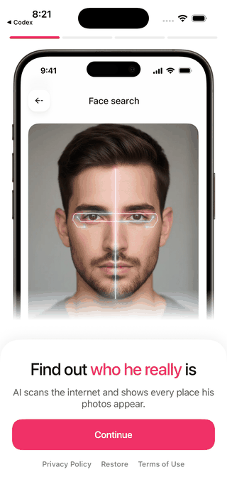
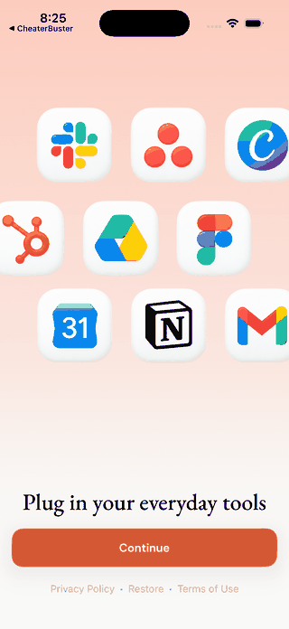
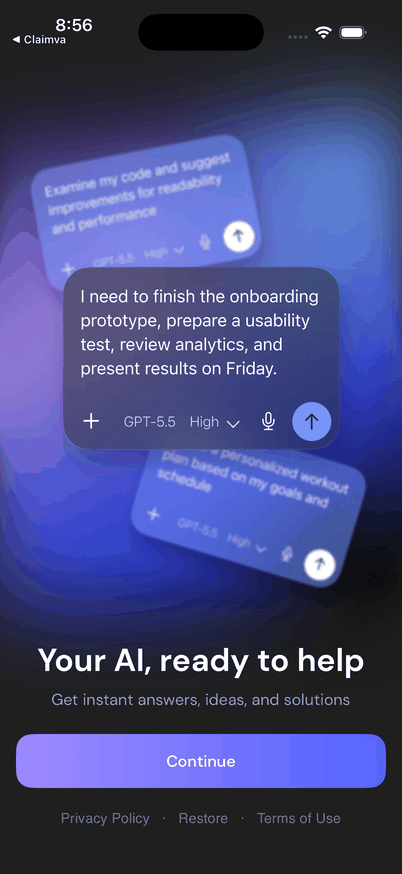

# BroadUIFlows: онбординг

Онбординг — это первые экраны, которые объясняют пользу приложения **до
главного экрана**. BroadUIFlows даёт механику страниц и переходов, а конкретное
приложение передаёт текст, изображения, цвета и количество шагов.

## Три варианта одного стандарта



Четыре экрана — пример, а не лимит: страниц может быть одна, три, пять или
больше.

В другом приложении те же роли выглядят совершенно иначе:





Эти экраны нельзя копировать как готовый шаблон. Они показывают одно правило:
**механика общая, а контент принадлежит конкретному приложению**.

## Минимальный стандарт

- на первом экране сразу понятно, что делает приложение;
- каждая кнопка ведёт только на следующий согласованный шаг;
- число страниц приходит из конфигурации приложения, а не зашито в библиотеке;
- ATT запрашивается только после понятного объяснения и только если он нужен;
- последняя страница ведёт в обычный paywall или main по продуктовому маршруту;
- после завершения онбординг не появляется снова без отдельной причины.

## Что является стандартом, а что меняет приложение

| BroadUIFlows обеспечивает | Приложение выбирает |
|---|---|
| текущий номер страницы | число и порядок страниц |
| Continue и завершение | тексты кнопок |
| переход на следующую страницу | фон, изображения, анимации |
| безопасную точку запроса ATT | зачем приложению ATT и какой permission text использовать |
| переход к paywall или main | какой маршрут нужен продукту |

## Полный маршрут

```text
Первый видимый экран
        ↓ Continue
Следующие страницы
        ↓ последняя страница
ATT, если он действительно нужен
        ↓
обычный paywall или сразу main
```

Системное окно ATT нельзя показывать раньше первого понятного экрана. Человек
должен уже видеть приложение и понимать контекст запроса.

## Что передать компоненту

- массив страниц в нужном порядке;
- заголовок и описание каждой страницы;
- иллюстрацию или анимацию;
- фон и тему;
- тексты Continue, Skip и legal-ссылок;
- действие после последней страницы;
- необходимость ATT.

## Проверка глазами

1. Первая страница появляется без белой вспышки.
2. Continue не перепрыгивает через страницу.
3. Длинный русский текст помещается на маленьком iPhone.
4. VoiceOver читает заголовок до кнопки.
5. Legal-ссылки нажимаются и не завершают онбординг.
6. Последняя страница ведёт ровно в согласованный paywall или main.
7. После перезапуска завершённый онбординг не появляется снова без продуктовой причины.

[Назад к BroadUIFlows](./broad-ui-flows.md) · [Разрешение ATT подробнее](./onboarding-att.md) · [Следующий экран: paywall](./ui-flows-paywall.md)
