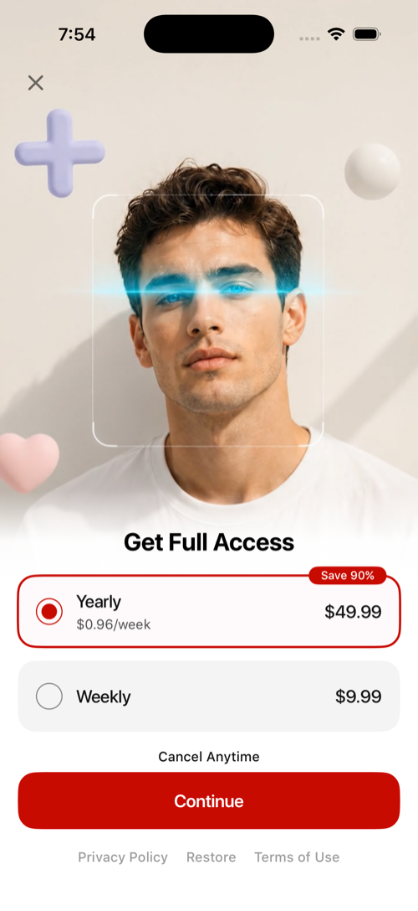
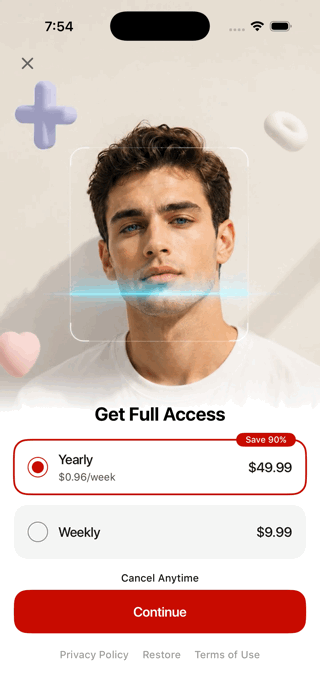
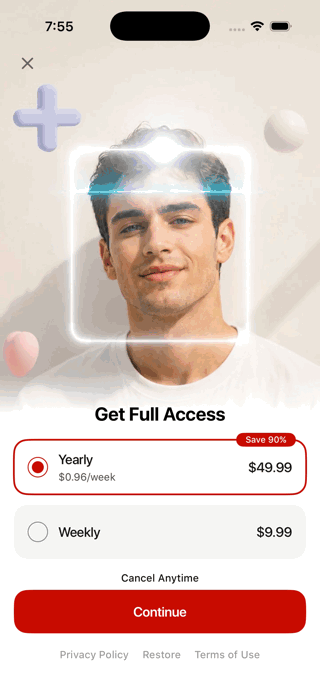
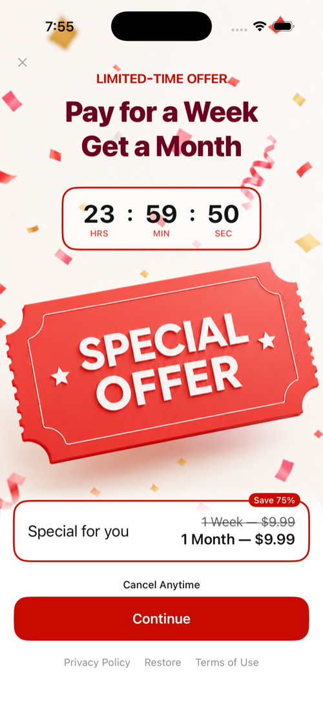
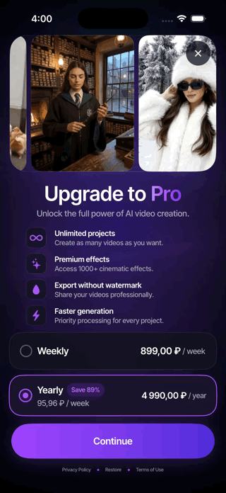
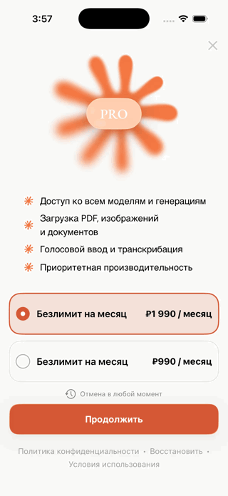
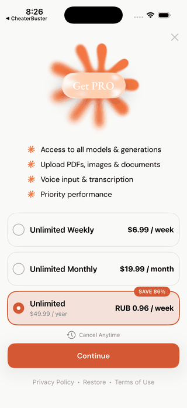

# BroadUIFlows: paywall и Special Offer

Здесь показан именно нужный сценарий: сначала обычный paywall,
затем пользователь нажимает крестик и видит отдельный Special Offer.
Это не два состояния одного экрана, а два последовательных продуктовых шага.

```text
Обычный paywall
        ├─ purchase / restore подтверждены → Premium / main
        └─ нажат крестик без покупки
                    ↓ если показ разрешён
              Special Offer
                    ├─ покупка подтверждена → Premium / main
                    └─ нажат крестик → main
```

## Adapty: реальный сценарий 5007

Ниже — актуальная сборка 5007. Сначала показывается обычный paywall с годовым
и недельным планами. Нажатие на тариф только меняет выбор и не запускает
покупку.





После нажатия на крестик основной paywall не закрывает весь сценарий: вместо
него появляется отдельный Limited-Time Offer с таймером, своей ценой и кнопкой
Continue.





## Adapty: реальный сценарий 5092

В 5092 дизайн другой, но контракт тот же: крестик не завершает
весь сценарий, а открывает второе предложение.



## RU Billing: Claude232 на русском

Этот пример записан с языком **Russian** и регионом **Russia**. Обычный
русский paywall закрывается, после чего появляется специальное
предложение RU Billing с рублёвой ценой.



> Важно: Russian отвечает за русскую локализацию экрана, а Russia — за
> региональный маршрут. Для повтора этого GIF в Simulator включите оба значения.

## Почему здесь нет GIF 5115Copilot

Документация не должна показывать выдуманный маршрут. В доступной сборке
5115Copilot крестик обычного paywall открывает экран Privacy, а в
доступных исходниках нет перехода в Special Offer. Как только будет
доступна сборка с этим переходом, её можно добавить четвёртым подтверждённым
референсом.

## Граница UI и оплаты

```text
BroadUIFlows       рисует карточки, выбор, loader, ошибки и кнопки
BroadMonetization  загружает продукты, запускает purchase/restore и проверяет Premium
Adapty / backend   возвращают продукты и подтверждённый результат
Приложение         задаёт дизайн, тексты, placements и момент показа
```

Крестик только сообщает о закрытии обычного paywall. Показывать ли второй
экран и какой продукт на нём продавать, решают подтверждённый флаг и
платёжный слой.

## Выбор продукта не запускает покупку



Нажатие на карточку только меняет selected product ID. Покупка
начинается только после Continue.

## Что проверить

- крестик обычного paywall открывает Special Offer только по согласованному флагу;
- успешные purchase и restore не открывают Special Offer;
- Special Offer продаёт только отдельно подтверждённый продукт;
- двойной tap не запускает вторую операцию;
- loader не стирает выбранный продукт;
- закрытие второго экрана завершает бесплатный маршрут;
- Premium открывается только после подтверждённого entitlement или backend-статуса.

[Назад к BroadUIFlows](./broad-ui-flows.md) · [Логика paywall](./paywall-ui.md) · [Special Offer от Adapty](./special-offer.md) · [Special Offer RU Billing](./ru-special-offer.md)
