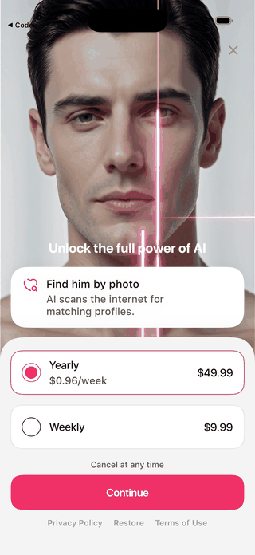
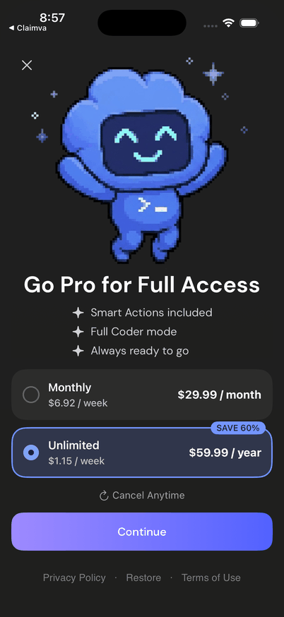
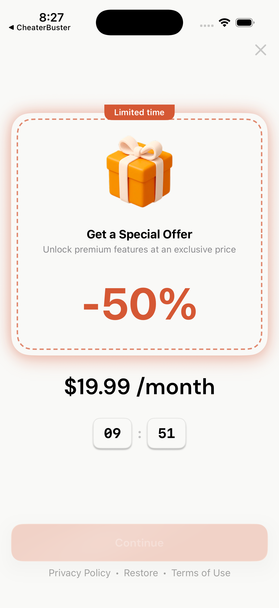

# BroadUIFlows: paywall и Special Offer

Paywall находится в BroadUIFlows потому, что это **экран, который видит и
нажимает пользователь**. Но деньги обрабатывает не UIFlows.

```text
BroadUIFlows       рисует карточки, выбор, loader, ошибки и кнопки
BroadMonetization  загружает продукты, запускает purchase/restore и проверяет Premium
Adapty / backend   возвращают продукты и подтверждённый результат
Приложение         задаёт дизайн, тексты, placements и момент показа
```

## Как пользователь проходит этот сценарий

Ключевой порядок:

1. пользователь видит обычный paywall;
2. выбирает любой из реально полученных продуктов;
3. покупка запускается только по Continue;
4. закрытие без покупки может открыть Special Offer;
5. успешная покупка или restore обходят Special Offer;
6. main открывается после подтверждённого Premium.

## Переключение продуктов — это UI, а не новая покупка



Нажатие на карточку только меняет выбранный product ID. Оно не должно запускать
покупку, менять порядок продуктов или терять цену.

Другой референс показывает три продукта и другой дизайн:


Тёмный вариант показывает ту же механику с другим дизайном:



Из этих примеров стандартом являются состояния и действия. Цвет, фон, текст,
число карточек и расположение могут отличаться.

## Обычный paywall и Special Offer — не одно и то же

| Экран | Когда появляется | Что продаёт |
|---|---|---|
| Обычный paywall | После онбординга, из main или settings | Основные продукты placement |
| Special Offer | Только после закрытия обычного paywall без покупки | Отдельный подтверждённый продукт или набор продуктов |



Special Offer нельзя показывать после успешной покупки, restore или уже
активного Premium.

## Сколько продуктов показывать

BroadUIFlows показывает **все продукты, которые передал платёжный слой**: 0, 1,
2 или N. Он не выбирает «два лучших» и не сортирует их по цене.


Если конкретному приложению нужно только два продукта, оно должно получить
отдельное подтверждённое продуктовое правило. Это не общий default платформы.

## Что проверить

- карточка меняет выбор, но не покупает;
- Continue запускает одну операцию;
- двойной tap блокируется;
- loader не стирает выбранный продукт;
- ошибка предлагает понятный Retry;
- крестик открывается по согласованному правилу;
- Special Offer появляется только при разрешении;
- возврат из браузера не считается оплатой;
- Premium открывает только подтверждённый entitlement или backend-статус.

[Назад к BroadUIFlows](./broad-ui-flows.md) · [Логика paywall](./paywall-ui.md) · [Спешл оффер от Adapty](./special-offer.md) · [Спешл оффер RU Billing](./ru-special-offer.md)
