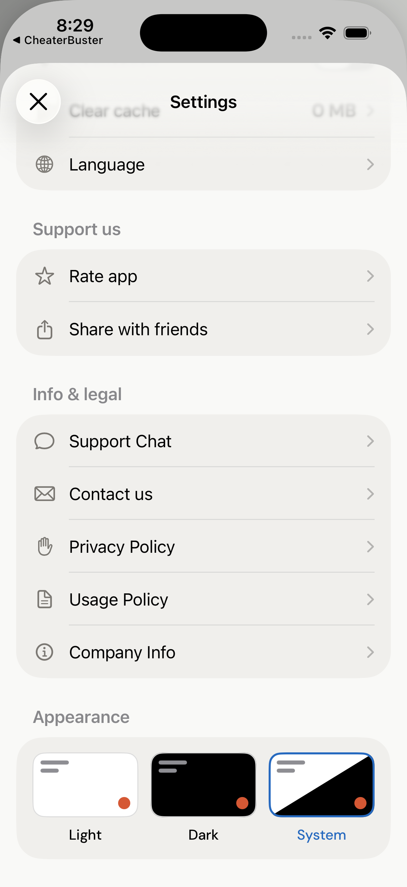
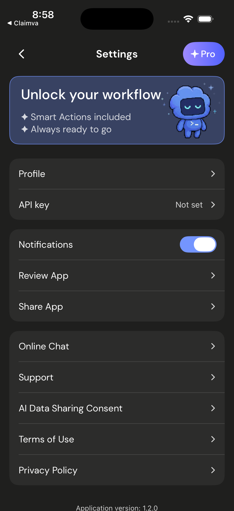
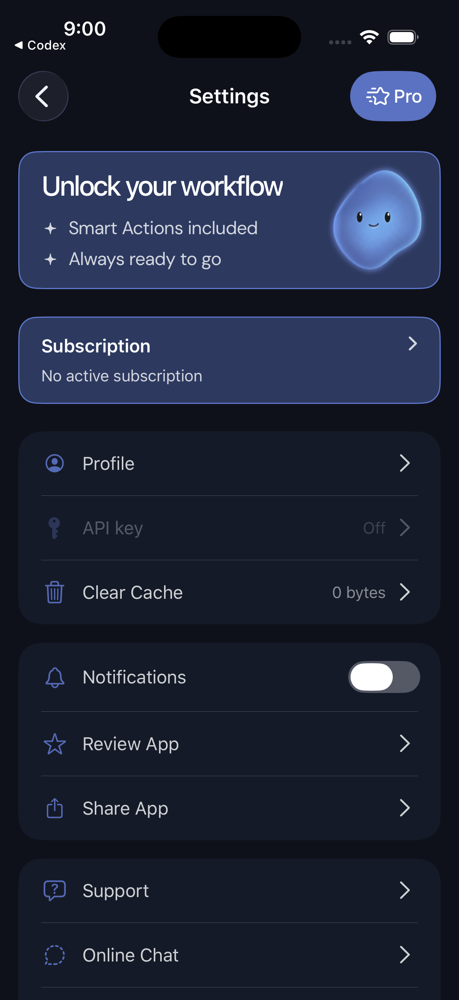

# BroadUIFlows: настройки и поддержка

Settings — не свалка ссылок. Это место, где пользователь управляет подпиской,
восстанавливает покупку, открывает поддержку, читает документы и видит
информацию о приложении.

## Три варианта одного стандарта







Все варианты допустимы. Стандарт — не конкретная розовая, светлая или тёмная
карточка, а понятные роли и безопасные действия.

Не каждое приложение обязано показывать Profile, API key, выбор темы или очистку
кеша. Добавляйте строку только тогда, когда за ней есть рабочее действие. Но
Upgrade, Restore, Support и legal должны оставаться предсказуемыми везде, где
они нужны продукту.

## Что должно быть понятно без догадок

| Строка | Ожидаемое действие |
|---|---|
| Upgrade / Get Premium | открыть обычный paywall |
| Restore Purchases | запустить restore и показать результат |
| Subscription management | открыть экран с подробной информацией о подписке и доступными способами управления ею |
| Support Chat | открыть согласованный чат поддержки |
| Contact us / Support | сформировать обращение с диагностикой |
| Privacy Policy / Terms | открыть точный публичный документ |
| App Version | помочь поддержке понять версию сборки |

Для подписки Apple приложение открывает системный экран управления App Store.
Он сам показывает доступные действия, включая отмену; отдельную кнопку
`Cancel subscription` и собственную логику отмены в приложении добавлять не
нужно. Для RU-подписки открывается предусмотренный для неё экран управления.

## Как должно формироваться письмо Support

Нажатие Support не должно отправлять письмо автоматически. Оно открывает
системный composer, где человек видит получателя, тему и текст и сам нажимает
Send.

Безопасный шаблон:

```text
Получатель: адрес поддержки текущего приложения
Тема: <название приложения> — Contact us

Опишите проблему:

--- App ---
Version / build:
Bundle ID:

--- Device ---
iOS version:
Device model:
Locale / time zone:

--- Account ---
Только технические ID, необходимые поддержке
Subscription state:
```

Пароли, платёжные реквизиты, полный токен авторизации и содержимое личных чатов
в письмо не добавляются.

Два технических поля даёт монетизация как данные: канонический статус подписки —
`EntitlementStatus.supportSubscriptionValue` (`subscribed`/`not_subscribed`/`unknown`),
а Adapty profile ID — `ProfileIdentityProviderProtocol` (реализация
`AdaptySDKProfileIdentityProvider`), который читает существующий профиль, не создавая
новый; если профиля ещё нет, приложение подставляет свой placeholder.

## Почему composer может не открыться в Simulator

iPhone Simulator часто не содержит настроенного Mail-аккаунта. В этом случае
эталонное поведение — понятное сообщение или безопасный fallback, а не молчание.

Понятный fallback может быть простым системным сообщением: почта не настроена,
поэтому обращение не создано. Не показывайте бесконечный loader и не отмечайте
обращение как отправленное.

Финальную проверку самого composer нужно выполнить на устройстве с настроенной
почтой: убедиться, что письмо **только подготовлено**, вложение читается и ничего
не отправляется без действия пользователя.

## Проверка настроек

1. Каждая строка нажимается всей площадью.
2. Restore нельзя запустить дважды одновременно.
3. Управление подпиской ведёт в правильный маршрут текущего способа оплаты.
4. Support открывает чат или composer и не отправляет данные сам.
5. Legal-ссылки принадлежат текущему приложению.
6. Технический ID можно скопировать, но он не попадает в публичные скриншоты.
7. Длинные строки и Dynamic Type не обрезают смысл.

[Назад к BroadUIFlows](./broad-ui-flows.md) · [Чат Usedesk](./usedesk.md) · [Paywall из настроек](./ui-flows-paywall.md)
