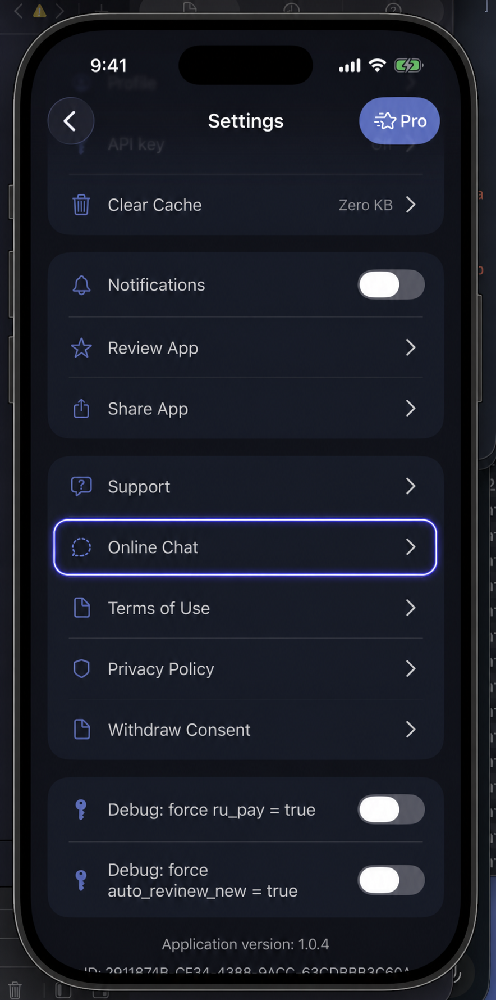
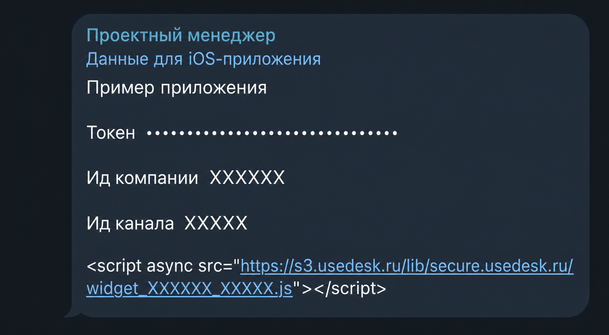

# Чат поддержки Usedesk

Usedesk подключается отдельно и только тем приложениям, которым нужен чат.
Он не приходит автоматически вместе с Core, Monetization или UIFlows.

## Где пользователь открывает чат

Чат запускается после явного нажатия `Настройки → Онлайн-чат`. Он не должен
открываться или загружаться при старте приложения.

## Что получить до разработки

- Company ID;
- Channel ID;
- решение, нужен ли готовый интерфейс SDK;
- решение, нужна ли база знаний;
- решение, нужны ли push-уведомления;
- backend-методы получения и сохранения chat token текущего аккаунта;
- правило выхода и смены аккаунта.

Готовый интерфейс Usedesk устанавливается через CocoaPods в основное
iPhone-приложение. После `pod install` открывайте `.xcworkspace`, а не
`.xcodeproj`.

## Не путайте три значения

| Значение | Что это |
|---|---|
| Company ID | Идентификатор компании в Usedesk |
| Channel ID | Идентификатор конкретного канала чата |
| User chat token | Связь истории чата с текущим аккаунтом приложения |

Административный token Usedesk не должен попадать в iPhone-приложение.

## Как хранится пользовательский token

Backend текущего аккаунта остаётся источником token. Keychain хранит локальную
копию и незавершённую синхронизацию. Идентификатор устройства не заменяет
аккаунт пользователя.

После получения нового token приложение сначала безопасно сохраняет его
локально, затем отправляет backend. При выходе token и история одного аккаунта
не должны показываться другому.

## Если нет сети

Покажите понятную ошибку и Retry. Не создавайте новую личность пользователя из
device ID или случайной строки только ради открытия чата.

## Как проверить

- действие в Settings открывает правильный канал;
- после переустановки тот же аккаунт получает свою историю;
- другой аккаунт не видит предыдущую историю;
- незавершённая синхронизация переживает временную ошибку сети;
- token не попадает в логи и README;
- разрешения запрошены только для включённых функций.

[Полная инструкция Usedesk](https://github.com/BroadApps-official/broad-platform-integration/blob/main/Documentation/Usedesk.md)
